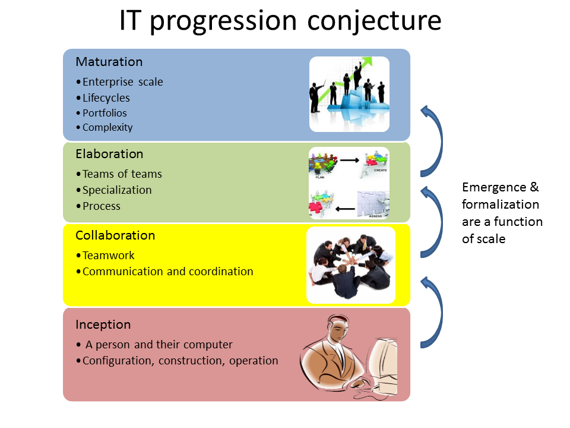

= Agile IT management, from startup to enterprise

:toc:

Current status as of 7/16/2015: I have ~60,000 words in Scrivener that I am starting to transfer to Github. This is not a simple conversion, the material needs further rewriting as I do this. But this project is by no means starting from scratch. 

== Overview

Welcome to the first comprehensive college level textbook covering Agile and Lean IT management techniques.

This Readme is written primarily for potential collaborators and *customers* of the book:footnote:[Of course, if you are a student to whom this book has been assigned, feel free to read this if you're curious about the origins of this work.]

1. fellow faculty with similar educational challenges, and
2. my good friends in the practitioner community who might be interested in helping this cause.

This README covers:

* Personal history
* A vision for a new, collaborative Agile text

== Some personal history

I teach a survey course, at the University of St. Thomas in St. Paul, Minnesota, at the graduate level in the department of Software Engineering and Information Systems. This program at St. Thomas is the largest such program in the country. We teach a broad variety of students. Some are  fresh out of a non-technical four-year liberal arts degree, and some are experienced technology professionals who have worked for years in the region's many Fortune 500 corporations.

As you can imagine, this breadth of experience poses some challenges, but also presents opportunities if one can figure out good ways for the students to teach each other -- one of the topics in this book and its related materials.

While my class is titled "IT Infrastructure" for historical reasons (related to something called the "IT Infrastructure Library," or ITIL), the class was intended from its creation to cover the management of IT broadly. It serves as a contextual course for the students in their in-depth studies of programming, databases, security, networking, and so forth. It is not limited to a narrower definition of "IT infrastructure" that would focus only on servers, operating systems, storage, networking, data centers, and the like.

As of this writing (July 2015) I am looking forward to teaching my class a fourth time. While I do not consider myself an expert instructor, I have learned a few things about what works in the classroom. I also think I have a good understanding of where the IT industry is going, and what students need to learn to be effective as industry practitioners. In fact, this book is written partly out of a sense that *IT education in this country is broken*.

This may seem like a presumptuous thing for an adjunct faculty to say, but my day job is as a consultant to senior IT leaders at some of the largest corporations in the world, many of whom I count as friends. None of them feel well served by the current IT educational system.footnote:[I admit my bias is US-centric. There is a European discipline called "informatics," that may be closer to what is needed.] "They don't even understand what source control is," goes one frequent complaint.

This is a problem, as we are starting to see shakeups in the talent market due to larger enterprises adopting Agile. I am aware of hundreds of experienced IT professionals being laid off in my region, due at least in part to Agile transformations. A new pedagogy is called for. (This is why I have also helped found the http://www.meetup.com/Agile-Study-Group/[Minnesota Agile Study Group], a meeting place for local faculty and professionals to interact on these topics.)

=== SEIS 660 at the University of St. Thomas
I wrote my first book in 2006, the well-received http://http://www.amazon.com/Architecture-Patterns-Management-Resource-Governance/dp/0123850177[_Architecture and Patterns for IT: Service Management, Resource Planning, and Governance (Making Shoes for the Cobbler's Children)_]. (Yes, the title was far too long, due to an unsatisfactory compromise with the publisher.) The book was rewritten and released as a 2nd edition in 2011.

In 2013, I was presenting at the SEI Saturn conference in Minneapolis, MN, on the contents of the book and was approached by Dr. Bhabani Misra, the head of the Graduate Programs in Software at the University of St. Thomas in St. Paul. Bhabani asked me to teach the above-mentioned "IT Infrastructure" course (SEIS660), which at the time had a very sparse definition:

****
_This course will cover several topics related to IT infrastructure. The course will cover Information Technology Infrastructure Library (ITIL) which is the most widely adopted approach for IT Service Management. It provides a practical framework for identifying, planning, delivering and supporting IT services to the business._
****

I readily accepted the opportunity. Adjunct positions, while notoriously ill-compensated, are legitmate faculty positions and afford a variety of benefits beyond the course stipend. In particular, in these practitioner-focused Masters' programs, one comes into contact with a wide variety of industry professionals and can gain great insight into current trends. Also, there is an aspect of "giving back." Like many teachers before me, I find the work deeply satisfying.

As the class progressed, we changed the course description as follows:

****
*http://www.stthomas.edu/gradsoftware/programs/catalog/#d.en.116975[SEIS 660 Information Technology Infrastructure]*

_This course covers the engineering and operation of IT infrastructure, and related IT management practices in both theory and practice. Students participate in building and operating an end to end “IT supply chain” applying current industrial practices, demonstrating how IT services move from idea through production in a practical industrial setting and are managed and improved over time._

_This lab simulation is then used to illuminate key IT management topics such as:  Cloud – Virtualization – Infrastructure as code – Web-scale IT – Continuous delivery –  Change and incident management – Monitoring and service management – IT process management – IT standards – Continuous improvement for IT._

_Students will gain hands-on experience with virtualization, systems administration, DevOps, monitoring, collaboration, and industrial IT processes._
****

While my spring 2015 class was about half full, based on the older ITIL description, my fall 2015 section filled to capacity immediately when the new description was published.

=== Considering a 3rd edition

For the past three semesters I have assigned my book (_Architecture and Patterns_) as a required text for the class. However, I did not write this book as a textbook and its limitations have become clearer and clearer throughout the 3 semesters I have taught to date.

I approached my publisher with the idea of a 3rd edition that would pivot the existing material towards being something more useful in class. They agreed to this and I started the rewrite.

However, by the time I was halfway done with the first draft, I had a completely new book. Material from the previous work simply did not fit.

A number of factors converged at this point:

* My view that the "medium is the message" and this extends to choice of authoring approach, intellectual property, DRM, and publisher
* Contacts with local and international faculty and thought leaders, and a desire to openly collaborate with them on making the book as good as possible
* A desire to freely share at least a rough version of the book, both for marketing purposes and in the interests of giving back to the global IT community
* A desire to be able to rapidly update the book with as little friction as possible
* A practical realization that the book might get more uptake globally if available as free and open source IP
* The fact I had already started to https://github.com/StThomas-SEIS660[publish my labs on Github], and had in fact had developed a reasonably sophisticated "DevOps in a Box" toolchain (the https://github.com/CharlesTBetz/Calavera[Calavera project], which has attracted collaborators from the US, Spain, and Israel).

Hence this project.

_Checkpoint: Yes, this README is long. If you have made it this far, great. I am looking for a few good collaborators, not a cast of thousands._

== The vision for a new Agile textbook

So, what exactly IS this textbook, anyhow?

* It is the first general, survey-level text on IT management with a specific Agile and Lean IT orientation.
* It both covers, and is written using, Agile, Lean, and continuous delivery techniques.
* It has a unique and innovative narrative structure.

=== Current textbooks

Most authors of IT/MIS survey texts struggle in my opinion with structuring their narrative. Many start by discussing (in too much depth) various computing fundamentals and then switch to a laundry list of assorted topics, including business needs for computing, project management, programming, database and network management, IT processes, security, and so forth.

A smaller number of authors may start with the business motivation and then go into the functional areas, but in either case these narratives are rather fragmented.

Perhaps worse, there is almost no reocgnition that computers and their usage are different matters depending on the *size and maturity of the organization*. College textbooks tend to assume that students are interacting with computers in the context of large, bureaucratic organizations. A smaller percentage may talk about computers and software as products to be developed and marketed in their own right.

Waterfall assumptions are found throughout many of these texts, not just as explicit discussion, but embedded pervasively as a mental model, that IT is "planned, built, and run."

Finally, while Agile techniques are certainly mentioned, they are typically grafted onto the former narrative.  Mostly, Agile is discussed in the context of project management. Questions of end to end flow, product management, Agile infrastructure, culture and organization, the relationship to Lean, and many other such topics go unaddressed.

As mentioned above, educators have a responsibility to effectively respond to the new realities of Lean product development and the end to end Agile transformation looming for enterprises. This can no longer be dismissed as "flavor of the month" or a fad. It is a fundamental transformation of business and society, ultimately based in Mark Andreessen's observation that "software is eating the world."

=== The proposed structure

In keeping with the entrepreneurial spirit that gave rise to the Agile movement and works like Ries' _The Lean Startup_, I am structuing this book around a progressive, evolutionary approach.

Here is a conceptual illustration of what I term a "conjecture" of IT management progression:

As a structuring mechanism, I have tested this in the classroom with some success. I divide a 13-week semester into four major sections, with each having a distinct "persona" for the students to adopt:

.... *Emergence*: The students are teamed as pairs of practitioners , each in a hypothetical startup, in a garage.

.... *Collaboration*: The students are in teams of 6-11, enough for specialization to emerge, but still intensely collaborative.

.... *Coordination*: The entire class becomes one large organization, a "team of teams" faced with the hard problems of coordination and communication across space and time barriers.

.... *Maturation*: Students are in groups of 4-5, representing the executive leadership of a large enterprise, concerned with IT portfolios, analytics, and the complex dynamics of running IT at massive scale.

Elaborating the above outline into chapters, we have:

..... *Emergence*

. _IT value_. Why do we need computers? What can they do for us?
. _IT infrastructure_ We want to build something. We have to choose a platform first.
. _IT applications_ Let's start building something of use to someone.

..... *Collaboration*
[start=4]
. _Product management_ What exactly is it we are building? How do we better define it for a bigger team?
. _Work management_ How do we keep track and communicate at the most basic level?
. _Operations management_ How do we sustain this surprisingly fragile computing-based service, in its ongoing delivery of IT value?

..... *Coordination*
[start=7]
. _Culture and organization_ We're getting big. How do we deal with this? How are we structured? Why this way and not that?
. _Process management_ OK, we have a structure. But work flows across it.
. _Project and resource management_ Process is great, but we want to get bigger stuff done.

..... *Maturation*
[start=10]
. _Architecture and governance_ We need better orientation on how the big picture fits together. We have major players and forces around us (vendors, regulators, security threats). We need to reduce redundancy and we *do* need to seek some economies of scale.
. _Portfolio and analytics_ We need to define our investment strategy based on a sound understanding of both business needs and technology limitations. We need to measure this massive IT estate and understand it as an overall system.
. _Chaos, complexity, and the road ahead_ No matter how we try, stuff happens, and it's getting harder to cope with as the systems get bigger and more complex. Where will this all lead?

..... *Appendices*
. _A review of IT frameworks and standards_
. _Towards a theory of IT management_
. _Architectural depictions_

The central advantage of this approach is that it is ideal for the new student. There really are no prerequisites for a course based on this text, although it can be a lot of work for those completely new to IT. Discussions of complex nuanced IT issues such as process frameworks are presented as part of a logical evolutionary progression and thought experiment, rather than simply dropped on the unsuspecting student.

I have spent considerable time thinking (agonizing) about the correct ordering of the chapters within these sections. This is possibly the tenth or twelth version of the chapter ordering. This is an area where I want critical review, but also have strong opinions.

There is benefit to restricting the chapters to 12, as a typical semester runs 14 weeks and the book then fits quite nicely. (Trying to modfiy the semester system is out of scope for this project.) Of course, a two-semester series, with 2 weeks per chapter, would also work well; each half of the book is also a logical unit.

You may notice that the chapter titles don't necessarily reflect "Agile" terminology. This is also deliberate, as students are going into a widely diverse world of much long-established IT. Furthermore, putting "Agile" as a qualifier on each chapter seems gratuitous (e.g. "Agile Operations Management" instead of just "Operations Management.")

The first word of the book's title is "Agile." That says everything right there, and for the rest, the proof will be in the reading. My intent is to involve many of the top Agile practitioners in the world in reviewing the sections most relevant to them, and I anticipate a high quality end result that is recognizably supportive of the Agile movement's goals and ambitions.

The book however is not a complete dismissal of older models of IT delivery. Wherever possible, Agile is presented as an evolutionary step relative to what has gone before. The specifics of "what's different" are identified, in the interest of de-mystifying what can be a fraught and quasi-religious topic. In the words of Don Reinertsen, you can have "faith based Agile or science based Agile." This book is strictly interested in the latter.

This emergence model can also be understood also as an individual's progression within a larger enterprise. Even if one starts from Day 1 at a Fortune 100 corporation, I believe the progression of one's understanding still progresses through individual, to team, to "team of teams," to enterprise. Of course, one may "stop" evolving one's understanding at any of these stages, with corresponding implications for one's career.

== Participating, and the road ahead

I need reviewers and content contributors. I especially appreciate well-informed sidebars on specific topics and will give full in-text authorial credit for such. Or, you can help with the body of the text. I also want to cultivate an ecosystem of labs, but that is a different story.

My desire is that interested parties contribute to this project via standard Github techniques. I realize this places a barrier for some otherwise qualified contributors, but this is deliberate. I believe that *source control is a singularly important practice*; it is the constraint which enables much of the benefits of Agile.

Learning Github is a good use of your time, if you seek to teach the next generation of IT practitioners. They are heading out into a world of "infrastruture as code" and pervasive use of source control. Github portfolios are increasingly selection criteria in the hiring process for IT professionals.

In terms of an Agile medium, the format of the book on Github will allow for better "random access" reviewing. This I think will be an improvement over the standard "read a big batch of my work please." I'll point to specific sections as they are completed, and as discussions progress on Twitter & other channels, an approach I think is more agile.

I will say more about the labs elsewhere, but I have found that developing good labs is extraordinarily labor-intensive. I intend that each chapter have a solid lab (or multiple alternatives) and would greatly value any contributions that align with the book's progression.

Finally, I have not decided on a publishing channel. I am experimenting with LeanPub, but the final decision is pending. The work would always be free here, but I may put additional formatting work in and sell the resulting value-added product. I am  considering setting up a nonprofit of some sort to further the work. And I am still considering the licensing options. Interested in any ideas along these lines.

My stance on these issues depends directly on other people making substantial contributions. If that does not happen, I will consider other, more proprietary models, although I remain concerned for educational access and am not inclined to publish this solely as a $150.00 glossy textbook.

If you have comments or questions, please log a https://github.com/dm-academy/aitm/issues[Github issue] on this repository. Or drop me a line at char AT dm-academy DOT com.
