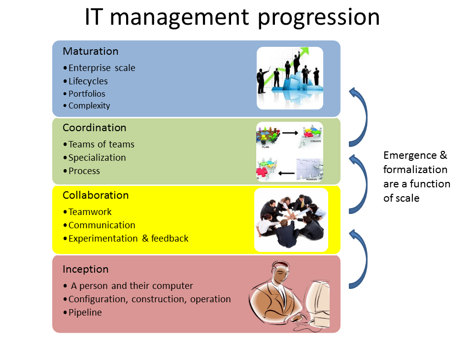

== Preface to the Instructor
****
*Collaborative*

 Status: This section is 1st draft since 2015.

 Notes: These intro parts may seem rough. As is best practice, the preface and introduction will be given a thorough update at the end of the development process.

 More can and should be said about the historic transition to digital; how platform-specific technologies cycle frequently but digital transformation is something much bigger.

include::../../collab-links.adoc[]
****

The goal of a preface is to position a book, to frame it and help the interested person decide if it makes sense for them. It also helps to tell the story of the book.

This preface covers:

* Some comments on the IT industry and the rise of Agile

* My personal history that led to this project

* A vision for a new, collaborative Agile text

=== The IT industry, and the rise of digital
[quote, Darrell Rigby et al, Harvard Business Review]
Now agile methodologies—which involve new values, principles, practices, and benefits and are a radical alternative to command-and-control-style management—are spreading across a broad range of industries and functions and even into the C-suite.

Let us start this preface with two industry reports:

In September 2015, Minneapolis-based Target Corporation laid off 275 workers with IT skillsets such as business analysis and project management, while simultaneously hiring workers with newer “Agile” skills. As quoted by a local news site, Target stated:

****
“As a part of our transition to an Agile technology development and support model, we conducted a comprehensive review of our current structure and capabilities… we are eliminating approximately 275 positions and closing an additional 35 open positions. The majority of the impact was across our technology teams and was primarily focused on areas such business analysis and project management.” <<KARE2015>>
****

Consider also the following from Jim Fowler, Chief Information Officer at General Electric:

****
“When I am in business meetings, I hear people talk about digital as a function or a role. It is not. Digital is a capability that needs to exist in every job. Twenty years ago, we broke ecommerce out into its own organization, and today ecommerce is just a part of the way we work. That's where digital and IT are headed; IT will be no longer be a distinct function, it will just be the way we work. …

[W]e've moved to a flatter organizational model with "teams of teams" who are focused on outcomes. These are colocated groups of people who own a small, minimal viable product deliverable that they can produce in 90 days. The team focuses on one piece of work that they will own through its complete lifecycle…in [the “back office”] model, the CIO controls infrastructure, the network, storage, and makes the PCs run. The CIOs who choose to play that role will not be relevant for long…” <<Heller2016>>
****

Fowler echoes the strategic concerns and directions of leading CIOs around the world. And beneath his words lie fundamentally new approaches to delivering IT and digital  value. These approaches carry a number of names, but the term “Agile” is prominent, with a number of variants (DevOps, Lean IT, Lean Product Development, Web-scale IT, Lean UX, and so forth). These trends, decades in the making, cannot be dismissed as "flavor of the month" or a fad.

The successes of Agile are notable. Evidence for Agile software development methods, and a related set of approaches that have coalesced into what we might call the digital ecosystem, continues to accumulate.

The annual State of DevOps report presents extraordinary, order of magnitude claims in terms of IT delivery and stability for organizations with mature Agile and DevOps practices <<Puppet2015>>:

* 60x fewer failures
* 168x better Mean Time To Recovery
* 30x more frequent delivery
* 200x shorter lead times

The proven effectiveness of these methods in managing many forms of complexity, including problems not usually seen as “IT” or even “digital,” leads to broader and broader appetite for appropriate instruction and curricula.

The new IT-based digital economy is informed top to bottom by an ecosystem of ideas founded on Agile software development. This is accompanied by rethinking or outright rejection of certain practices, including waterfall software development, lengthy “analysis and design” phases, stage-gated project management, and the use of process improvement frameworks. Many are introduced to such practices via formal education, where they are still often presented uncritically.

Startups; large, established firms; and now mid-size companies are embracing the insights and practices of digital transformation, and local workforce requirements are shifting. We believe that academic systems and curriculum owners need up to date understanding and relevant, mainstream offerings appropriate to these trends.

A primary goal of this book, as a textbook, is to prepare the student for a career in this new digital industry. “Industry” is broadly defined as both those industries that offer digital products per se, as well as industries that rely on digital technology instrumentally for delivering all kinds of products. A central theme of the book is that “IT,” considered as a component, represents an increasing proportion of ALL industrial products (both consumer and business facing). This is known as "digital transformation."

Because of this, the IT industry, and my understanding of it, have transformed dramatically in the past ten years, and the transformation has accelerated even more in the last five.

However, IT remains under-managed and poorly understood relative to peer functions in the enterprise. It struggles with a reputation for expensive inflexibility and Dilbert-esque dysfunction. The DevOps and Agile movements promise transformation, but are encountering an entrenched legacy of:

* enterprise architecture,
* program and project management,
* business process management,
* IT service management practices, and
* IT governance concerns

Understanding and engaging with the challenges of this legacy are an ongoing theme throughout this introductory text.

=== Some cautions
However, some of the more radical voices in the Agile movement seem to think that the legacy can be simply swept away. The following cautionary message from Mike Burrows shows that, in terms of core Agile philosophy, this would be ill-advised:

_“…some will tell you that when things are this bad, you throw it all away and start again. It's ironic: The same people who would champion incremental and evolutionary approaches to product development seem only too eager to recommend disruptive and revolutionary changes in people-based systems – in which the outcomes are so much less certain.”_ <<Burrows2014>>, Kindle Locations 827-829.

IT management at scale within an organization is a complex system. Complex systems do not respond well to dramatic perturbations. They are best changed incrementally, with careful monitoring of the consequences of each small change. (This is part of the systems theory foundation underlying the Agile movement.)

This is why the book, especially in the later chapters, starts with relatively straightforward and uncritical presentations of the following topics:

* Project management
* Process management
* Governance, risk, security, and compliance
* Enterprise information management
* Enterprise architecture and portfolio management

While these practices, and their associated approaches and policies, have caused friction with digital and Agile practitioners, they all have their reasons for existing. The goal of this book is to understand their interaction with the new digital approaches, but in order to do this we must first understand them on their own terms. It does no good to develop a critique based on misconceptions or exaggerations about what (for example) "process management" is all about.

Instead, we try to break these large and sometimes controversial topics down into smaller, more specific topics - "lowest common denominators," perhaps:

* Work
* Ordering of tasks
* Task dependencies
* Estimation vs. commitment
* Repeatability
* Defined vs. empirical process control
* Synchronization and cadence
* Resource demand
* Shared mental models
* Mission objectives vs perimeter defense
* Technical debt

and so forth.

So, how do we undertake digital transformation? For longer term, more ambitious goals, while we cannot plan in advance how any given change initiative will play out, we *can* develop awareness.

The idea of the OODA loop is popular in the Agile community. OODA stands for Orient, Observe, Decide, Act, a set of concepts developed by Air Force colonel John Boyd in analyzing the performance of aviators in the Korean War. The faster an actor can move through this cycle, the more effective they will be.

I propose this book as an initial “OO” of the “OODA” loop for those seeking Agile transformation of their IT capabilities. Its purpose is to provide the student with a well documented set of observations on IT's current challenges that can orient you for more effective decisions and actions in your journey toward IT excellence.

=== What this book does not cover
This book does not cover specific technologies in any depth. Many examples are used, but carefully framed to not require previous expertise. This is about broader, longer-lifecycle trends.

=== Some personal history

I teach a survey course, at the University of St. Thomas in St. Paul, Minnesota, at the graduate level in the department of Software Engineering and Information Systems. This program at St. Thomas is the largest such program in the country and is comprised of a broad mix of students. Some are fresh out of a non-technical four-year liberal arts degree, and some have years of IT experience in businesses of various sizes, including the region's many Fortune 500 corporations.

As you can imagine, this breadth of experience poses some challenges, but also presents opportunities if one can figure out good ways for the students to teach each other -- to be covered in the associated lab materials.

My class is entitled "Modern IT Delivery," and has been intended from its creation to cover the management of IT broadly. It serves as a contextual course for the students in their in-depth studies of programming, databases, security, networking, IT processes, and so forth.

ifdef::instructor-ed[]

_Instructor's note_

As of this writing (February 2015) I am looking forward to teaching my class a fifth time. While I do not consider myself an expert instructor, I have learned a few things about what works in the classroom. I also think I have a good understanding of where the IT industry is going, and what students need to learn to be effective as industry practitioners. In fact, this book is written partly out of a sense that *IT education in this country is broken*.

This may seem like a presumptuous thing for an adjunct faculty to say, but my day job is as a consultant to senior IT leaders at some of the largest corporations in the world. None of them feel well served by the current IT educational system.footnote:[I admit my bias is US-centric. There is a European discipline called "informatics," that may be closer to what is needed.] "The students coming out don't even understand what source control is," goes one frequent complaint. And Agile methods, if mentioned at all, are presented in a context- and experience-free manner.

This is a problem, as we are starting to see shakeups in the talent market due to larger enterprises adopting Agile. I am aware of hundreds of experienced IT professionals being laid off in my region, due at least in part to Agile transformations. A new pedagogy is called for. (This is why I have also helped found the http://www.meetup.com/Agile-Study-Group/[Minnesota Agile Study Group], a meeting place for local faculty and professionals to interact on these topics.)

==== SEIS 660 at the University of St. Thomas
I wrote my first book in 2006,  http://http://www.amazon.com/Architecture-Patterns-Management-Resource-Governance/dp/0123850177[_Architecture and Patterns for IT: Service Management, Resource Planning, and Governance (Making Shoes for the Cobbler's Children)_]. This work was based on the application of enterprise architecture techniques to the "business of IT," taking ITIL, COBIT, IT portfolio management, and similar inputs as a statement of requirements and analyzing a logical solution. The book was rewritten and released as a 2nd edition in 2011.

In 2013, I was presenting at the SEI Saturn conference in Minneapolis, MN, on the contents of the book and was approached by Dr. Bhabani Misra, the head of the Graduate Programs in Software at the University of St. Thomas in St. Paul. Dr. Misra asked me to teach an "IT Infrastructure" course (SEIS660), which at the time had a very sparse definition:

****
_This course will cover several topics related to IT infrastructure. The course will cover Information Technology Infrastructure Library (ITIL) which is the most widely adopted approach for IT Service Management. It provides a practical framework for identifying, planning, delivering and supporting IT services to the business._
****

I readily accepted the opportunity. Adjunct positions, while notoriously ill-compensated, are legitimate faculty positions and afford a number of benefits beyond the course stipend. In particular, in these practitioner-focused Masters' programs, one comes into contact with a wide variety of industry professionals and can gain great insight into current trends. Also, there is an aspect of "giving back." Like many teachers before me, I find the work deeply satisfying.

The first semester of the class was well received enough for me to be invited back. However, there were complaints from the students that it was too "theoretical." I was attempting to teach using an enterprise architecture style, with lots of abstractions, that just were not engaging students effectively.

For example, in the ITIL framework, one learns that "an Incident is different from a Problem." From the perspective of a student new to IT, that is a meaningless semantic distinction. Absent practical reinforcement, it will not be retained after the class, if they even manage to remember it for the final.

I also had a team project approach that immediately started the students out as the IT leadership team of a large corporation. This generated feedback that the students wanted something more practical; they were not going to be immediately hired as senior executives!

I took this feedback seriously, of course. I especially gave thought to a practical aspect, and so started to develop a lab component. This was and is popular with the students, based on the evaluations I get. I also started to think about different approaches for structuring the class that would make more sense for a survey class with a wide spectrum of experience. The fruits of this are detailed below.

As the class progressed, we changed the course description as follows:

****
*http://www.stthomas.edu/gradsoftware/programs/catalog/#d.en.116975[SEIS 660 Modern IT Delivery]*

_This course covers the engineering and operation of IT infrastructure, and related IT management practices in both theory and practice. Students participate in building and operating an end to end “IT supply chain” applying current industrial practices, demonstrating how IT services move from idea through production in a practical industrial setting and are managed and improved over time._

_This lab simulation is then used to illuminate key IT management topics such as:  Cloud – Virtualization – Infrastructure as code – Web-scale IT – Continuous delivery –  Change and incident management – Monitoring and service management – IT process management – IT standards – Continuous improvement for IT._

_Students will gain hands-on experience with virtualization, systems administration, DevOps, monitoring, collaboration, and industrial IT processes._
****

As part of the explorations related to developing a new curriculum, I reached out to other faculty and scholars in this space and developed some basic premises:

****
Sidebar: Proposed premises of the https://github.com/MN-ASG/main[Agile Study Group]

We offer the following premises, as a set of old vs. new contrasts:

|====
|*Old view*|*New view*
|Lean/Agile is a cultural and generational phenomenon that will pass.
|Lean/Agile  has sound empirical and theoretical foundations. Rather than being seen as a passing fad, it is better understood as the logical culmination of the great systems and management theorists of the 20th century (Deming, Forrester, et al.)

|Theory is relevant for core computer science, but less so for IT industry practice.
|There are relevant theories for software product management, work execution, and service operations that we as educators should be using to inform our pedagogy.

|Teaching students an assortment of foundational theory and functional skills (computation, programming languages, networking, security, and more applied topics) is sufficient.
|Students need to understand the collaborative software-based product lifecycle process as a socio-technical system.

|The default organizing model of functionally specialized, maximally utilized IT organizations matrixed through projects and processes is effective and needs little further discussion.
|Current IT management guidance overlooks critical insights of queueing theory, resulting in gridlock. Project and process management across functionally specialized centers of excellence is being challenged by product-centric approaches (e.g. Amazon’s “Two-pizza team” model).

|Product design is not our field.
|IT is an increasing component of products in general and this is transforming both the practices of IT and product management. It can be argued that all IT system development is a form of product design and delivery. +
 +
 The “business/IT” boundary continues to erode as part of this. The implications of this for traditional IT organizational design and performance management are radical and poorly addressed in in research and pedagogy.

|Companies vary too greatly in how they employ IT and software graduates for academic training to cover practical issues.
|There is an emerging practical industry consensus around how IT is best delivered. Regions where this is most advanced are reaping economic benefit. +
 +
Certain widely adopted  industry practices (*source control*, *continuous delivery*, and *computing infrastructure automation* in particular) need to be better reflected in current instructional approaches. Teaching them as isolated functional topics is insufficient. *They should pervade the IT student experience, just as antiseptic practices pervade medical education.*

|Agile methods can be understood and taught as a subset of project management.
|Lean/Agile IT is expanding upstream (via product management and increasing impact on organizational design) and downstream (via DevOps) from traditional project management and is challenging project management’s foundational assumptions. +
 +
Filtering Lean/Agile through a project management lens tends to reduce it to development-centric Agile practices such as Scrum, and diminishes the breadth of Agile theory and applicability. In fact, the future of project management is itself in question; significant concerns have been raised about the theoretical foundations and practical utility of project management as traditionally understood.

|Industry partnerships are essential.
|Yes, and we need to have additional experiential approaches, such as shared simulation testbeds and effective hands-on labs, for grounding students in current industrial practices so they are well prepared for their industry practicums.

|Technology is moving too fast and we continually struggle with keeping up and staying relevant.
|There is a new high value, well-grounded, stable pedagogical core we can identify, that can be translated at different levels for students of various interests and abilities. We do not need to resign ourselves to merely providing fashion-driven vocational training.
|====

Like any mental model, these contrasts are open to debate, refinement, and even elimination.

****

==== Considering a 3rd edition

For three semesters I assigned my book (_Architecture and Patterns_) as a required text for the class. However, I did not write this as a textbook and its limitations became clearer and clearer. In particular, it had a strongly architectural approach, approaching the IT management problem as a series of https://en.wikipedia.org/wiki/4%2B1_architectural_view_model[views on a model]. I do not recommend this as a pedagogical approach for a survey class.

I approached my publisher with the idea of a 3rd edition that would pivot the existing material towards being something more useful in class. They agreed to this and I started the rewrite.

However, by the time I was halfway done with the first draft, I had a completely new book. Material from the previous work simply did not fit.

A number of factors converged at this point:

* My view that the "medium is the message" and this extends to choice of authoring approach, intellectual property, DRM, and publisher
* Contacts with local and international faculty and thought leaders, and a desire to openly collaborate with them on making the book as good as possible
* A desire to freely share at least a rough version of the book, both for marketing purposes and in the interests of giving back to the global IT community
* A desire to be able to rapidly update the book with as little friction as possible
* A practical realization that the book might get more uptake globally if available as free and open source IP
* The fact I had already started to https://github.com/StThomas-SEIS660[publish my labs on Github], and had in fact had developed a reasonably sophisticated "DevOps in a Box" toolchain (the https://github.com/CharlesTBetz/Calavera[Calavera project], which has attracted collaborators from the US, Spain, and Israel).

Hence this project.

_End instructor's note_

endif::instructor-ed[]

=== Emergence: vision for a new Agile textbook

So, what exactly IS this textbook, anyhow?

* It is the first general, survey-level text on IT management with a specific Agile and Lean IT orientation.
* It both covers, and is written using, Agile, Lean, and continuous delivery techniques.
* It has a unique and innovative narrative structure.
* Because it is written with continuous integration and print on demand techniques, it can be continually updated to reflect current industry trends.

****
*Current Agile texts*
There are hundreds of books on Agile. In this section I will seek to credit specifically collegiate texts that may also be of interest.

* Ashmore, Sondra and Kristin Runyan, http://www.goodreads.com/book/show/18349912-introduction-to-agile-methods[_Introduction to Agile Methods_]

* Cobb, Charles G. http://www.goodreads.com/book/show/24844947-the-project-manager-s-guide-to-mastering-agile[_The Project MANAGER'S GUIDE TO MASTERING AGILE: Principles and Practices for an Adaptive Approach_]

* Limoncelli, Thomas A., Strata R. Chalup, Christina J. Hogan http://www.goodreads.com/book/show/23131211-the-practice-of-cloud-system-administration[_The Practice of Cloud System Administration: Designing and Operating Large Distributed Systems, Volume 2_]
- While not an academic text per se, does have user questions and exercises at end of chapters; I currently use as supplementary text and am scoping this one to complement it

****

Most authors of IT/MIS survey texts struggle in my opinion with structuring their narrative. Many start by discussing (in too much depth) various computing fundamentals and then switch to a laundry list of assorted topics, including business needs for computing, project management, programming, database and network management, IT processes, security, and so forth.

A smaller number of authors may start with the business motivation and then go into the functional areas, but in either case these narratives are rather fragmented.

Waterfall assumptions are found throughout many of these texts, not just as explicit discussion, but embedded pervasively as a mental model, that IT is "planned, built, and run."

While Agile techniques are certainly mentioned, they are typically grafted onto the former narrative.  Mostly, Agile is discussed in the context of project management. Questions of end to end flow, product management, Agile infrastructure & operations, culture and organization, the relationship to Lean, and many other such topics go unaddressed.

As mentioned above, educators have a responsibility to effectively respond to the new realities of Lean product development and the end to end Agile transformation looming for enterprises. This can no longer be dismissed as "flavor of the month" or a fad. It is a fundamental transformation of business and society, ultimately based in Mark Andreessen's observation that "software is eating the world."

Finally, there is almost no recognition that the management of information technology differs greatly depending on the *size and maturity of the organization*. College textbooks tend to assume that students are interacting with computers in the context of large, bureaucratic organizations. A smaller percentage may talk about computers and software as products to be developed and marketed in their own right.

Few if any discuss the challenging questions of scaling IT management, and the state transitions it implies. My central educational hypothesis is that *in embracing the scaling problem we can develop an effective pedagogy that can orient even the greenest student*.

The central advantage of this approach is that it is ideal for the new student. There are no technical prerequisites for a course based on this text, although it can be a lot of work for those completely new to IT. Most people can relate to the iconic image of a small team in a garage starting a company, and having it scale over time. Discussions of advanced IT issues such as process frameworks are presented as part of a logical evolutionary progression and thought experiment, rather than simply dropped on the unsuspecting student.

Here is a conceptual illustration of an IT management progression:

As a structuring mechanism, I have tested this in the classroom with some success. I divide a 14-week semester into four major sections, with each having a distinct "persona" for the students to adopt:

.... *Founder*: The students are in teams of 2, each in a hypothetical startup.

.... *Team*: The students are in teams of 5-6, enough for specialization to emerge, but still intensely collaborative. A startup that has started to become viable.

.... *Team of Teams*: The entire class becomes one large organization, a "team of teams" faced with the hard problems of coordination and communication across space and time barriers.

.... *Enterprise*: Students are back in groups of 5-6, representing the executive leadership of a large enterprise, concerned with IT portfolios, analytics, and the complex dynamics of running heterogeneous IT at massive scale.

The structure of the book is further documented in the next section, Introduction.

==== Assumptions of the reader

* This book is written at the advanced undergraduate/graduate student level. It is currently available only in English.
* There is no assumption of deep IT experience, but there is an assumption that the person interacts with computers in some depth. They should for example understand the concept of an "operating system." An A+ certification, for example, would more than adequately prepare someone for this book.
* A person completely unfamiliar with computing will need to supplement their reading as suggested throughout the text. There is a wealth of free and accurate information on IT fundamentals (e.g. compute, storage, networking, programming, etc) and this book seeks more to curate than replicate.

==== Acknowledgements
Thanks to Dr. Bhabani Misra for asking me to teach at the University of St. Thomas.

Thanks to Stephen Fralippolippi and Roger K. Williams for being the first Github contributors.

Thanks to Jason Baker for text and technical collaboration.

Thanks to Mark Kennaley for guidance on open vs closed loop thinking.

Thanks to Glen Alleman for guidance on modern project management practices.

Thanks to Jeff Sussna for ongoing inspiration, Twitter feedback, discussion question ideas, and sourced quotes.

Thanks to Nicole Forsgren for links to articles on performance management.
