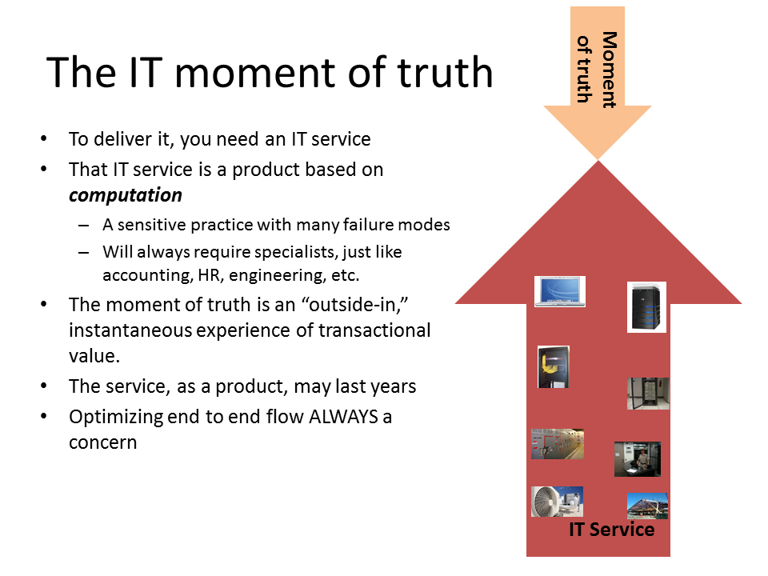

==== Examining an IT value experience

===== The "IT stack"

Let's examine our user's value experience in more detail, without getting unnecessrily technical.

In order to view her balance, our user is probably using an application downloaded from a "store" of applications made avaialble to her device. Whether she is using a smartphone, a tablet, or even a laptop, the system "architecture" is generally the same

_re-used, thematic slides to be redrawn_
_draw the narrative out of the images_

image::images/01-ITStack.png[]

****
*Use of the word "architecture" in information technology*

"Architecture" is of course a word usually associated with physical construction: buildings, landscapes, etc. It was https://en.wikipedia.org/wiki/Computer_architecture[appropriated by systems engineers at IBM in 1959] to describe the problems of designing complex information processing hardware and software.

This leads to some confusion, and occasional questions from "real" architects as to why IT people are calling themselves "architects." Perhaps a different choice of word would have been advisable.
****

===== The "IT service"

_discussion of momemt of truth, experience vs. system_
_current thinking on service definition?_

Definitional discussions - "service," "application," "system," etc

"inside out" vs "outside in" thinking, useful themes but beware of applying them as absolutes - they are always relative.

===== The IT service changes over time
_reused graphic to be redrawn_

image::images/01-ITSvcChg.png[]

===== The IT service lifecycle

image::images/01-ITStates.png[]

===== The IT user vs IT customer

But who paid for our user's enjoyment? The bank and restaurant both had clear motivation for supporting a better on line experience, and people now expect that service organizations provide this. The bank experiences less customer turnover and increased likelihood that customers add additional services. The restaurant sees increased traffic and smoother flow from more efficient reservations. Both see increased competitiveness.

The traffic application is a somewhat different story. While it is an engineering marvel, there is still some question as to how to fund it long term. It requires a large user base to operate, and yet end users are unlikely to pay for it. At this writing, the service draws on advertising dollars from businesses wishing to advertise to passersby, and also sells its real-time data on traffic patterns to a variety of customers, such as developers considering investments along given routes.

****
*IT exists in a social context*

Like the proverbial fish that doesn't understand water (because water it all it knows), we may lose sight of the laws and customs that enable us to use computers in the ways covered in this chapter.

For example, the ability for banks to hold money as electronic bits on a computer is rooted in the earliest history of banking and the emergence of centralized settlement and clearing mechanisms. The existence of global Internet connectivity relies on laws supporting utility easements and rights of way. Without a social infrastructure, social and collaborative technology has no meaning.
****
