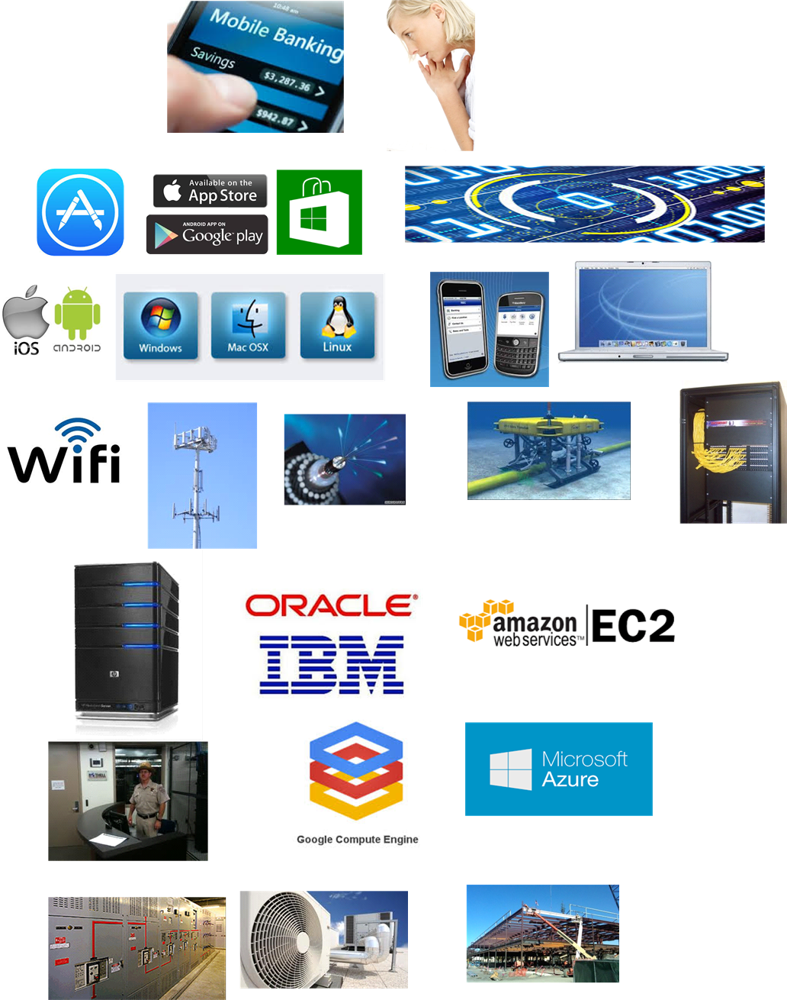

==== The IT "service" and the IT "stack"

Let's examine our user's value experience in more detail, without getting unnecessrily technical, and clarify some definitions along the way.

_discussion of momemt of truth, experience vs. system_
_current thinking on service definition?_

image::images/1.01-ITmomentTruth.png[]

Definitional discussions - "service," "application," "system," etc

"inside out" vs "outside in" thinking, useful themes but beware of applying them as absolutes - they are always relative.

In order to view her balance, our user is probably using an application downloaded from a "store" of applications made avaialble to her device. Whether she is using a smartphone, a tablet, or even a laptop, the system "architecture" is generally the same

_re-used, thematic slides to be redrawn_
_draw the narrative out of the images_

****
*Use of the word "architecture" in information technology*

"Architecture" is of course a word usually associated with physical construction: buildings, landscapes, etc. It was https://en.wikipedia.org/wiki/Computer_architecture[appropriated by systems engineers at IBM in 1959] to describe the problems of designing complex information processing hardware and software.

This leads to some confusion, and occasional questions from "real" architects as to why IT people are calling themselves "architects." Perhaps a different choice of word would have been advisable.
****
