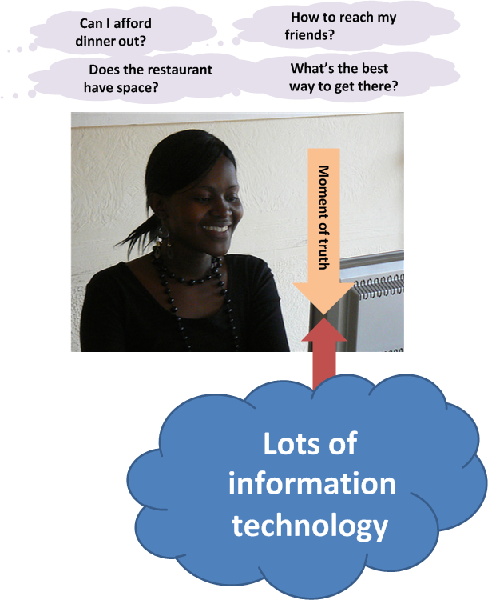

==== The IT "service" and the IT "stack"

Let's examine our user's value experience in more detail, without getting unnecessrily technical, and clarify some definitions along the way.

The first idea we need to cover is the "moment of truth." In terms of information technnology, this English-language cliche represents the user's experience of value.

NOTE: The "moment of truth" represents the user's experience of value, from a product, good, or service.

In the example, our friend seeking a relaxing night out had several moments of truth:

* Consulting her bank balance, and subsequent financial transactions also reflecting what was stated to her

* Making a reservation and having it honored on arrival at the restaurant

* Arriving on time to the restaurant, courtesy of the traffic application

Each of these individual value experiences was co-created by our friend's desire for value, and the response of a set of IT resources.

In order to view her balance, our user is probably using an application downloaded from a "store" of applications made avaialble to her device.

On her device, there is an intricate set of components performing functions such as

* connecting to the phone network
* securely connecting over the phone network to the Internet and then to the bank
* identifying the user to the bank's systems
* requesting the necessary information (in this case, an account balance)
* receiving that information and converting it to a form that can be represented on a screeen
* finally, displaying the information on the screen

The application, or "app," downloaded to the phone plays a primary role, but is enabled by:

* the phone's operating system and associated services
* the phone's hardware
* the telecommunicatons infrastructure (cell phone towers, long distance fiber optic cables, switching offices, and much more)

Of course, without the banking systems on the other end, there is no bank balance to transmit. These systems are similar, but on a much larger scale than our friend's device:

* Internet and middleware services to receive the request from the international network
* Application services to validate the user's identity and route the request to the appropriate handling service
* Data services to store the user's banking information (account identity and transactions) along with millions of other customers
* Many additional services to detect fraud and security attacks, report on utilization, identify any errors in the systems, and much more.
* Physical data centers full of computers and associated hardware including massive power and cooling infrastructure, and protected by security systems and personnel.

image::images/1.01-ITStack.png[]

Definitional discussions - "service," "application," "system," etc

Obviously we need to have a more precise way of describing the information technology, beyond just saying there is "lots" of it. A variety of terms are used:

* IT service
* Application
* IT system

We also see discussion of components, resources, subsystems, assets, and many more terms.

WARNING: There are many debates around these definitions. Sometimes these debates are helpful in clarifying the terminology you want to use on your team. But sometimes the debates can go on too long, without any real value.  Beware of anyone who claims there is a "best practice" here.

"inside out" vs "outside in" thinking, useful themes but beware of applying them as absolutes - they are always relative.

****
*Use of the word "architecture" in information technology*

"Architecture" is of course a word usually associated with physical construction: buildings, landscapes, etc. It was https://en.wikipedia.org/wiki/Computer_architecture[appropriated by systems engineers at IBM in 1959] to describe the problems of designing complex information processing hardware and software.

This leads to some confusion, and occasional questions from "real" architects as to why IT people are calling themselves "architects." Perhaps a different choice of word would have been advisable.
****
