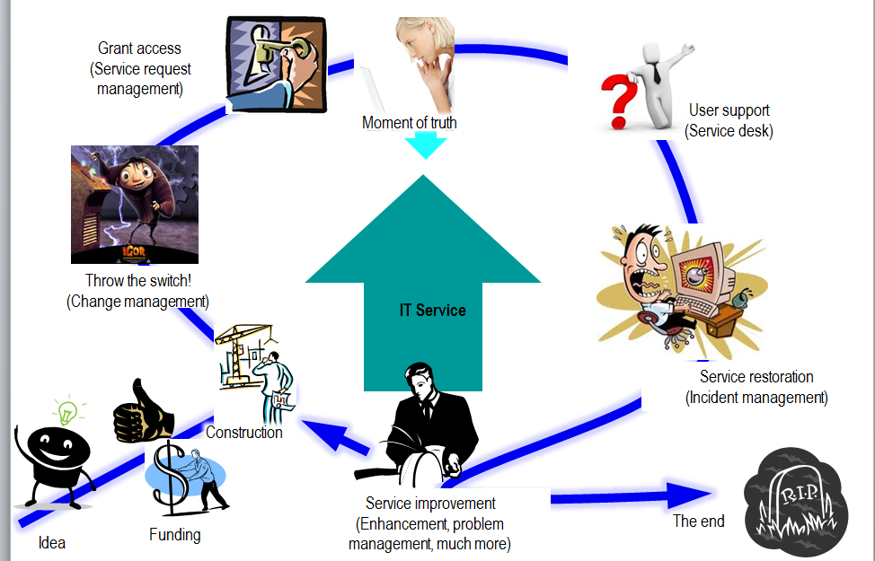

==== The IT service lifecycle

We've established that the IT service is based on a complex stack of technology, from local devices to global networks to massive data centers. Software and hardware are layered together in endlessly inventive ways to solve problems people did not even know they had ten years ago.

But these IT service systems must come from somewhere. They must be designed, built, and operated, and (as any smartphone user can testify) they are continually improved over time.

A simple representation of the IT service lifecycle is shown in the figure below.

. It starts with an idea. Someone has an insight into an IT-enabled value proposition that can make a profit, or better fulfill a mission.
. The idea must garner support and resources so that it can be built.
. The idea is then constructed, at least as an initial proof of concept or Minimum Viable Product (in the language of Ries' _Lean Startup_.) Construction is assumed to include an element of design; in this textbook, *construction and design are not represented as two separate phases.*
. There is a critical state transition however that will always exist. Initially, it is the change from OFF to ON when the system is first constructed. After the system is ON, there are still distinct changes in state when new features are deployed, or incorrect behaviors ("bugs" or "defects") are rectified.
. The system may be ON, but it is not delivering value until the user can access it. Sometimes, that may be as simple as providing someone with a network address, but usually there is some initial "provisioning" of system access to the user, who needs to identify themselves.
. The system can then deliver services (moments of truth) to the end users. It may deliver millions or billions of such experiences, depending on its scale and how one might choose to count the subjective concept of value experience.
. The user may have access, but may still not receive value, if they do not understand the system well enough to use it. Whether via a formal service desk, or informal social media channels, users of IT services will require and seek support on how to maximize the value they are receiving from the system.
. Sometimes, support requests indicate that something is wrong with the system itself. If the system is no longer delivering value experiences (bank balances, restaurant reservations, traffic directions) then some action must be taken promptly to restore service.
. All of the previous states in the lifecycle generate data and insight that lead to further evolution of the system. There is a wide variety of ways systems may evolve: new user functionality, more stable technology, increased system capacity, and more. Such motivations result in new construction and changes to the existing system, and so the cycle begins again.
. ...Unless... the system's time is at an end. If there is no reason for the system to exist any longer, it should be retired.

NOTE: System retirement is often more complex and expensive than expected, and there are many examples of systems surviving well beyond the point they deliver value.

Figure XX - The essential states of the IT service

So we see that the IT service evolves over time, through many repetitions ("iterations") of the improvement cycle. This entire process, from idea to decommissioning ("inspire to retire") can be understood as the _service lifecycle_.

image::images/1.01-ITSvcChg.png[]

Figure XX: The IT service lifecycle

 [add full 2-axis treatment, and discussion of production vs product design]
