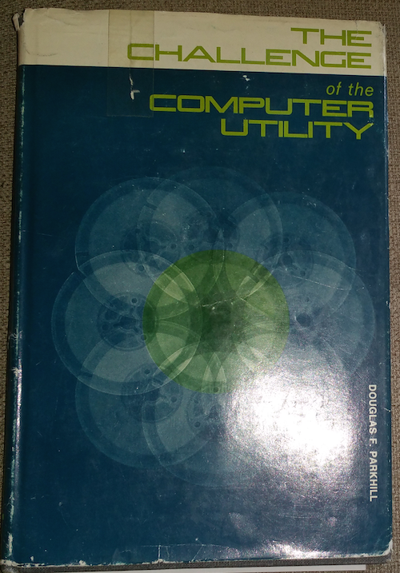
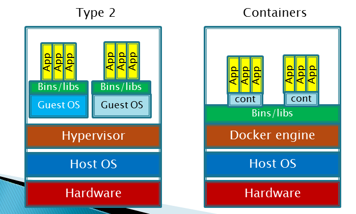

==== From "physical" compute to Cloud

According to the http://csrc.nist.gov/publications/nistpubs/800-145/SP800-145.pdf[National Institute for Standards and Technology], Cloud is:

****
_a model for enabling ubiquitous, convenient, on-demand network access to a shared pool of configurable computing resources (e.g., networks, servers, storage, applications, and services) that can be rapidly provisioned and released with minimal management effort or service provider interaction._
****

Before Cloud, people generally bought computers of varying sizes and power ratings to deliver the IT value they sought. With Cloud services, the same compute capacity can be rented or leased by the minute or hour, and accessed over the Internet.

There is much to learn about Cloud computing. In this introduction, we will discuss the following aspects:

* Virtualization
* Managed hosting
* What differentiates Cloud
* The various kinds of Cloud services

===== Virtualization

https://en.wikipedia.org/wiki/Virtualization[Virtualization], for the purposes of this section, starts with the idea of a computer within a computer.footnote:[it has applicability to storage and networking as well but we will skip that for now] In order to understand this, we need to understand a little bit about operating systems and how they relate to the physical computer.

Assume a simple, physical computer such as a laptop:

image::images/1.02-laptop.jpg[]

When the laptop is first turned on, the operating system (OS) loads; the OS is itself software, but is able to directly control the computer's physical resources: its CPU, memory, screen, and any interfaces such as WiFi, USB, and Bluetooth.

The operating system (in a traditional approach) then is used to run "applications" such as Web browsers, media players, word processors, spreadsheets, and the like. Many such programs can also be run as applications within the browser, but the browser still needs to be run as an application.

image::images/1.02-virt.png[]
_Figure XX. Virtualization is computers within a computer._

In the simplest form of virtualization, a specialized application known as a hypervisor is loaded like any other application. The purpose of this hypervisor is to emulate the hardware computer in software. Once the hypervisor is running, it can emulate any number of "virtual" computers, each of which can have its own operating system. The hypervisor mediates the https://en.wikipedia.org/wiki/Virtual_machine["virtual machine"] (VM) access to the actual, physical hardware of the laptop; the VM can take input from the USB port, and output to the Bluetooth interface, just like the master OS that launched when the laptop was turned on.

TIP: You can experiment with a hypervisor by downloading https://www.virtualbox.org/wiki/Downloads[Virtualbox] (on Windows, Mac OS, or Linux) and using https://www.vagrantup.com/[Vagrant] to download and initialize a Linux virtual machine. +
 +
 You'll probably want at least 4 gb of RAM on your laptop and a gigabyte of free disk space, at the bare minimum.

There are two different kinds of hypervisors. The example we just discussed was an example of a Type 2 hypervisor, which runs on top of a host operating system. In a Type 1 hypervisor, a master host OS is not used; the hypervisor runs on the "bare metal" of the computer and in turn "hosts" multiple VMs.

Paravirtualization is another form of virtualization found in the marketplace. In a paravirtualized environment, a core operating system is able to abstract hardware resources for multiple virtual guest environments without having to virtualize hardware for each guest. The benefit of this type of virtualization is increased I/O efficiency and performance for each of the guest environments.
However, while hypervisors can support a diverse array of virtual machines with different operating systems on a single computing node, guest environments in a paravirtualized system generally share a single OS.

image::images/1.02-virtualization-types.png[]

===== Why is virtualization important?

While the conceptual idea of Cloud and utility computing was foreseeable fifty years ago, it took many years of hard-won IT evolution to support the vision. Reliable hardware of exponentially increasing performance, robust open-source software, Internet backbones of massive speed and capacity, and many other factors converged towards this end.

Cloud computing has its uses even on a laptop (as you will see if you follow certain paths in the labs.) However, it is in larger industrial uses where it has the greatest utility.

The idea of running IT as a utility service goes back at least to 1965 and the publication of _The Challenge of the Computer Utility, by Douglas Parkhill.

_The author's copy of Parkhill's book_

****
NOTE: Virtualization was predicted in the earliest theories that led to the development of computers. Turing and Church realized that any general purpose computer could emulate any other. Virtual systems have existed in some form since https://en.wikipedia.org/wiki/Timeline_of_virtualization_development[at latest 1967] - only 20 years after the first fully functional computers. +
 +
And yes, you can run computers within computers within computers with virtualization. They get slower and slower the more levels you go in, but the logic still works.
****

In order to run compute as a utility, multi-tenancy was essential. This is different from electricity (but similar to the phone system). As noted elsewhere, one watt of electric power is like any other and there is less concern for leakage or unexpected interactions. People's bank balances are not encoded somehow into the power generation and distribution infrastructure.

However, people store data - often private - on computers. In order to deliver compute as a utility, it is essential to segregate each customer's workload from all others. This is called multi-tenancy. In multi-tenancy, multiple customers share physical resources that provide the illusion of being dedicated.

NOTE: The phone system has been multi-tenant ever since they got rid of https://en.wikipedia.org/wiki/Party_line_(telephony)[party lines]. A party line was a shared line where anyone on it could hear every other person.

Virtualization attracted business attention as a means to consolidate computing workloads. For years, companies would purchase servers to run applications of various sizes, and in many cases the computers were badly underutilized. Because of configuration issues (legitimate) and an overabundance of caution (questionable), average utilization in a pre-virtualization data center might average 10%. (That's 90% of the computer's capacity being wasted.)

The computing and storage infrastructure supporting each application stack in the business were sized properly to support each workload. For example, a payroll server might run on a different infrastructure configuration than a data warehouse server. Large enterprises needed to support hundreds of different infrastructure configurations, increasing maintenance and support costs.

The adoption of virtualization allowed businesses to compress multiple application workloads onto a smaller number of physical servers. In most virtualized architectures, the physical servers supporting workloads shared a consistent configuration, which made it easy to add and remove resources from the environment. Virtualization introduced a new design pattern into the enterprise where computing and storage infrastructure became commoditized building blocks supporting an ever-increasing array of services.

image::images/1.02-virt-benefits.png[]
 [redo graphic]

But what about where the application is large and virtualization is mostly overhead? Virtualization still may make sense in terms of management consistency and ease of system recovery.

NOTE: Some database professionals still don’t like virtualization, that is, making them run Oracle RDBMS or Microsoft SQL Server on top of virtual servers, instead of directly on the host operating system. “The database IS virtualization” they will say.

===== Virtualization vs cloud

Virtualization is necessary, but not sufficient for cloud. True Cloud services are highly automated, and most Cloud analysts will insist that if virtual machines cannot be created and configured in a completely automated fashion, the service is not true Cloud. This is currently where many in-house "private" Cloud efforts struggle; they may have virtualization, but struggle to make it fully self-service.

There also is a long tradition of managed services, where applications are built out by a customer and then their management is outsourced to a third party.

NOTE: Traditional managed services are sometimes called "your mess for less." With Cloud, you have to "clean it up first."

Cloud services have refined into at least three major models:

* Infrastructure as a service
* Platform as a service
* Software as a service

****
*From the http://csrc.nist.gov/publications/nistpubs/800-145/SP800-145.pdf[NIST Definition of Cloud Computing (p. 2-3)]:*

*Software as a Service (SaaS).* The capability provided to the consumer is to use the provider’s applications running on a cloud infrastructure. The applications are accessible from various client devices through either a thin client interface, such as a web browser (e.g., web-based email), or a program interface. The consumer does not manage or control the underlying cloud infrastructure including network, servers, operating systems, storage, or even individual application capabilities, with the possible exception of limited user-specific application configuration settings.

*Platform as a Service (PaaS).* The capability provided to the consumer is to deploy onto the cloud infrastructure consumer-created or acquired applications created using programming languages, libraries, services, and tools supported by the provider. The consumer does
not manage or control the underlying cloud infrastructure including network, servers, operating systems, or storage, but has control over the deployed applications and possibly configuration settings for the application-hosting environment.

*Infrastructure as a Service (IaaS).* The capability provided to the consumer is to provision processing, storage, networks, and other fundamental computing resources where the consumer is able to deploy and run arbitrary software, which can include operating systems and applications. The consumer does not manage or control the underlying cloud infrastructure but has control over operating systems, storage, and deployed applications; and possibly limited control of select networking components (e.g., host firewalls).
****

There are Cloud services beyond those listed above (e.g. Storage as a Service). Various platform services have become extensive on providers such as Amazon, which offers load balancing, development pipelines, various kinds of storage, and much more.

===== Containers and looking ahead

At this writing, two major developments in Cloud computing are prominent:

* Container technologies such as http://www.zdnet.com/article/what-is-docker-and-why-is-it-so-darn-popular/[Docker]
  ** Containers are lighter weight
    *** Virtualized Guest OS: Seconds to instantiate
    *** Container: Milliseconds (!)
  ** Containers must be same OS as host
* https://aws.amazon.com/lambda/[AWS Lambda], "a compute service that runs your code in response to events and automatically manages the compute resources for you, making it easy to build applications that respond quickly to new information."

It's recommended you at least scan the links provided.
