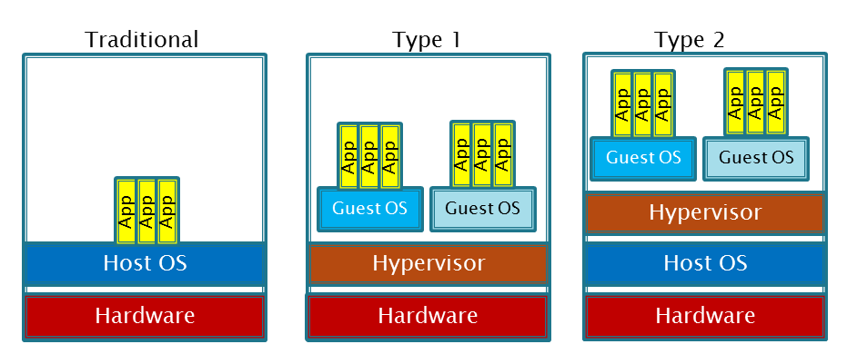

==== From "physical" compute to Cloud

What do we even mean by “Cloud”?

First we need to understand what we mean by IT

* Computing cycles
* Memory & storage
* Communications

Those are the fundamentals

The idea of running IT as a utility service goes back years

* Complexity has been the problem

Cloud origins

* Virtualization (we will discuss further)
* Managed hosting
* Web-scale IT
* “IT doesn’t matter”

Virtualizaton

* Essentially, a computer within a computer.

image::images/1.02-virt.png[]

* There is a host system that can instantiate one or more guests.
 - The host system knows about the guests, but the guests do not know about the host (except as a peer system on the network, perhaps).
 - The physical resources allocated can vary according to demand

* The technical details are deep. Talk to your
OS instructor.

****
*Did you know?*

Virtualization was predicted in the earliest theories that led to the development of computers. Turing and Church realized that any general purpose computer could emulate any other. Virtual systems have existed in some form since (IBM LPAR?).
****

* Multi-tenancy
 - Multi-tenancy is where multiple customers share physical resources that provide the illusion of being dedicated
 - The phone system has been multi-tenant ever since they got rid of party lines.

Virtualization vs containers

Virtualization benefits

Why virtualize?

* Great for heterogeneous workloads – lots of miscellaneous applications & services running on underutilized servers
* What about where the application is large and virtualization is mostly overhead?
 - Still may make sense
* Management consistency
* Ease of restoration
* Database professionals still don’t like it
 - “The database IS virtualization” they will say

Virtualizaiton vs cloud

* “Cloud is not just virtualization” many critics will say
* Financial model
* Tenancy model
* Provisioning model
* Services beyond raw compute, storage and network
* Self-service, API-driven

Traditional managed hosting vs cloud
* Managed services: “your mess for less”
* Cloud: “clean it up first”

****
Sidebar: Introducing Allspaw.
****
