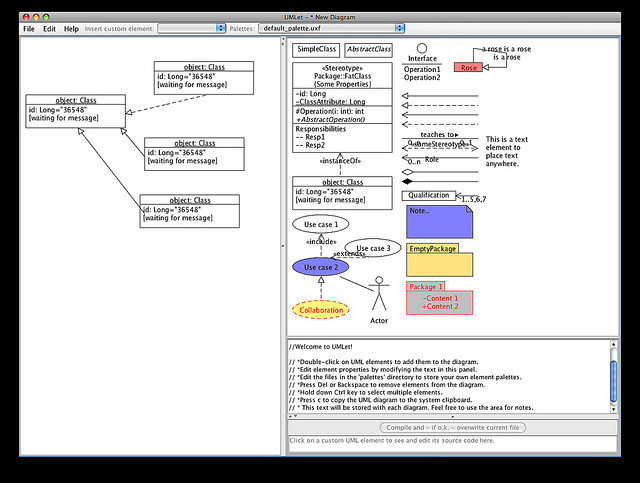

==== Basics of applications and their development

===== Defining "Application"

In keeping with our commitment to theory and first principles, we use an engineering definition of "application." To an electrical engineer, a toaster or a light bulb is an "application" of electricity. Similarly, a customer relationship management system, or a Web video on demand service, are "applications" of the core computer infrastructure we studied in the last chapter.

===== History of applications and application software

image::images/1.03-Eniac.jpg[]
_Public domain photo of early https://en.wikipedia.org/wiki/ENIAC[ENIAC] computer from Wikipedia. ENIAC was "programmed" by reconfiguring its cables, not by a programming language._

Without applications, computers would be merely a curiousity. Computers were first "applied" to military needs for codebreaking and artillery calculations. After World War II, ex-military officers like https://en.wikipedia.org/wiki/Edmund_Berkeley[Edmund Berkeley] at Prudential realized their potential if "applied" to problems like insurance record keeping. <<Akera2007>>

At first, such systems required actual manual configuration (as in the ENIAC photo in this section), or painstaking programming in complex, tedious, and unforgiving low-level https://en.wikipedia.org/wiki/Programming_language[programming languages]. As the value of computers became obvious, investment was made in making programming easier through more powerful languages.

The  https://en.wikipedia.org/wiki/History_of_software[history of software] is well documented. Low level languages (https://en.wikipedia.org/wiki/Binary_code[binary] and https://en.wikipedia.org/wiki/Binary_code[assembler]) were increasingly replaced by higher level languages (https://en.wikipedia.org/wiki/Fortran[FORTAN], https://en.wikipedia.org/wiki/COBOL[COBOL], https://en.wikipedia.org/wiki/C_(programming_language)[C]). Proprietary machine/language combinations were replaced by open standards and https://en.wikipedia.org/wiki/Compiler[compilers] that could take a common set of source code and build it for different hardward platforms.

Today, we have extensive frameworks like Struts and Ruby on Rails, along with interpreted languages that take much of the friction out of building and testing code. But even today, the objective remains to create a https://en.wikipedia.org/wiki/Executable[binary executable] file or files that computer hardware can "execute," that is, turn into a computing-based value experience, mediated through devices such as workstations, laptops, smart phones, and their constituent components.

===== Applications and infrastructure: the old way

In the first decades of computing, any significant application of computing power to a new problem typically required its own http://dm-academy.github.io/aitm/#_infrastructure_overview[infrastructure], often designed specifically for the problem. While computer scientists always were aware that computers in theory could be "general purpose," in practice this was not so easy. Military/aerospace needs differed from industry, which differed from scientific and technical uses. And major new applications required new compute capacity.

Take for example when a corporation in 1998 decided to replace its mainframe Human Resources system due to https://en.wikipedia.org/wiki/Year_2000_problem[Y2K concerns]. Such a system might need to support several thousand users around the world. At that time, PeopleSoft was a frequent choice of software. Implementing such a system was often led by consulting firms such as Deloitte or Andersen Consulting (where the author worked).

A typical PeopleSoft package implementation would include:

* https://en.wikipedia.org/wiki/PeopleSoft[PeopleSoft] software, including the PeopleTools framework and various modules written in the framework (e.g. the well-regarded PeopleSoft HR system)
* https://en.wikipedia.org/wiki/Oracle_Database[Oracle database] software
* AT&T "Tuxedo" https://en.wikipedia.org/wiki/Transaction_processing[transaction manager]
* Autosys https://en.wikipedia.org/wiki/Job_scheduler[job scheduler]
* https://en.wikipedia.org/wiki/HP-UX[HP-UX operating system]
* HP-UX servers, perhaps 20 or so, comprising various "environments" including a production "cluster" consisting of application and database servers
* https://en.wikipedia.org/wiki/EMC_Corporation[EMC] storage array
* Various ancillary software and hardware: management utilities and scripts, backup, networking, etc.
* Customization of the PeopleSoft HR module and reports by hired consultants, to meet the requirements of the acquiring organization

The software and hardware needed to be specified in keeping with requirements, and acquiring it took lengthy negotiations and logistics and installation processes. Such a project from inception to production might take 9 months (on the short side) to 18 or more months.

Hardware was dedicated and rarely re-used. The HP servers compatible with PeopleSoft might have few other applications, if they became surplus. In fact, PeopleSoft would "certify" the infrastructure for compatibility. Upgrading the software might require also upgrading the hardware.

In essence, this was more akin to https://en.wikipedia.org/wiki/Systems_engineering[systems engineering], as designing and optimizing the hardware component was a significant portion of the work.

===== Applications and infrastructure today
Today, matters are quite different, and yet echoes of the older model persist. As mentioned, ANY  compute workloads are going to incur economic cost. However, capacity is being used more efficiently and can be provisioned on demand. Currently, it is a significant application indeed that merits its own systems engineering.

Instead, a variety of mechanisms (as covered in the previous chapter's http://dm-academy.github.io/aitm/#_from_physical_compute_to_cloud[discussion of Cloud systems]) enable the sharing of compute capacity, the raw material of application development. The fungibility and agility of these mechanisms increases the velocity of creation and evolution of application software.

NOTE: To "provision" in an IT sense means to make the needed resources or services available for a particular purpose or consumer.

For small and medium sized applications, the overwhelming trend is to virtualize and run on  commodity hardware and operating system. Even 15 years ago, non-trivial web sites with database integration would be hosted by internal https://en.wikipedia.org/wiki/Platform_as_a_service[PaaS] clusters at major enterprises (for example, Microsoft ASP, COM+, and SQL Server clusters could be managed as multi-tenant).

The general purpose capabilities of virtualized public and private Cloud today are robust. Assuming the organization has the financial capability to purchase computing capacity in anticipation of use, it can be instantly available when the need surfaces.

Interfaces (interaction points for applications to exchange information with each other, generally in an automated way) are increasingly standardized. Hardware engineering is more and more independent of the application lifecycle; the trend is towards providing compute as a service, carefully specified in terms of performance but NOT particular hardware.

Hardware physically dedicated to a single application is rarer, and even the largest engineered systems are more standardized so that they may one day benefit from Cloud approaches.

===== Application architecture

_Software architecture design tool_

_Photo credit: https://www.flickr.com/photos/osde-info/2786012027, Creative commons license_

The design and architecture of applications is a large topic (see e.g. <<Gamma1995>> and <<Fowler2003>>) and this text only touches lightly on it. http://www.iso-architecture.org/ieee-1471/defining-architecture.html[ISO/IEC 41010] defines architecture as “the fundamental organization of a system, embodied in its components, their relationships to each other and the environment, and the principles governing its design and evolution.”

A computer program can be as simple as https://en.wikipedia.org/wiki/%22Hello,_World!%22_program["Hello World."] Such a program requires only one or a few files to compile and execute. However, significant applications such as an online video streaming service require hardware and software configurations of http://techblog.netflix.com/search/label/cloud%20architecture[tremendous complexity].  Specialized visual notations are used to describe this complexity, as in the image above. We will discuss this further in Chapter 11.

===== Applications and project management
Because the initial applications were implemented as a kind of systems engineering, and were expensive to build and maintain, the technique of choice was https://en.wikipedia.org/wiki/Project_management[project management]. Project management will not be covered in this book until Chapter 8, as it is not appropriate to the earlier stages of this book's http://dm-academy.github.io/aitm/#_a_process_of_emergence[emergence model].

This history of project managed systems engineering produced any number of successes, but by the early 1990s there were significant concerns with the rate of large project failures <<Glass1998>>, which occurred despite seemingly extensive and rigorous bureaucratic overhead, evidenced by frameworks such as https://en.wikipedia.org/wiki/Capability_Maturity_Model_Integration[CMMI] and https://en.wikipedia.org/wiki/Project_Management_Body_of_Knowledge[PMBOK]. footnote:[Both project management and CMMI have come in for significant criticism <<Koskela2002>>, <<Keefer2006>>, and will be discussed further in Sections 3 and 4.]
