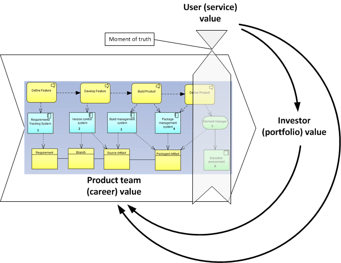

== Section II: Team

=== Section II introduction

*Scenario*
You are part of a tight-knit team. You’ve moved out of the garage into a more professionalized environment. You might not all be in the same room, but you have a single mission and a cohesive culture, and you don’t need a lot of overhead to get the job done.

Your startup has met with some success and you are now a team - still small enough to be fed by two pizzas, if people aren't that hungry. Even with a few new people comes the need to more clearly establish your product direction, so people are building the right thing. You're all in the same location, and can still communicate informally, but there is enough going on that you need a more organized approach to getting work done. Finally, this great thing you're building doesn't mean much if it's not running right and people can't get to it.

However, things are getting larger and more complex. You have a significant user base, and your founder is increasingly out meeting with users, customers and investors; she isn’t in the room with the product team as much any more… in fact, she just named someone to be “product owner” and what is that all about?

image::images/svcLifecycle.png[]

Remember in Chapter 1 we talked of the user's http://dm-academy.github.io/aitm/images/1.01-ITStack2.png[value experience], and also how services http://dm-academy.github.io/aitm/#_the_it_service_lifecycle[evolve over time in a lifecycle]?

There are two primary value experiences:

- The value the user derives from the service (e.g. account lookups, or a flawless navigational experience)
- The value the investor derives from monetizing the product, or comparable incentives (e.g. nonprofit missions)

Additionally, the product team derives career value. This becomes more of a factor later in the game. We will discuss this further in chapter 7 on organization, and Chapter 11 on architecture lifecycles & technical debt.

The product team receives feedback from both value experiences. The day to day interactions with the service (e.g. help desk and operations) are understood, and (typically on a more intermittent basis) the portfolio investor also feeds back the information to the product team (the boss's boss comes for a visit).

This is of course a simplified model, and in a large enterprise both the users and investors may have proxies (more on this to come).

The figure above is an architectural representation of the toolchain we started to develop in Section 1. The toolchain can be seen as part of a value chain that is delivering an IT service.

In this section, we will look at:

- How you are accepting and executing on feedback signals
- How the feedback relationship with your investors is evolving, in terms of your product direction
- How the feedback relationship with your users is evolving, in terms of both operational criteria and product direction

We will discuss work management, product management, shared mental models, visualization, and systems monitoring.

*Chapter 4: Product Management*

You (as the startup leader) are spending more time with investors and customers, and maintaining alignment around your original product vision is becoming more challenging as you are pulled in various directions. You need some means of keeping the momentum here. And the concept of "product management," you're finding, represents a rich set of ideas for managing your team's efforts at this stage of the game.

*Chapter 5: Work Management*

Even with a small team of 5 people (let alone 8 or 9), it's too easy for balls to get dropped as work moves between key contributors. You probably don't need a complex software-based process management tool yet, but you do need some way of managing work in process.

*Chapter 6: Operations Management*

Since Chapter 3, your application developers have been running your systems and even answering the occasional phone call from customers. You're big enough that you need a bit more specialization. You've got dedicated support staff answering the phone calls and you are finding that, even if you rotate operational responsibilities across developers, it is still a distinct kind of "interrupt-driven" work that is not compatible with heads-down, focused software development.
