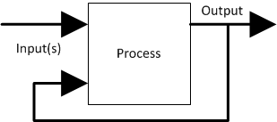
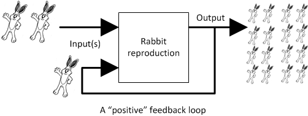
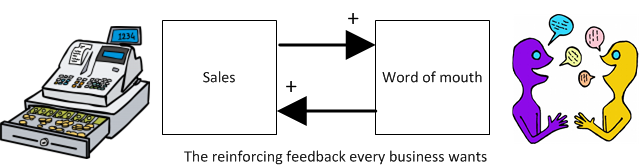

=== Special section: Systems thinking and feedback

[quote, Peter Senge,  The Fifth Discipline]
"The harder you push, the harder the system pushes back."

While the term "information systems (IS)" was widely replaced by "information technology (IT)" in the 1990s, do not be fooled. Enterprise IT is a complex sociotechnical system, that delivers the services to support a myriad of other complex sociotechnical systems.

Systems play by their own rules. Merriam-Webster defines a system as "a regularly interacting or interdependent group of items forming a unified whole". These interactions and relationships quickly take center stage as you move from individual work to team efforts. Consider that while a 2 member team only has 1 relationship to worry about, a 10 member team has 45, and a 100 person team has 4,950!

As the Senge quote implies, brute force does not scale well. This arises from the fact that our actions lead to outcomes, which in turn affect our future actions. This *feedback* often becomes amplified and re-amplified until an overload occurs, such as the horrible screeching of a microphone too close to a speaker that bears the same name. In the business world, these feedback loops can manifest themselves in rigid platforms, brittle applications, or even a toxic work culture that sabotages success.

A thorough discussion of systems theory is beyond the scope of this book. Many of the ideas that follow are underpinned and/or are informed by it. Obtaining a working knowledge of systems theory will not only enhance your understanding of this book, it can also be an essential tool for managing uncertainty in your future career, teams, and organizations.

Feedback is a loaded term. We hear terms like positive feedback, negative feedback, and associate it quickly with performance coaching and management discipline. That is not the sense of feedback in this book.

The definition of feedback as used in this book is based on engineering. There is considerable related theory in general engineering and especially control theory and the reader is encouraged to investigate some of these foundations if unfamiliar.

(***SDLC 3.0)

Here is the classic illustration of a feedback loop:

For example, we can consider “rabbit reproduction” as a process with a positive feedback loop:

The more rabbits, the faster they reproduce, and the more rabbits.

This is a “positive” feedback loop, although Mr. MacGregor the local gardener may not agree, given that they are eating all his cabbages!! This is why feedback experts prefer to call this “reinforcing” feedback, because there is not necessarily anything “positive” about it.

We can also consider feedback as the relationship between TWO processes:

image::images/processAB.png[]

In our rabbit example, what if Process B is fox reproduction, that is, the birth rate of foxes (who eat rabbits)?

image::images/rabbitfox.png[]

More rabbits equals more foxes (notice the “+” symbol on the line), because there are more rabbits to eat! But what does this do to the rabbits? It means LESS rabbits. Which, ultimately, means less foxes… and at some point, the populations balance. This is classic negative feedback. However, the local foxes don’t see it as negative (nor the local gardeners!)  That is why feedback experts prefer to call this “balancing” feedback.

What does this have to do with building IT systems?

First, at a technical level, reinforcing feedback can be a very bad thing in IT systems. In general, any process that is amplified without any balancing feedback will eventually consume itself and all its resources, just like rabbits will eat all the food available to them. So, if you write a process that recursively spawns itself, it will sooner or later exhaust all its local resources.
Balancing feedback, on the other hand, is critical to make sure you are “staying on track.” Balancing feedback in a business and IT context takes a wide variety of forms:
- The end users calling to tell you the “system is slow” (or down)
- The product owner or portfolio sponsor calling to tell you they are not satisfied with the system’s value

In short, we see these two basic kinds of feedback:
- Positive/Reinforcing, “do more of that”
- Negative/Balancing, “stop doing that,” “fix that”

Positive feedback: the special case investors want
At a business level, there is a special kind of positive feedback that defines the successful business:

This is reinforcing feedback and positive for most people involved: investors, customers, employees.

At some point, if the cycle continues, it will run into balancing feedback:

- Competition
- Market saturation
- Negative externalities (regulation, pollution, etc)

But those are the problems the business wants to have.

Finally, we should talk briefly about open loop versus closed loop systems.

Open loop systems have no regulation, no balancing feedback
Closed loop systems have some form of balancing feedback

A good example of an open loop system is the children’s game “pin the tail on the donkey.” In “pin the tail on the donkey,” a person has to execute a process while blindfolded, based on their memory of their location (and perhaps after being deliberately disoriented by spinning in circles). Since they are blindfolded, they have to move across the room and pin the tail without the ongoing corrective feedback of their eyes. (Perhaps they are getting feedback from their friends, but perhaps their friends are not reliable…)

https://www.flickr.com/photos/portland_mike/5445434245/[Photo Credit - mike krzeszak, Flickr, Creative Commons]

Without the blindfold, it would be a closed loop system. They would rise from their chair and through the ongoing feedback of their eyes to their central nervous system, would move towards the donkey and pin the tail in the correct location.
This may seem obvious, but the history of IT management over the past decades has been the struggle to overcome open-loop practices. A IT team that is designing and delivering without sufficient corrective feedback from its stakeholders is an ineffective, open-loop system. This section is about closing the loops. More on this in sections three and four.

Conjecture: "command and control culture" means open loop control. Agile culture also controls, but through closed loop.

Engineers of complex systems use feedback techniques extensively. Complex systems do not work without these.
