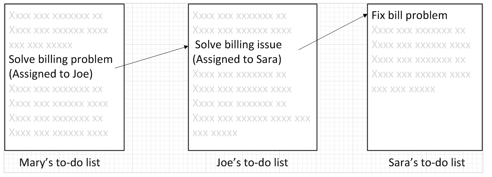

==== Why work management?

Work management may start with verbal requests, emails, even postal mail. The design process may result in a wide variety of deliverables that also initiate work activity. And as your product matures, the product itself generates both routine and non-routine work. Some of the work depends on other work getting done. Sometimes you do not realize this immediately. All of this needs to be tracked.

If you ask your colleague to do one thing, and she doesn’t have anything else to do, it’s likely that the two of you will remember. If you ask her to do four things over a few days, you *might* both still remember. But if you are asking for new things every day, it is likely that some things will get missed.

You each might start keeping your own “to do” list and this can handle a dozen or two dozen tasks.

Consider an example of three people, each with their own to do list:

In this situation, each person has their own “mental model” of what needs to be done, and their own tracking mechanism. We don’t know how the work is being transmitted: emails, phone calls, hallway conversations (”Say Sara, there is an issue with Customer X’s bill, can you please look into it?”)

But what happens when there are three of you? When you ask coworker B to do something and in order to complete it she needs something from coworkers C and D, whom you are also asking to complete tasks?

As an organization scales, this can easily start to become like the children's game of http://www.wikihow.com/Play-the-Telephone-Game[“telephone”]:

image::http://redeapp.com/images/blog/WordofMouth.jpg[]

At some point, you need to formalize your model of the work, how it is described, and how it flows. This is such a fundamental problem in human society that many different systems, tools, and processes have been developed over the centuries to address it.

Probably the most important is the shared task reference point. What does this mean? The “task” is reified (see definition) into a common artifact.

[quote, Wikipedia , https://en.wikipedia.org/wiki/Task_management]
Task management is the process of managing a task through its life cycle. It involves planning, testing, tracking and reporting. Task management can help either individuals achieve goals, or groups of individuals collaborate and share knowledge for the accomplishment of collective goal

For example, a “ticket” may be created. Or a “story.” At our current level of understanding, there is little difference between these concepts. The important thing they have in common is an independent existence. That is, Mary, Joe, and Sara might all change jobs, but the artifact persists independently of them. This can be called _reification_.

[quote, Wikpedia, https://en.wikipedia.org/wiki/Reification]
Reification generally refers to making something real, bringing something into being, or making something concrete.

A complex IT-based system is not needed! (Nor for that matter a complex process framework, such as ITIL. This author sees little value in using such frameworks at this stage of evolution.) A shared white board in a public location might be all that is needed. This gives the team a “shared mental model” of who is doing what.

image::images/2.05-commonList.png[]

The design of the task board above has some issues, however. After the team gets tired of erasing and rewriting the tasks and their current assignments, they might adopt something more like this:

image::images/2.05-basicKanban.png[]

The rectangles labeled “Task” are index cards or sticky notes. The board itself might be a white board, or a cork bulletin board with push pins. It doesn’t really matter. The important thing is that, at a glance, the entire team can see its flow of work and who is doing what.

This is usually called a “Kanban board” (from <<Anderson2010>>), although Scrum originator Sutherland calls it a "Scrum board". The board at its most basic is not specific to either methodology. (See the sidebar on Scrum and Kanban.)

The basic board is widely used because it is a powerful artifact. Behind its deceptive simplicity is considerable industrial experience and relevant theory from operations management and human factors <<Anderson2010>>. However, it has scalability limitations. What if the team is not all in the same room? We will cover this in Section 3.

===== Limiting work in process

At this time, we’ll foreshadow some material to be covered more in depth in Section 3. But even at this stage of our evolution, with just one co-located collaborative team, it’s important to consider work in progress and how to limit it. We’ll touch on the queuing theory in section 3. For now, some rules of thumb are advisable:

* Finish what you start, if you can, before starting anything else
* Infinitely long to-do lists (backlog) sap motivation. Consider limiting backlog as well as work in process.
* Visibility into work in progress is important for the collective mental model of the team
