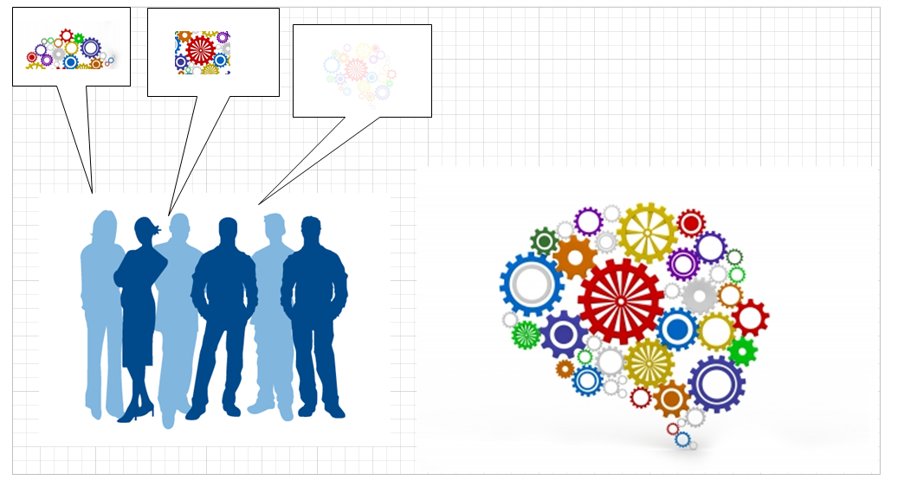

==== The shared mental model of the work to be done
As work flows through the system performing it, understanding its status is key to managing it.
One of the most important mechanisms for doing this is to simply define what is meant by “done.” The Agile Alliance http://guide.agilealliance.org/guide/definition-of-done.html#sthash.6rSCZMyU.dpuf[states]:

“The team agrees on, and displays prominently somewhere in the team room, a list of criteria which must be met before a product increment, often a user story, is considered "done". Failure to meet these criteria at the end of a sprint normally implies that the work should not be counted toward that sprint's velocity.”

This idea of defining “done” can be extended by the team to other concepts such as “blocked.” The important thing is that this is all part of the team’s shared mental model, and is best defined by the team and its customers. (However, governance and consistency concerns may arise if teams are too diverse in such definitions.)

Whether you choose Scrum, Kanban, or choose not to label your work management at all, the important thing is that you are creating a shared mental model of the work: its envisioned form and content, and your progress towards it.

===== Andon, and the Andon Cord

Another related concept from Lean is the idea of andon:

[quote, Wikipedia, https://en.wikipedia.org/wiki/Andon_(manufacturing)]

Andon (Japanese: アンドン or あんどん or 行灯) is a manufacturing term referring to a system to notify management, maintenance, and other workers of a quality or process problem. The centrepiece is a signboard incorporating signal lights to indicate which workstation has the problem. The alert can be activated manually by a worker using a pullcord or button, or may be activated automatically by the production equipment itself. The system may include a means to stop production so the issue can be corrected. Some modern alert systems incorporate audio alarms, text, or other displays.

The Andon Cord is a well known concept in Lean Manufacturing. It originated with Toyota, where line workers were empowered to stop the production line if any defective materials or assemblies were encountered. Instead of attempting to work with the defective input, the entire line would shut down and all concerned would establish what had happened and how to prevent it. The concept of andon cord concisely summarizes the Lean philosophy of employee responsibility for quality at all levels. <<Ohno1988>>

[quote, Taiichi Ohno]
Stopping the machine when there is trouble forces awareness on everyone. When the problem is clearly understood, improvement is possible. Expanding this thought, we establish a rule that even in a manually operated production line, the workers themselves should push the stop button to halt production if any abnormality appears.

This idea of a shared reference point, informing the shared mental model of the team, is essential.

This is why a shared kanban board, with its dimensionality, is more informative than a simple to-do list (e.g.  in a spreadsheet). The cards occupy two dimensional space and are  moved over time to signify activity, both powerful cues to the human visual processing system.

===== Visualization
Why are shared visual representations important? Depending on how you measure, between 40% to as much as 80% of the human cortex is devoted to visual processing, more than the other four senses combined. Visual representations are powerful communication mechanisms, well suited to our cognitive abilities.

Furthermore,  visual processing http://simplybrainy.com/wp-content/uploads/2011/01/2008-Int-Vis-Other-Senses-All-Illustrations.pdf[dominates mental activity], consuming more neurons than the other four senses combined <<Sells1957>>.

This is why Kanban boards located in the same room are so prevalent. They communicate and sustain the shared mental model of a human team. Similarly, monitoring tools for systems operation make use of various visual clues. Human visual orientation is also why Enterprise Architecture persists. People will always draw to communicate. (More on EA in Chapter 10.)

===== Definition of done
 [Shared mental model, consensus alignment]

 Thoughtworks writeup - BA has to agree with dev
https://t.co/2X92CFcKqU

 Importance of code reviews

===== Time and space shifting

 At some point your team will be faced with the problems of time and/or space shifting. People will be on different schedules, or in different locations, or both.
 There are two things we know about this. First, it leads to sub-optimal team communications and performance. Second, it is inevitable.

 The need for time and space shifting is one of the major drivers for more formalized IT systems. It is difficult to effectively use a physical Kanban board if people aren’t in the office. The outcome of the daily standup needs to be captured for the benefit of those who could not be there.

 However, acceptance of time and space shifting may lead to more of it, even when it is not absolutely required. A constant pressure and questioning is recommended, given the superior bandwidth of face to face communication.

 Work management in practice has divided between development and operations toolsets. However, DevOps and Kanban are forcing a reconsideration and consolidation. Historically, here are some of the major tools and channels through which tasks and work are managed on both sides:

Development
Operations
Requirements log
Issue/risk/action item log
Defect tracker
Agile backlogs (user stories)
Service desk ticketing system

Kanban is a special case, as it can mean both a manual as well as an automated system. Obviously, for time and space shifting, we need an automated system.

All of these systems have common characteristics. All can (or should) be able to:

Register a new task
Describe the work to be done (development or break/fix/remediate)
Represent the current status of the work
Track who is currently accountable for it (individual and/or team)
Indicate the priority of the work, at least in terms of a simple categorization such as high/medium/low

More advanced systems may also be able to:

Link one unit of work to another (either as parent/child or peer to peer)
Track the effort spent on the work
Prioritize and order work
Track the referral or escalation trail of the work, if it is routed to various parties
Link to communication channels such as conference bridges and paging systems

The first system you may find yourself acquiring along these lines is a help desk system. 
