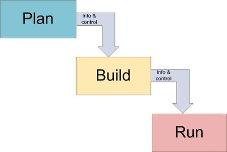
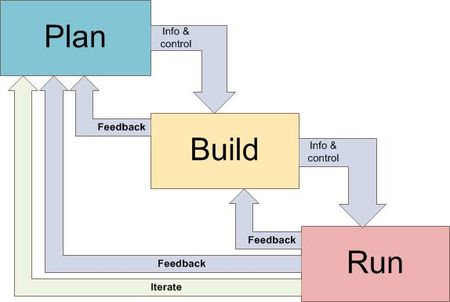
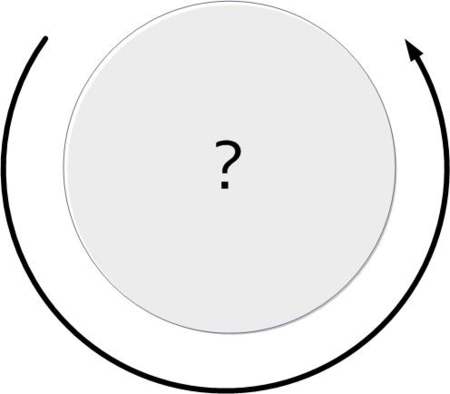
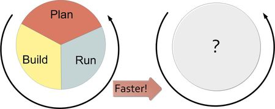
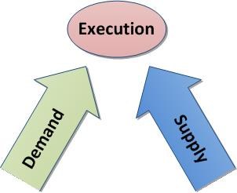
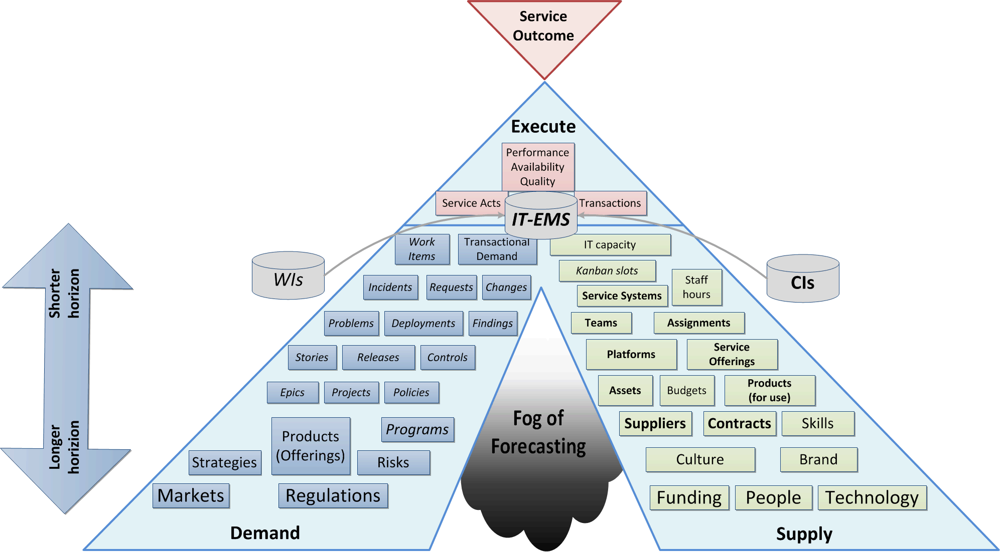
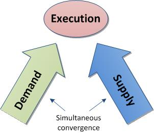

==== From Plan, Build, Run to Demand, Supply, Execute

ifdef::instructor-ed[]
****
_Instructor's note_
This is more advanced, speculative material and its presence in the book is in question. Thoughts?

****
endif::instructor-ed[]

Originally published at http://www.lean4it.com.

Let's talk mental models. The biggest one we have in IT.

In the broad system of IT management, we often hear of three stages, “Plan/Build/Run.” We make plans for a new IT system, we construct it, and we run it.

IT organizations often structure themselves and communicate to a large degree along these lines. I’ve used them myself in any number of writings. However, I have come to question the usefulness of “Plan-Build-Run” (which I’ll abbreviate PBR) as a mental model for understanding and guiding IT management.

While it pervades IT management thinking, and can clearly be seen in the structures of frameworks like ITIL and COBIT, PBR is ill suited for the demands of 21st century IT management. I believe it is fundamentally a statement of waterfall thinking.

The major structures of Plan, Build, Run in my experience are framed as discrete, mutually exclusive states, with interfaces (information exchanges and control signalling) in between them. The model reflects IT's history of project-centric management, in which large batches of work are moved across those three phases. Since each large batch is fragile and the state transitions are risky and high ceremony, there is also concern for insulating each batch from outside "interference."

This results in systems being built in isolation from one another and without openness to feedback from later stages or other batches of work. Thus we also lose opportunities to learn from mistakes, leverage shared services and ensure architectural consistency across the IT estate.

Continuous improvement cannot be an afterthought. Yet when PBR is the fundamental model, continuous improvement activities are run as spreadsheet-driven initiatives, poorly resourced and in constant contention with the "real" work of Plan, Build, Run. (The classic example is the massive spreadsheet of Audit findings which becomes a political football in The Phoenix Project. Note that I advocate for a broad definition of continuous improvement.)

I'd suggest these kinds of approaches are essentially "inspecting quality in" and therefore not what Deming would have wanted. ("We cannot rely on mass inspection to improve quality.")

Finally, is PBR the reflection of your organization's communication structures? Conway's Law would suggest that PBR is the reflection of embedded organizational communications structures - dating I would argue from the time of Frederick Taylor and the worst excesses of hierarchical, command and control management philosophy.

This is probably the most pernicious consequence - specialists in planning, building, and running, all trying to optimize their worlds, with the "planners" at the top, the "builders" in the middle and the "runners" taking orders at the bottom. The trouble is that this idealized hierarchical model is utterly ineffective.

It certainly doesn't reflect military principles, often caricatured as "command and control" (see Reinertsen's discussion of military doctrine on decentralized control in Principles of Product Development Flow). Effective product and software development has also long eschewed it; much evidence demonstrates the futility of relying on "expert" opinion and planning in truly complex domains. (See this excellent discussion from a venture capitalist at Y-Combinator.)

Concepts like Lean Startup experimentation, generalizing specialists, and empowered 2-pizza product teams do not seem to reflect a PBR model. In an Agile world, the work boundaries blur across these phases. Those who plan, also build and run, and the primary planning of worth is planning the next experiment for testing.

Some will say this is unfair. One hears various responses:

. Iterate (with increasing speed), either the whole cycle or subsets
. Insert feedback loops.
. See the stages as overlapping

My question is, even with these enhancements, is this mental model the best foundation?

Let's look at the "fast PBR" response a bit more. Agile and Lean Startup arguably would call for many cycles of PBR, with each cycle constituting a test, or a story, or some other small grained delivery. Increasing the speed of this cycle is a widespread theme in discussions of Agile, DevOps, Continuous Delivery, and the rest.

Now if you are going to "spin it faster," a circular illustration would seem more appropriate:

image::images/2.05-PBR3.png[]

But what happens when we spin this fast? Remember your elementary physics of color? It all blends together, just as we see boundaries blurring today between Dev and Ops:

And when the phases blur, what emerges? That's the question...

Now, I should say... IF YOU ARE LUCKY it all blends together. This assumes that you have somehow overcome the transactional overhead with those state transitions, information exchanges, and organizational handoffs, as you attempt to speed them up.

What if a given state change isn't needed for a particular cycle? You wind up fighting a system hard-wired to protect the role of each activity (and all their sub-activities). You wind up asking to "tailor" methodologies, to exempt your work from activities that are clearly non-value-add, and so forth.

Accelerating PBR isn't sufficient; it is still a sequential process with discrete steps and implications of information and control flow between each, reinforcing a dysfunctional division of organizational responsibilities. Can you get up to speed if people are trying to "optimize" the "plan," "build," or "run" phase independently? How can you optimize one third of a wheel?

I ask: is PBR how work really gets done? How value gets delivered? If it is how work gets done in your organization, how effective is it? If you are fortunate to be working in an organization using Agile approaches, can you in truth characterize them as simply "fast PBR"? Does this mental model fundamentally inform your daily experience?

I think "spin it faster" is an insufficient response. A continuous flow is needed.

When the delivery cycle accelerates and the boundaries begin to break down between Plan/Build/Run, what emerges? First, one starts to see that work has common characteristics across Plan, Build, and Run.

We might observe that a common workflow or kanban system can be utilized across planning, building, and running activities. We might also notice that smaller teams require people to cover more responsibilities ("generalizing specialists"), especially when the boundaries between planning, building, and running are blurring.

We see that distinctions between "incidents," "problems," and "user stories" become increasingly arbitrary when it is the same team that needs to respond to any. Certainly, there are differences between proactive and reactive work, but as forms of demand both compete for the same supply of resources, and when tracked in different systems cause overburden, uncoordinated effort, and bad multi-tasking.

We also see that continuous improvement activities (which are kind of a middle ground between proactive and reactive) are "just more demand" and also compete for resources with purely proactive and reactive demand.

As we consider all this, the question arises: What, in fact, *is* the IT work, in the general case? The irrevocable meeting of demand with supply, with intent to generate value. Same in IT as in the rest of industry.

These are not novel concepts. Supply and demand stem from fundamental economics and operational management. I also want to add Execution, which is a widely accepted industrial term that covers the ideally optimal translation of supply and demand into value, via detailed resource and capacity management, dispatching, process monitoring, and performance analysis.

As an aside:  I am not in favor of naive approaches to equating IT delivery with manufacturing. But, as Eric says in The Phoenix Project,

“You think IT Operations is rocket-science compared to manufacturing. What absolute baloney...From where I’m sitting, the people in this [manufacturing facility] have been far more creative and courageous than anything I’ve seen come from you IT guys so far.”

Demand management starts from the premise that regardless of the size of the implied work, all demand on IT resources should be understood in a unified manner (as popularized in the Phoenix Project). From a new mobile device to the day’s incident reports and change requests, to a strategic initiative implying a $10 million projects, it’s all “just demand.”

Different techniques come into play depending on planning horizon, value, scope, risk, and other parameters - more on this to come. Some demand signals contain others, or have complex interdependencies - e.g. an Incident that generates a Change, or a Project that contains multiple Service Requests. But if we understand demand as a unified entity we position ourselves to provide much better service to our stakeholders while at the same time giving our IT staff a saner existence.

Supply represents the fundamentals of “atoms, bits, and cells”: hardware, software, and people, under various ownership and sourcing models (e.g. Cloud). The CIO is responsible for increasingly complex IT sourcing and contract management strategies, and understanding one’s baseline supply is key to evaluating new supplier options for technology products and people with the skills to exploit them.

Finally, next generation IT execution management starts with demand and supply generally, and looks for optimal (or at least satisfactory) means of delivering value. “Projects” and “tickets” are seen as part of a unified management structure, not as the respective domains of "builders" and "runners." The availability of resources is always considered before releasing work, and ongoing scenario-based forecasting is employed to identify emergent constraints. And time tracking is completely transparent, relying on intelligent automation to determine what people have actually been working on. No Friday afternoon time reconstruction!

So, Demand - Supply - Execution. Here is a graphical representation emphasizing the continuous nature of this mental model:

Well established IT process areas such as project, release, incident, change, and so forth are important and will continue, but I think a DSE approach could counteract the tendency to form functional silos around each -- or around a particular PBR cycle and its inputs and outputs -- and instead promote a whole-systems approach to IT management.

To summarize Keynes, “even the most practical man of affairs is usually in the thrall of the ideas of some long-dead economist.” Basic conceptual structures like plan/build/run and demand/supply/execute have consequences. When widely adopted to the point where they are just “common sense,” they define our social relationships, operational thinking, problem solving, and more. And thus, while we may think that “plan/build/run” is some form of IT natural law, it is a human construct that can be adapted or even discarded if we no longer find it useful. I think it's time.

So, here is my first graphical representation of the Demand/Supply/Execute model for IT service organizations.

The intent of this model is to provide an alternative to Plan/Build/Run and its sequential, waterfall, and Taylorist connotations. It is also intended to support modern Agile methods and philosophy which emphasize iteration, fast feedback, flow, and especially (per Don Reinertsen) managing queues, limiting Work in Progress and supporting small batch sizes.

Bottom to top, this diagram tells a story of demand and supply as they progress through increasingly refined understandings to the very specific execution of work and delivery of value.

We have markets and regulations, which define and constrain the potential demand for an IT-centric product. Markets are met with strategies and product offerings, which lead to programs of work, projects, and platform decisions. These in turn lead to identifying user stories, writing software, configuring platforms, and executing changes, service requests and work tasks.

This is NOT a methodology. These constructs can be as light or heavyweight as needed and value scenarios can originate at any point; there is no contradiction with Lean Startup and Agile principles of architectural iterations and minimum viable products. The existence of "Project" as a concept in the model does not mean that all work happens via Projects.

That finer and finer grained demand stream parallels a finer and finer grained supply stream. Large blocks of capital are translated into strategic technology choices and vendor relationships and investments in skilled people. More detailed budgets and planning culminate ultimately in the availability of people, hardware, and software for given assignments, e.g, an empty slot on a Kanban board.

Again, the journey can start anywhere, with a large block of traditionally managed programmatic capital or a small round of seed funding translated directly into a two-pizza team with maximum autonomy.

Ultimately the deployed IT service system is available for fulfilling transactional service demand which can be measured in terms of quality, availability and performance. When demand and supply irrevocably combine, that is my definition of execution.

I had a number of requirements driving this model.

First, it needed to be a graphical representation that could not be read as a sequence. That is the flaw of any model which is too easily reduced to a linear format, such as Plan/Build/Run. Circular models are a popular alternative, but repeating a sequence is not enough.

My primary reservation about value networks is their lack of a goal. What is to be done? How do I develop an action plan without some sense of the network’s purpose? (More here.) But the value network critique of naive sequencing is right on.

While the names “Plan/Build/Run” and “Demand/Supply/Execute” are similar in format, they are very different structurally. It is not usually possible to fully inventory demand and only THEN turn to considerations of supply. Forecasting is inherent in the relationship between the two, which both must operate continuously and simultaneously.

So, if we are trying to shift the IT mental mental models from sequential to network my proposal is that we start with the simplest non-sequential, non-linear concept, a vertex, two simultaneous vectors converging on a point.

Because the inverted “V” approximates human legs, it reinforces the feeling of simultaneous action. Both legs must exert effort simultaneously.

The gap between the legs of the V is filled with the "Fog of Forecasting."

image::images/2.05-DSE3.gif[]

With the lower level, larger grained abstractions it is more difficult to understand demand and supply, especially when product development (e.g. novel software engineering) is involved. As demand and supply converge to the point of execution, a finer and finer grained awareness is created of the impending work and whether it is likely to be successful - that is, if demand will effectively and efficiently be paired with supply. (Notice how the fog lifts as you get closer to actual execution.)

We only start to really get a feel for how execution is going to work when we get down to team and individual level assignments across all queues and ultimately actual Kanban slots or their equivalent (e.g. assigned and accepted work orders).

Turning to the choices of terms - the words inhabiting each leg (Asset, Release, Strategy, Team, etc):

Most of the nouns are things that may be found in various IT management systems (Incidents, Assets, etc), or at least deliverables & leadership conversations (Strategies, Programs). Roughly speaking, they go from larger grained and more abstract at the bottom, to smaller grained and more specific at the top.

Governance, Risk and Compliance (GRC) is included – one thing I appreciated about the Phoenix Project is that GRC is seen itself as a form of demand. Laws, regulations, and risks translate into policies, controls, and ultimately audit findings to be remediated, and all of this is also demand.

As noted above, there is still a risk that each leg will receive too sequential a reading. A value scenario can start anywhere. There is NO methodology proposed or assumed.  As  elsewhere, the framework simply represents frequently used IT terms, including some of my explorations of service semantics.

This picture is not overly concerned with functional boundaries (legal and/or internal). These can appear in many ways. The primary boundary is between the service act vertex (inside-out) and the service outcome vertex (outside-in). But additional org boundaries might be found between demand side and supply side functions (IT Demand Management vs. Asset Management), and/or between different abstraction levels (Project Management vs. Incident Management).

Finally, this is an IT-centric representation. The framwork might be more broadly applicable to other domains, but I will leave that to others for now.

In closing: I think this mental model is a more accurate reflection of IT practice as it is evolving. It avoids sequential, linear and waterfall thinking as well as command and control Taylorism. It accomodates well known ITSM functional concepts, but aligned along a different fundamental structure, a structure better aligned with economic principles.
