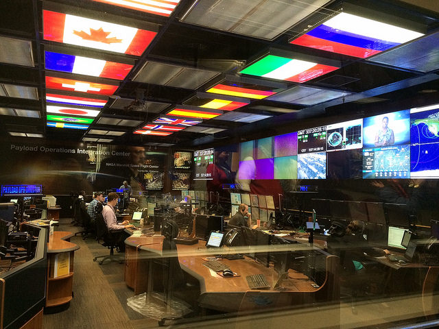
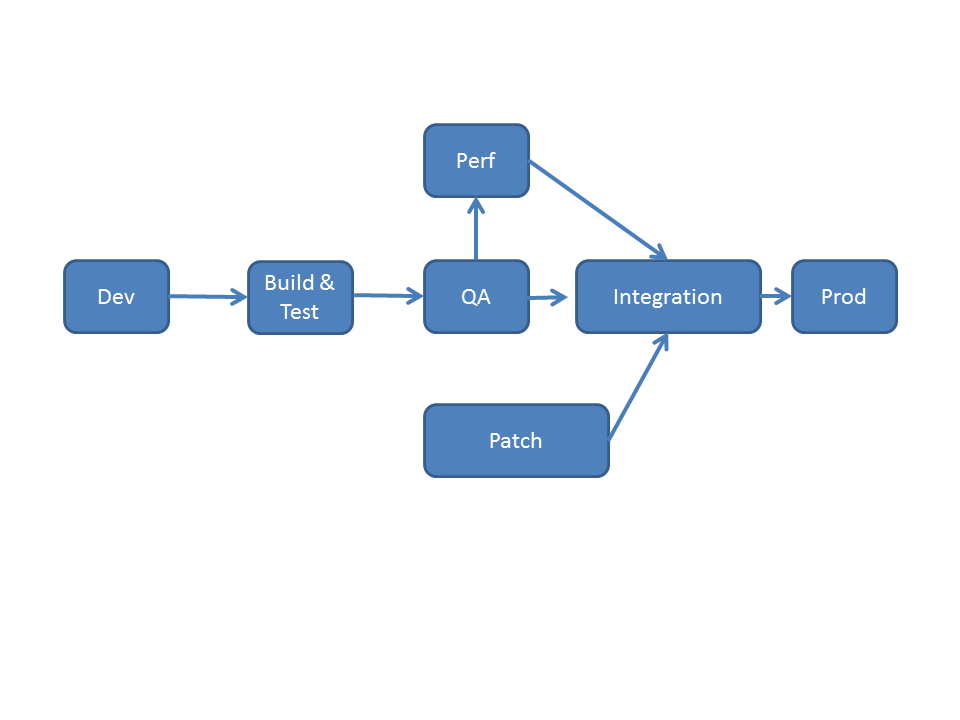

==== Introducing operations management

_NASA Payload Operations Integration Center_

_Photo credit https://www.flickr.com/photos/nasamarshall/15330580364, non-commercial_

What do we mean by operations? Operations management is a broad topic in management theory, with whole programs dedicated to it.

We started to run into this in chapter 5, as we examined the topic of “work management” - in traditional operations management, the question of work is primary. However, in IT, “operations” tends to have a more technical meaning, being focused on the immediate questions of systems integrity, availability and performance, and feedback from the user community (i.e., the service or help desk).

Operations often can mean, “everything but development” in an IT context. When merged with Development into “DevOps,” one gets IT Product Management with an Agile twist.

IMPORTANT: In a digitally transformed enterprise, Operations is part of the Product.

Consider the following various definitions of “operations” in an IT context. Some are relevant to our “two pizza team” scenario, some might be more applicable to larger environments:

* Keeping track of an IT product’s availability (is the Web site working?), and troubleshooting if it goes down (e.g. by rebooting it).
* Answering phone calls from users requiring support. They may be calling because a system or service they need is malfunctioning. They may also be calling because they do not understand how to use the system for the value experience they have been led to expect from it.
* Physically traveling to a remote site to evaluate and if necessary update or fix IT hardware and/or software.
* Performing routine work, such as installing hardware, granting access, or running or testing backups. Such routine work may be scheduled, or it may be on request (e.g. ticketed).
* Ensuring security protocols are followed, e.g. access controls.

As above, the primary thing that operations does NOT do is develop new systems functionality. However, new functionality usually has operational impacts.

In manufacturing and other traditional industries, product development was a minority of work, while operations was where the bulk of work happened. However, when an operational task involving information becomes repetitive and risk-free, it can be automated with a computer. This continuous cycle of innovation and commoditization has driven closer and closer ties between “development” and “operations.” It also has driven confusion around exactly what is meant by “operations.”

In many organizations, there is an “Infrastructure and Operations” function. Pay close attention to the naming. A matrix may help, because we have two dimensions to consider here.

[cols="3*", options="header"]
|====
||Development phase
|Operations phase
|Application layer
|Application developers. Handle demand, proactive and reactive, from product and operations.
|Help desk. Application support and maintenance (provisioning, fixes not requiring software development).
|Infrastructure layer
|Engineering team. Infrastructure platform engineering and development (design and build typically of externally sourced products)
|Operations center. Operational support, including monitoring system status. May monitor both infrastructure and application layers.
|====

===== A day in the life
A duty-oriented, physical presence in the service of executing particular tasks is an unchanging aspect of operational responsibility. The tasks may support broader goals and strategies, and need to be systematically discharged.

What do we mean by this?

* Systems operators sitting in 24x7 operations centers, monitoring system status and responding to alerts
* Field technicians executing work orders (install a new PC, fix a printer, service a cell tower antenna)
* Help desk representatives responding to user inquiries
* Developers and engineers wearing pagers on a rotating basis to respond to systems outages referred to them by the operations center.

Limoncelli, Strata, and Hogan, in their excellent _Cloud Systems Administration_, emphasize the role of the "oncall" and "onduty" staff in the service of operations. Oncall staff have a primary responsibility of emergency response, and the term oncall refers to their continuous availability, even if they are not otherwise working (e.g., they are expected to pick up phone calls and pages at home and dial into emergency communications channels). Onduty staff

* Emergency vs non-emergency - it's all a matter of expectations
** A brief look at terminology (Incident, Problem, Issue, Defect, Request)

At the end of the day, we need to remember that operational work is just one form of work. In the classic model, developers built systems and "threw them over the wall" to operations. Each side had specialized processes and technology supporting their particular concerns.

Now, companies undergoing digital transformation are experimenting with many different models; as we will see in Section III, up to and including the complete merging of Development and Operations-oriented skills under common product management.

===== Environments and the fierce god of "Production"

[quote, unknown]
“Don’t mess with that server! It’s … Production!!!”

“Production” is a term that new IT recruits rapidly learn has forbidding connotations. To be “in production” means that the broader enterprise value stream is directly dependent on that asset. Breakage or mishandling will result in questions and concerns from powerful forces. Be Very Scared.

How do things get to be “in production”? What do we mean by that?

First, let’s get back to our fundamental principle that there is an IT system delivering some "moment of truth" to someone. This system can be of any scale, but fundamentally we are able to conceive of it having a “state.” (See http::/url[State, Configuration, and Discovery].)

When we want to change the behavior of this system, we are cautious. We reproduce the system at varying levels of fidelity and experiment with potential changes. This is called development.

When we start to gain confidence in our experiments, we increase the fidelity and also start to communicate more widely that we are contemplating a change to the state of the system. We may increase the fidelity along a set of traditional names:


* Development
* Testing
* QA
* Integration
* Performance Testing

The final state, where value is realized, is “Production.”

There is nothing sacred about the environments listed above. You will see many variations, especially at scale.

The idea that one sequentially moves (”promotes”) new system functionality through a series of states to gain confidence before finally changing the state of the production system is historically well established. However, the production state is notoriously difficult to reproduce fully, especially in highly distributed environments. Therefore there is always risk in changing the state of the production system. Mitigating strategies include:

* Extensive automated test harnesses that can quickly determine if system behavior has been unfavorably altered.
* Elaborating lower environments with strategies such as service virtualization to make them appear more like production
* Hardening services against their own failure in production, or the failure of services on which they depend
* Reducing the size (and therefore complexity and risk) of changes to production (a key DevOps strategy)
* Ensuring that changes to the production system can be easily and automatically reversed
* Using policy-aware infrastructure management tools

Another important development in environmental approaches is A/B testing. In this approach, the “production” environment is segregated into two or more discrete states, with different features or behaviors exposed to users in order to assess their reactions (see sidebar).

===== Do we need environments at all?
The author has heard it recommended that the term “environment” be eliminated, as it tends to result in turf wars and empire building, and potentially the waste of fixed assets (see chapter 8). Performance environments are particularly in question.

Instead, in a dynamic infrastructure environment (private or public), one simply defines the kind of test one wants to perform and provisions that capacity on-demand.

****
*Testing in Production?*

It used to be that the concept of “testing in production” was frowned upon. Now, with these mitigating strategies, and the recognition that complex systems cannot ever be fully reproduced, there is more tolerance for the idea.

But with older systems that may lack automated testing, incremental deployment, or easy rollback, it is strongly recommended to retain existing promotion strategies, as these are battle-tested and known to reduce risk. Often, their cycle time can be decreased.
****

===== “Development is production”

On the flip side, development systems must never be treated casually.

* The development pipeline itself (Chapter 3, figure X) represents a significant operational commitment.
* The failure of a source code repository, if not backed up, could wipe out a company (see the Code Spaces sidebar in Chapter 2).
* The failure of a build server or package repository could be almost as bad.
* In the digital economy, dozens or hundreds of developers out of work represents a severe operational and financial setback, even if the nominal “production” systems continue to function.

It’s therefore important to treat “development” platforms with the same care as production systems. This requires nuanced approaches: with infrastructure as code, particular virtual machines or containers may represent experiments, expected to fail often and be quickly rebuilt. No need for burdensome change processes when VM base images and containers are being set up and torn down hundreds of times each day!

But the platforms supporting the instantiation and teardown of those VMs are production platforms, supporting the business of new systems development.
