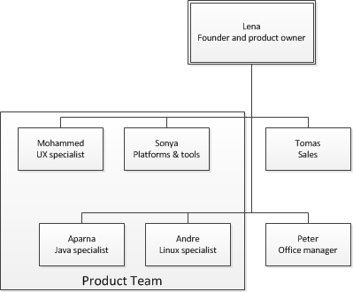
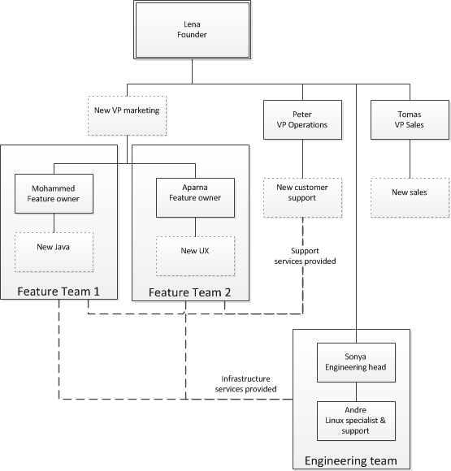
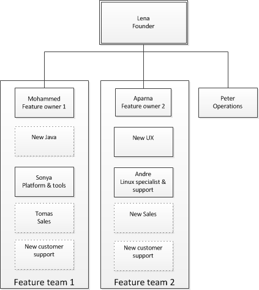
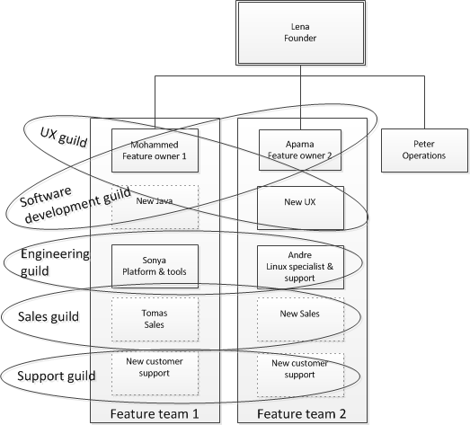

==== Organizational transition and the Spotify model

[quote, Furr & Ahlstrom, Nail It then Scale It]
Everyone in a startup wears many different hats. The first step in scaling your business is to list all the different hats you and your team members are wearing.

Perhaps your organizational form at the end of Section 2 looks like this:

You have the following personnel:

* Lena, the visionary and product owner, who had the idea for the startup. Lena retains the overall vision for the product and is therefore the Chief Marketing Officer as well as CEO.

* Mohammed, the user experience specialist
* Aparna, the Java software engineer
* Sonya, who has a broad scope of platforms and tools, including the development pipeline, source control, and the product’s NoSQL database
* Tomas, the sales lead.
* Peter, the office manager, who is responsible for a range of operational, financial, and lightweight HR duties.

Because of your success, Lena needs to go from one team to two. She is cautious about this transition,  has heard that there are a few different ways in which this can be done, and the decisions may have long term consequences!

Let’s assume you are going to break the product into two feature teams. One will focus on the existing market and the other will develop a new major feature for a new, distinct set of user value propositions.

In order to do this, you are going to bring in a new UX specialist, a new Java programmer, a new sales person, and someone to field customer support calls. Lena also intends to step back a bit from direct product ownership, so a new Chief Marketing Officer comes in. She talks with an organizational consultant and proposes the following new structure:

*Proposed structure #1*

[quote, Seth Godin, http://www.ehow.com/info_8088140_cons-combining-marketing-sales.html]
What’s the difference between Sales and Marketing? Marketing tells a story that spreads. Sales overcomes the natural resistance to say yes.

This may seem reasonable. Everyone agreed that there is no need to add more people to help Sonya and Andre; they can support both feature teams. Obviously, the new sales person comes in under Tomas.
Because Peter was the one receiving all the calls, and in the interest of giving him a clear career path, it was determined that the first product support person would come in under him, in what was anticipated to become a dedicated help desk/call center.

It was perceived that the engineering team would likely be receiving various requests and so a dotted line appears on the organization chart, indicating a service relationship. The new support person under Peter would also be shared across both teams, and their needed to be some means of communicating support requests to the feature teams when their support was needed. There was some question as to how the office Kanban boards might be reconfigured to support these relationships. Peter and Sonya, after some online research, started to become interested in something called ITIL.

But before that discussion continued, Lena retained another consultant as a cross-check. This consultant had worked with many Silicon Valley startups and had a very different opinion. This consultant was inspired by the https://dl.dropboxusercontent.com/u/1018963/Articles/SpotifyScaling.pdf[“Spotify model”] and proposed the following scaled-down version of it:

*Proposed structure #2*

The consultant also added something called “guilds” to the model:

The “guilds” are not formal reporting mechanisms, but rather a way for people doing similar work to share experiences, best practices, and so forth. Each tribe has a designated lead:

* Tomas leads the Sales guild
* Mohammed leads the UX guild
* Aparna leads the Software Development guild
* Sonya leads the Engineering guild
* TBD leads the support guild

The idea would be that the guilds would meet regularly (perhaps bi-weekly) and would have their own forums on the company’s social media channels. The head of each guild would meet with Lena monthly to discuss issues and concerns, and would have a direct channel of communication to her as needed for more time sensitive matters.

NOTE: The strict Spotify model calls for "tribes" that work on products and features, with "chapters" within each tribe for the common interests. The chapters in turn meet as "guilds" across the "tribes." The model presented here is scaled down and omits the chapter concept in the interest of simplicity, as there would be "chapters" of one. 

These two organizational structures were very different and were extensively discussed in the company (Lena preferring a   transparent, open decision making process.) The following arguments pro and con were noted:

[cols="3*", options="header"]
|====
||Pro|Con
|Option 1|
Groups specialists together, so they can share knowledge and become excellent at what they do. +
 +
Perceived to be more scalable, with the infrastructure and support teams loosely coupled to the product teams, and the establishment of the company’s first true support and shared services processes.
|Concern that the new process approach would lead to delays and finger-pointing.  +
 +
 Concern that the engineering specialist team in particular would start to lose focus on customer needs. +
 +
 More expensive, with a new VP of marketing.
|Option 2
|Groups product teams together and assigns each their own engineering and support resources, so they can most effectively understand the customer needs as a team and organize themselves to meet those needs. +
 +
Less expensive, substituting a new customer support person instead of a VP.

|Specialists are not working together and exchanging key knowledge and experience daily (the guilds meet at most weekly).  +
 +
 Concern that engineering standards might become fragmented and weakened if the product teams went in different directions. +
  +
Concern that Feature Team 2 did not need a support person immediately. +
 +
Concern that Peter no longer had a clear career path as VP of Operations.
|====

One fact everyone agreed on was that Sonya had to do more Linux and Andre has to learn some NoSQL and other platform technology. But this fact was not put into the matrix as there was not agreement as to whether this was a pro or a con. On one hand, it did seem a bit wasteful, but it was also recognized as a good thing in terms of cross training and deepening the bench. Sonya also felt that a Data guild would eventually be needed.

Everyone agreed that the engineering guild in particular would need to be a very strong guild, to ensure consistency of approaches around key disciplines like source control, security, platform choices, build pipeline, and so forth. The other guilds could be a bit lighter weight, but the engineering guild leader could set binding technical policies across the product teams if need be (the expectation was that this would not be done lightly). It was recognized that eventually a distinct operations & engineering team might still be necessary, but probably not until another round of scaling, and that that team, per the Spotify model, would be more focused on setting up self-service tools for the product teams, and would avoid ticketed work as much as possible.

Another “neither pro nor con” but important was that the second option eliminated the new VP layer. Establishing an executive layer might still happen later, the consultant suggested, but it was premature to do so now.

After further discussion and benchmarking with other startups, the second option was chosen. The new support person for Feature Team 2 would be able to be hired without urgency, allowing time for a high quality search.

This hypothetical case illustrates many of the themes we will explore throughout the rest of this chapter:

* Traditional functional vs product-centric model
* Influence of Spotify approach
*
