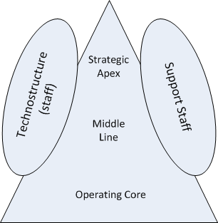

==== Organizational theory

[quote, Henry Mintzberg, Structure in Fives]

Five coordinating mechanisms seem to explain the fundamental ways in which organizations coordinate their work: mutual adjustment, direct supervision, standardization of work processes, standardization of work outputs, and standardization of worker skills. +
 +
These should be considered the most basic elements of structure, the glue that holds organizations together…As organizational work becomes more complicated,  the favored means of coordination seems to shift from mutual adjustment to direct supervision to standardization, preferably of work processes, otherwise of outputs, or else of skills, *finally reverting back to mutual adjustment*. (emphasis added)

As mentioned at the outset of this chapter, there is much research and thought available on the question of how to organize an enterprise.

One useful model for understanding the problems of organizational structure is the Five Forces model of Henry Mintzberg  <<Mintzberg1983>>. While much organization theory (even recent work) is presented as a simple, sequential model, the Mintzberg approach is more sophisticated.

In simple, sequential models, organizations are presented as evolving from less good to more good types. Such models might propose a simplistic, bad-better-best sequence such as:

Type 1 Simple, authoritarian and fear-based

Type 2 Strictly hierarchical and complex

Type 3 Divisionally decentralized

Type 4 Matrixed and process-driven

Type 5 Evolutionary/next-generation

(The above sequence is a synthesis of various industry sources which are deliberately left unidentified, to protect the guilty.)

However, Mintzberg points out that different industry sectors and business types result in different kinds of organizational forms, and that certain tendencies (“pulls”) are evident which are not in and of themselves either good or bad.

Factors like line/staff interactions and lateral linkages also complicate the picture.
After extensive review and summarization of peer-reviewed research, Mintzberg developed the following models of corporate structure.

First, the question of structure is at an equivalent level with various other internal concerns:

* Strategy
* Structure
* Human Resource Management
* Reward Systems
* Business Processes & Lateral Links

image::images/3.07-HM-star.png[]

Adapted from <<Mintzberg1983>>

Within the particular domain of structure, Mintzberg identified five major parts existing in most organizations:

Adapted from <<Mintzberg1983>>

The five major areas are:

* Strategic Apex
* Middle Line
* Operating Core
* Technostructure
* Support Staff

Definitions and examples for business and IT:

[cols="4*", options="header"]
|====
|Area
|Definition
|Mainstream example
|IT example
|Strategic Apex
|The owners and their executive representatives
|Board of directors, CEO
|CIO & direct reports
|Middle Line
|Those who manage the Operating Core
|Sales executive, operations manager
|Product/solution manager, network manager, project manager
|Operating Core
|The people who “produce the products and render the services.”
|Line worker, market analyst
|Software developer, infrastructure engineer, systems operator
|Technostructure
|Those who standardize the work of the Operating Core and Middle Line, interpreting the desires of the Strategic Apex
|Strategic planning, quality assurance
|Enterprise architecture, IT Service Management capability, Project Management Office
|Support staff
|Those who enable the work of the line and other staff.
|Corporate legal, human resources, purchasing, corporate finance
|IT Asset Management, IT Vendor Management
|====

Mintzberg further developed his theory by proposing that each of these five areas exerted a characteristic “pull” on the organization:

image::images/3.07-five-pulls.png[]
Adapted from <<Mintzberg1983>>

Definitions and examples for business and IT:

[cols="4*", options="header"]
|====
|Pull
|Definition
|Mainstream example
|IT example
|To Centralize (Strategic Apex)
|Tendency to control all decision making
|CEO presiding over functional executives (Sales, Marketing, Finance, Operations, IT)
|CIO presiding over activity-centric development, engineering/operations, security, architecture silos, very project and ticketing driven
|To Balkanize (Middle Line)
|Tendency to pull power from both top and bottom, ultimately resulting in divisionalized form
|Divisionalized corporation or more granular product/LOB-centric organization.
|Dedicated product and infrastructure organizations by line.
|To Professionalize (Operating Core)
|Tendency to minimize control of administrators and technostructure, seeking independence through increasing sophistication of skills and tacit understandings.
|Machine operators seeking to become engineers.
|Developers seeking to become software engineers or solutions architects. Desire for certification.
|To Standardize (Technostructure)
|Tendency to make work consistent. Directly opposed to Operating Core’s desire to professionalize.
|Human Resources standardizing hiring processes.  CFO Office standardizing travel policies.
|IT Service Managers standardizing ITIL processes. Project Management Offices standardizing project governance. Architects standardizing approved products.
|To Collaborate (Support staff)
Tendency to seek high-touch interactions
|Research and Development teams. Agile IT teams seeking to get closer to business partners
|IT operations teams assigning dedicated engineers to IT product teams (DevOps).
|====
