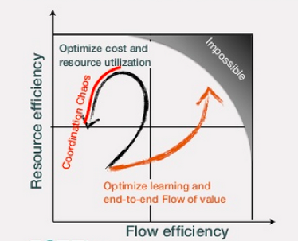
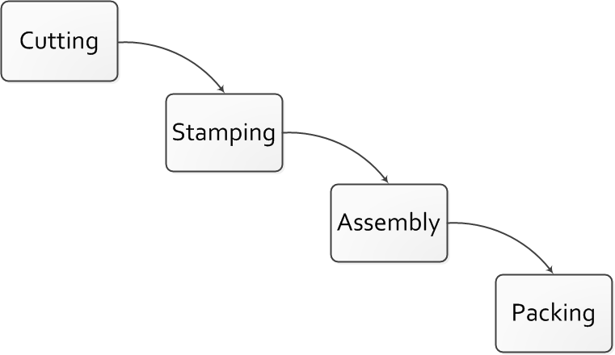
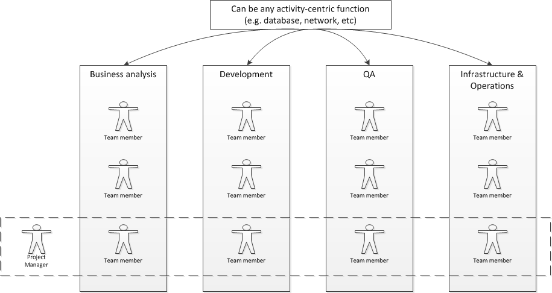
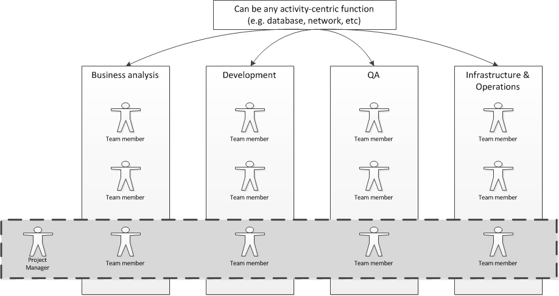
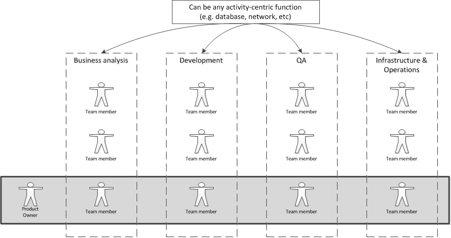

==== Product and function

[quote, Sriram Narayan, Agile IT Organization Design]
Even where they are not part of a value stream, activity-oriented teams tend to standardize their operations over time. Their appetite for offering custom solutions begins to diminish. Complaints begin to surface—“ They threw the rule book at us,” “What bureaucracy!”

By this time, you probably detect that there is a fundamental tension between functional specialization and end to end value delivery. This tension is the topic of endless research, articles, books, and commentary, in the mainstream business press and more specialized channels. The tension may go by different names:

* Flow vs resource
* Process vs silo
* Line vs staff (which has some additional connotations)

===== Efficiency versus flow

Here from an interesting presentation by Ari Tikka <<Tikka2013>> is a depiction of one dysfunctional pattern that can emerge in navigating this tension:

The above slide is worth a careful examination. The idea is that the more effective you are at product flow, the further to the right you are. The more efficient you are with your resources, the further up you are. It is easy to be completely efficient with resources, and have no flow. It is also possible to be very good at flow, but at the cost of little resource efficiency. Being excellent at both, however, is impossible - there is an outer boundary.

Also, there is an interesting dynamic if you seek too much resource efficiency. Loading staff more and more heavily has counterproductive results, in which flow actually decreases, and the resulting "coordination chaos" also decreases resource efficiency in a vicious reinforcing feedback loop.

===== Examining the problem more deeply
[quote, Steve Denning]
Complexity responds to competence, not authority.

Graphics such as the previous one are limited in insight. What are the particular organizational forms and practices in question? We will spend some time thinking through this.

As we saw previously <<2.04.01-process-project-product>>, there are three major tools used to achieve end to end flow across functional areas:

* Process
* Project
* Product

NOTE: We will go into detail on project management in chapter 8 and process management in chapter 9. But we need to understand how they influence organizational forms.

For example, some manufacturing can be represented as a very simple, sequential process model:

image::images/3.07-naive-mfg.png[]

The product is already defined and the need to generate information (i.e. through feedback) is at an absolute minimum. Functional areas can continually increase their efficiency and economies of scale through deep specialization.

NOTE: Even in this simplest model, feedback is important. Much of the evolution of 20th century manufacturing has been in challenging this naive, open-loop model. (Remember our brief discussion of open-loop? <<link>>)

The original, open-loop <<link>> waterfall model of IT systems implementation was arguably based on just such a naive concept:

(Review chapter 3 <<link>> for more of this history.)

There are two primary disadvantages to this model:

* It discourages closed-loop feedback
* The transactional friction of each handoff

The model falls into what we characterized as the "original sin" of IT management: confusing production with product development  <<link>>. As a repeatable production model, it may work, assuming that there is little or no information left to generate regarding the production process (an increasingly questionable assumption in and of itself).

But when applied to product development, where the *primary goal* is the generation of information, the model is inappropriate and has led to innumerable failures. This includes software development, and even implementing purchased packages in complex environments.

===== The continuum of organizational forms

NOTE: The following discussion and accompanying set of diagrams is a development of Preston Smith and Don Reinertsen's thought regarding this problem in both  _Developing Products in Half the Time_ <<Smith1998>> and _Managing the Design Factory._ <<Reinertsen1997>>.

There is a spectrum of alternatives in structuring organizations for flow across functional concerns.

First, a lightweight product structure may be implemented, in which the project manager has limited power to influence the activity-based work, where people sit, etc. The project manager is little more than a factory floor expediter in this model.

It is in the above model that the following Reinertsen quote is most applicable:

"The danger in using specialists lies in their low
involvement in individual projects and the multitude of tasks competing for their time." Work flows across the functions, perhaps called "centers of excellence," and there may be contention for resources within each center. Often, simple "first in, first out" approaches are used to manage the work, rather than more sophisticated approaches such as Cost of Delay. We will focus in Chapter 9 on approaches to mitigate these issues while retaining this overall organizational form.

Second, a heavyweight project structure may specify much more, including modes of work, standards, etc. The functional manager may be little more than a resource manager, but does still have reporting authority over the team member and crucially still writes their annual performance evaluation (if the organization still uses those.)

If even more focus is needed -- the now-minimized influence of the functional areas is still deemed too strong --  the organization may move to completely product-based reporting. With this, the team member reports to the product owner. There may still be communities of interest (the Spotify guilds and tribes are good examples) and there still may be standards for technical choices:

[quote, Preston Smith and Don Reinertsen, Developing Products in Half the Time]

The original Skunk Works [was] established by Kelly Johnson at Lockheed ... Skunkworks have been tried by many others, with outcomes ranging from very good to very bad, and this has led to a variety of opinions on skunk works.

Finally, in the skunkworks model, all functional influence is deliberately blocked, as distracting or positively injurious to the product vision:

image::images/3.07-skunk.png[]

The product team has complete autonomy, and can move at great speed. It is also free to

* re-invent the wheel, developing new solutions to old and well-understood problems
* bring in new components on a whim (regardless of whether they are truly necessary) adding to procurement complexity,
* ignore safety and security standards that ultimately may result in expensive retrofits.

Ultimately, skunkworks is not scalable. Research by the Corporate Executive Board suggests that "Once more than about 15% of projects go through the fast [skunkworks] team, productivity starts to fall away dramatically." It also causes issues with morale, as a two-tier organization starts to emerge with elite and non-elite segments <<Goodwin2015>>.

Because of these issues, Don Reinertsen observes that:

[quote, Don Reinertsen, Managing the Design Factory]
Companies that experiment with autonomous teams learn their lessons, and conclude that the disadvantages are significant. Then they try to combine the advantages of the functional form with those of the autonomous team.

The Agile movement is an important reaction to dominant IT management approaches that unquestionably accept open-loop attempts at delivering value across centralized functional centers of excellence. However, the ultimate extreme of the skunkworks approach is not scalable and cannot be the basis for organization across the enterprise.

We will examine the various adaptations and approaches for balancing the two organizational extremes further in Chapters 8 (Project Management) and 9 (Process Management).
