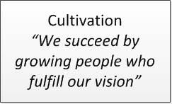
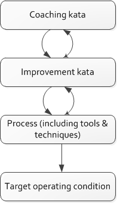

==== Culture
[quote, Sriram Narayan, Agile IT Organization Design]
What is culture in this context? It is not so much about an informal dress code, flexible hours, or a free in-house cafeteria as it is about how decisions are taken, norms of behavior, protocols of communication, and the ways of navigating hierarchy and bureaucracy to get things done.

"Culture" is a difficult term to define, and even more difficult to characterize across large organizations. It starts with how an organization is formally structured, as structure is in part a set of expectations around how information flows. "Who talks to who, when and why" is in a sense culture. Culture can also be seen embedded in artifacts like processes and formally specified operating models. Certainly, much in the previous section on organizational theory implied culture; Mintzberg's Five Forces all come with their own cultural tendencies.

But "culture" has additional, less tangible meanings. The anecdotes executives choose to repeat are culture. Whether an organization tacitly condones being 5 minutes late for meetings (because walk time in large facilities is expected) or has little tolerance for this (because most people dial in) is culture. The degree of deference shown to senior executives, and their opinions, is culture. Whether a junior person dares to hit "reply-all" on an email including her boss's boss is culture.

Culture cannot be directly changed - it is better seen as a lagging indicator, that changes in response to specific practical interventions. Even tools and processes can change culture, if they are judiciously chosen (and most tools and processes do *not* have this effect). Skeptical? Consider the impact that computers - a tool - have had on culture. Or email.

We'll look at culture from a few different perspectives in this section:

* Motivation
* Schneider matrix
* Mike Rother's research into Toyota's improvement and coaching "katas"
* Emotional intelligence
* Paul Glen's work on "Leading Geeks"

===== Basic ingredients & factors
* communication norms
* decision making norms
* conflict resolution norms
** causes
*** facts
*** methods
*** goals
*** values
** resolution mech
*** competition
*** collaboration
*** accommodation

getting to yes, etc - conflict resolution processes/lit

forming/storming/norming/performing

Need for longer lived teams
http://searchcio.techtarget.com/tip/How-organizational-agility-will-save-and-destroy-your-company

===== Motivation
One of the most important reasons to be concerned for culture is its effect on motivation. There is little doubt that a more motivated team performs better than an unmotivated, "going through the motions" organization.

In general, it is an article of faith in the Agile and Lean communities that motivated teams are more likely to collaborate effectively and seek creative, novel solutions to problems. (I am not sure if there is  evidence to this effect, but it seems intuitively obvious.)

But what motivates people?

One of the oldest discussions of culture is Douglas McGregor's idea of http://www.wikipedia.org/["Theory X" vs "Theory Y"] organizations, which he developed in the 1960s at the Massachusetts Institute of Technology.

"Theory X" organizations rely on extrinsic motivators and operate on the assumption that workers must be cajoled and punished in order to produce results. We see Theory X approaches when organizations focus on pay scales, bonuses, titles, awards, writeups/demerits, performance appraisals, and the like.

Theory Y organizations operate on the assumption that most people seek meaningful work intrinsically and that they have the ability to solve problems in creative ways that do not require tight standardization. According to Theory Y, people can be trusted and should be treated as mature individuals, in contrast to the distrust inherent in Theory X.

IMPORTANT: This book is biased towards Theory Y.

In terms of intrinsic motivation, Daniel Pink, author of Drive, suggests that three concepts are key: autonomy, mastery, and purpose. If these three qualities are experienced by individuals and teams, they will be more likely to feel motivated and collaborate more effectively.

 [More on A, M, P]

===== Schneider matrix, and the failure of control culture

One model for understanding culture is the following matrix https://www.youtube.com/watch?v=wIbCcfxzc2A[proposed by Schneider]:

Two dimensions are proposed:

* the extent to which the culture is focused on the company or the individual
* the extent to which the company is "possibility-oriented" versus "reality-oriented"

This is not a neutral matrix. It's not clear that highly controlling cultures are ever truly effective. Even in the military, which is generally assumed to be the ultimate "command and control" culture, there are notable case studies of increased performance when more empowering approaches were encouraged.

For example, in _Turn the Ship Around: A True Story of Turning Followers Into Leaders_, Captain L. David Marquette discusses moving from a command-driven to an outcome-driven model and the beneficial results it had on the _USS Santa Fe_. Similar themes appear in Captain D. Michael Abrashoff's _It's Your Ship: Management Techniques from the Best Damn Ship in the Navy_.

Neither of these accounts is surprising, when one considers the more sophisticated aspects of military doctrine. Don Reinertsen provides a rigorous overview in chapter 9 of _Principles of Product Development Flow_. In this discussion, he notes that the military has been experimenting with centralized vs. decentralized control for centuries. Modern warfighting relies on autonomous, self-directed teams that may be out of touch with central command and required to improvise effectively to achieve the mission.  Therefore, military orders are incomplete without a statement of "commander's intent" - the ultimate outcome of the mission. <<Reinertsen2009>>, pp. 243-265.

===== Toyota Kata
[quote, Mike Rother, Toyota Kata]
Six years ago I began the research that led to [Toyota Kata] thinking, like just about everyone else, that the story was about techniques and other listable aspects of Toyota. Today I see Toyota in a notably different light: as an organization defined primarily by the unique behavior routines it continually teaches to all its members.

Academics and consultants have been studying Toyota for many years. The performance and influence of the Japanese automaker is legendary, but it has been difficult to understand why.

Much has been written about Toyota's use of particular tools, such as kanban bins and andon boards. However, Toyota views these as ephemeral adaptations to the demands of its business.

According to Mike Rother in _Toyota Kata_,  underlying Toyota's particular tools and techniques are two powerful practices:

* The improvement kata
* The coaching kata

What is a _kata_? It is a Japanese word stemming from the martial arts, meaning pattern, routine, or drill. More deeply, it means "a way of keeping two things in alignment with each other."

The improvement kata is the repeated process by which Toyota managers investigate and resolve problems, in a hands-on, fact-based, and preconception-free manner, and improve processes towards a "target operating condition."

The coaching kata is how the improvement kata is instilled in new generations of Toyota managers.

As Rother describes it, the coaching and improvement katas establish and reinforce a coherent culture or mental model of how goals are achieved and problems approached. It is understood that human judgement is not accurate or impartial. The method compensates with a teaching-by-example focus on seeking facts without preconceived notions, through direct, hands-on investigation and experimental approaches.

This is not something that can be formalized into a simple checklist or process; it requires many guided examples and applications before the approach becomes ingrained in the upcoming manager.

****
*Open and closed loop control in culture*

We can understand Toyota Kata partly in terms of systems theory (Section II) - the katas are in a sense closed-loop control, working on several levels in a layered fashion. [link]

(There are interesting theories and models that  thinkers such as Stafford Beer have proposed for understanding systems of closed-loop control - Viable Systems Model.)

 Conjecture: "command and control culture" means open loop control.
****

===== Emotional intelligence
 - Culture != 'collaborate & be nice' - but intelligent IT pros do sometimes have issues - autism spectrum/Aspergers, empathy, etc ...

 (to be written)

===== "Leading Geeks"

[quote, Paul Glen, Leading Geeks]
Because power is about the regulation of behavior, it has very little effect on creativity. Traditional methods of exercising control have little positive effect on the inner state of mind of geeks.

 (to be written)

===== The problem of culture "change"

 [to be written]

===== Sidebar: Basics of professional conduct

Authority, responsibility, accountability
Delegation, commitment
Micromanagement.

(examples)
