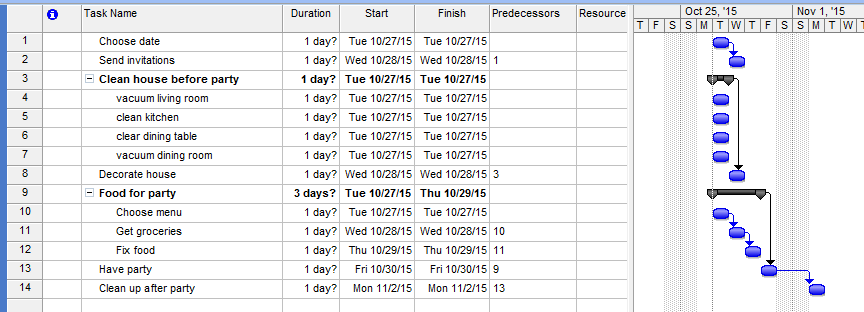

==== Why project management?
[quote, Project Management Body of Knowledge, version 5]
An ongoing work effort is generally a repetitive process that follows an organization's existing procedures. In contrast, because of the unique nature of projects, there may be uncertainties or differences in the products, services, or results that the project creates.

Project management, like many other areas of IT practice, is undergoing considerable transformation in response to the Agile transition. However, it will likely remain an important tool for value delivery at various scales. There is little doubt the student pursuing an IT career will encounter project managers and their techniques at some point. Rather than a dogmatic "project management bad" approach, this book will discuss the fundamental premises and techniques of project management, in the context of Agile transformation.

===== What is a project?
Let's start with the most fundamental aspects of a project. Essentially, a project can be seen as little more than a "to-do" list. However, rather than a miscellaneous list of errands, it is a to-do list that is aimed at delivering some overall end result.

So, comparing to your daily life, a random list of to-dos isn't a project, but if you are organizing your annual holiday party, that certainly would qualify as a project.

We could start with the following list:

|===
|Choose menu
|Clean house before party
|Get groceries
|Fix food
|Decorate house
|Send invitations
|Choose date
|Clean up after party
|===

One of the important characteristics of a project is that it is temporary. This project ends when we clean up after the party - not the most fun part.

Project management however takes things much further. There are a number of ways that the list above can be refined using project management techniques.

First, we should probably organize the list a little better. And the task "clean house" - do we understand precisely what we mean by that? Maybe we should break this down into sub-tasks. There is also a question about "choose menu" - isn't the menu part of the project plan? Also, you may notice that there are "dependencies." For example, we can't send out invitations before we choose the date, nor can we fix the party food before we get groceries.

Let's break out the heavyweight tools. Introducing Microsoft Project:

image::images/3.08-ms-proj-1.png[]

First, let's set up some sub-tasks and document the dependencies:

Notice the bold headings:

* *Clean house before party*
* *Food for party*

and how they have indented "sub-tasks" underneath them. These are all the things that need to be completed, for the overall major task to be considered complete.

For example, we can't call the house clean if the dining room isn't vacuumed.

Also notice that, to the right, we see certain tasks are linked by thin black arrows. We are not going to decorate the house until all the cleaning is done, and we need to get the food prepared before we have the party. As mentioned above, these are called dependencies.

As we look at the schedule, we see that the time is off. The party will be on December 19, so we need to adjust the dates. In addition, let's indicate the initials of the person who is responsible for a given task.

image::images/3.08-ms-proj-3.png[]

This is just the tip of the iceberg.  Much more  can be tracked in a formal project management approach, such as:

* Cost of people's time - forecast and actual
* % complete of a given task
* Which sequence of tasks is the "critical path" - the sequence that must be done in order, that will take the longest time

A project manager is responsible for all of this and more. A critical concept is that of "deliverable." In this example, the deliverable is the outcome of each task:

* invitations sent by 11/30 by CB
* menu decided by 12/17 by all
* house cleaned by 12/18 by all
* food prepared for guests by 12/18 by CB

Notice that deliverables are defined by "what," who *and* when.

While it is the responsibility of each contributor to the project to "meet" their deliverables, the project manager checks in regularly with each of them as to whether they will in fact be able to do this. In larger, more complex projects, the project manager updates the project plan with the effort expended to date, and the estimated time to completion. Individual status reports are assembled ("rolled up") into an overall picture of project status, reported to executives with a high level assessment of whether the project is likely to meet its objectives of cost, scope, quality, and schedule.

===== The "iron triangle"
image::https://upload.wikimedia.org/wikipedia/commons/thumb/a/a6/The_triad_constraints.jpg/375px-The_triad_constraints.jpg[]
_Project Management "Iron Triangle" from Wikipedia_

The project management https://en.wikipedia.org/wiki/Project_management_triangle["Iron Triangle"] represents the interaction of cost, time, scope, and quality on a project. The idea is that, in general, one or more of these factors may be a constraint. The following sign is often seen in service organizations:

image::http://www.industrialbrand.com/wp-content/uploads/2012/05/fast-and-cheap-visual-for-blog-436x313.jpg[]

http://www.industrialbrand.com/why-great-design-doesnt-come-fast-and-cheap[photo credit]

The same applies to project management and reflects well the "iron triangle" of tradeoffs.

===== Project management in information technology
So, what does all this have to do with information technology? As we have discussed in previous chapters, project management is one of the main tools used to deliver value across specialized skill-based teams.
