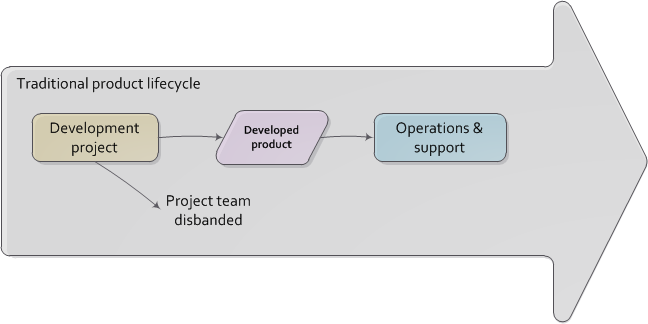

==== Why project management?
[quote, Project Management Body of Knowledge, version 5]
An ongoing work effort is generally a repetitive process that follows an organization's existing procedures. In contrast, because of the unique nature of projects, there may be uncertainties or differences in the products, services, or results that the project creates.

Project management, like many other areas of IT practice, is undergoing considerable transformation in response to the Agile transition. However, it will likely remain an important tool for value delivery at various scales.

IMPORTANT: There is little doubt the student pursuing an IT career will encounter project managers and their techniques at some point. Rather than a dogmatic "project management bad" approach, this book will discuss the fundamental premises and techniques of project management, in the context of digital transformation.

===== What is a project?
_As noted in the introduction, we are already doing work in our emergence model, using Scrum and Kanban for the most part. But there is interest in more formalized, traditional project management, so some of you go to training and learn the following basics._

Let's start with the most fundamental aspects of a project. You can start your understanding of a project by first thinking of a "to-do" list. However, rather than a miscellaneous list of errands, a project is a to-do list that is aimed at delivering some overall end result, with certain resources and within a time frame.

So, comparing to your daily life, a random list of to-dos isn't a project, but if you are organizing your annual holiday party, that certainly would qualify as a project.

We could start with the following list:

|===
|Choose menu
|Clean house before party
|Get groceries
|Fix food
|Decorate house
|Send invitations
|Choose date
|Clean up after party
|===

One of the important characteristics of a project is that it is temporary. This project ends when we clean up after the party.

Project management, however, takes things much further. There are a number of ways that the list above can be refined using project management techniques.

First, we should probably organize the list a little better. And the task "clean house" - do we understand precisely what we mean by that? Maybe we should break this down into sub-tasks.  Also, you may notice that there are "dependencies." For example, we can't send out invitations before we choose the date, nor can we fix the party food before we get groceries, which in turn depends on setting the menu.

Let's break out the heavyweight tools. Introducing Microsoft Project:

image::images/3.08-ms-proj-1.png[]

First, let's set up some sub-tasks and document the dependencies:

image::images/3.08-ms-proj-2.png[]

Notice the bold headings:

* *Clean house before party*
* *Food for party*

and how they have indented "sub-tasks" underneath them. These are all the things that need to be completed, for the overall major task to be considered complete.

For example, we can't call the house clean if the dining room isn't vacuumed.

Also notice that, to the right, we see certain tasks are linked by thin black arrows. We are not going to decorate the house until all the cleaning is done, and we need to get the food prepared before we have the party. As mentioned above, these are called dependencies.

As we look at the schedule, we see that the time is off. The party will be on December 19, so we need to adjust the dates. In addition, let's indicate the initials of the person who is responsible for a given task.

image::images/3.08-ms-proj-3.png[]

This is just the tip of the iceberg.  Much more  can be tracked in a formal project management approach, such as:

* Cost of people's time - forecast and actual
* % complete of a given task
* Which sequence of tasks is the "critical path" - the sequence that must be done in order, that will take the longest time

A project manager is responsible for all of this and more. A critical concept is that of "deliverable." In this example, the deliverable is the outcome of each task:

* invitations sent by 11/30 by CB
* menu decided by 12/17 by all
* house cleaned by 12/18 by all
* food prepared for guests by 12/18 by CB

Notice that deliverables are defined by "what," "who,"  *and* "when.""

While it is the responsibility of each contributor to the project to "meet" their deliverables, the project manager checks in regularly with each of them as to whether they will in fact be able to do this. In larger, more complex projects, the project manager updates the project plan with the effort expended to date, and the estimated time to completion. Individual status reports are assembled ("rolled up") into an overall picture of project status, reported to executives with a high level assessment of whether the project is likely to meet its objectives of cost, scope, quality, and schedule.

===== The "iron triangle"
image::https://upload.wikimedia.org/wikipedia/commons/thumb/a/a6/The_triad_constraints.jpg/375px-The_triad_constraints.jpg[]
_Project Management "Iron Triangle" from Wikipedia_

The project management https://en.wikipedia.org/wiki/Project_management_triangle["Iron Triangle"] represents the interaction of cost, time, scope, and quality on a project. The idea is that, in general, one or more of these factors may be a constraint. The following sign is often seen in service organizations:

image::http://www.industrialbrand.com/wp-content/uploads/2012/05/fast-and-cheap-visual-for-blog-436x313.jpg[]

http://www.industrialbrand.com/why-great-design-doesnt-come-fast-and-cheap[photo credit]

The same applies to project management and reflects well the "iron triangle" of tradeoffs.

===== How is a project different from simple "work management"?

In xref:2.05.00-work-management[Chapter 5], we covered a simple concept of "work management" that deliberately did not differentiate product, project, and/or process-based work. As was noted at the time, for smaller organizations, most or all of the organization would be the "project team," so what would be the point?

The project is starting off as a list of tasks, that is essentially identical to a product backlog. Even in Kanban, we know who is doing what, so what is the difference? Here are key points:

* The project is explicitly time-bound. As a whole, it is lengthier and more flexible than the repetitive, time-boxed sprints of Scrum, but more fixed than the ongoing flow of Kanban.

* Dependencies. You may have had a concept of one task or story blocking another, and perhaps you used a whiteboard to outline more complex sequences of work, but project management  has an explicit concept of dependencies in the tasks, and powerful tools to manage them. This is essential in the most ambitious and complex product efforts.

* Project management also has more robust tools for managing people's time and effort, especially as they translate to project funding. While this may be a contentious aspect of project management (see later in this chapter on the xref:3.08.03-NoEstimates[No Estimates] controversy), it remains a critical part of management practice in both IT and non-IT domains.

At the end of the day, people expect to be paid for their time, and investors expect to be compensated through the delivery of results. Investment capital only lasts as a function of an organization's "burn rate;" the rate at which the money is consumed for salaries and expenses. Some forecasting of status (whether that of a project, organization, product, program, or what have you) is therefore an essential and unavoidable obligation of management, unless funding is unlimited (a rare situation to say the least.)

Project accounting, at scale, is a deep area with considerable research and theory behind it. In particular, the concept of Earned Value Management is widely used to quantify the performance of a project portfolio (more on this to come).

===== A traditional information technology project
So, what does all this have to do with information technology? As we have discussed in previous chapters, project management is one of the main tools used to deliver value across specialized skill-based teams.

A "traditional" IT project starts with the "sponsorship" of some executive with authority to request funding. For example, suppose that the VP of Logistics under the Chief Operations Officer believes that a new supply chain system is required. With the sponsorship of the COO, they put in a request (possibly called a "demand request" although this varies by organization) to implement this system. The assumption is that a commercial software package will be acquired and implemented.

The IT department serves as an overall coordinator for this project. The "demand request" in many cases is registered with the enterprise Project Management Office, which may report under the CIO.

NOTE: Why might the Enterprise Project Management office report under the CIO? IT projects in many companies represent the single largest type of internally managed capital expenditure. The other major form of projects, building projects, are usually outsourced to a general contractor.

The project is initiated by establishing a charter, allocating the funding, assigning a project manager, establishing communication channels to stakeholders, and a variety of other activities.

One of the first major activities of the project will be to select the product to be used.

They will help lead the RFI/RFQ process by which vendors are evaluated and selected.

NOTE: RFI stands for https://en.wikipedia.org/wiki/Request_for_information[Request for Information]; RFQ stands for https://en.wikipedia.org/wiki/Request_for_quotation[Request for Quote]. See the links for definitions.

Once the product is chosen, the project must staff up (in reality, staffing arrangements were probably being made at the same time as the RFI/RFQ) and the systems implementation lifecycle can start.

We might call the above, the *systems implementation lifecycle*, not the *software development lifecycle*. This is because most of the hard software development was done by the third party who created the supply chain software. There may be some configuration or customization (adding new fields, screens, reports) but this is lightweight work in comparison to the software engineering required to create a system of this nature.

The system requires its own hardware (servers, storage, perhaps a dedicated switch) and specifying this in some detail is required for the purchasing process to start. The capital investment may be hundreds of thousands, or millions of dollars. This in turn requires extensive planning and  senior executive approval for the project as a whole.

It would not have been much different for a fully in house developed application, except that more money would have gone to developers. The slow infrastructure supply chain still drove much of the behavior, and correctly "sizing" this infrastructure was a challenge particularly for in-house developed software. (The vendors of commercial software would usually have a better idea of the infrastructure required for a given load.) Hence much attention to up-front planning. Without requirements, no analysis or design; without design, how to know how much server to buy?

Ultimately, the project comes to an end, and the results (if a product such as a digital service) are transitioned to a "production" state. Here is a graphical depiction:

====== The decline of the "traditional" IT project
The above scenario is in decline, and along with it a way of life for many "IT" professionals. One primary reason is Cloud, and in particular Software as a Service. The long hardware acquisition cycle is gone.

There is diminishing reason to run commodity software (e.g. payroll, expenses, HR, etc) in-house. Cloud providers such as Workday, Concur, Salesforce, and others provide ready access to the desired functionality "as a service" and concerns over security and data privacy are rapidly fading. What is left, increasingly, are those initiatives deemed "competitive" or "strategic" for the company. Usually, this means that they are going to contribute to a revenue stream. This in turn means they are "products" or significant components of them. (See Chapter 4.)

A significant market-facing product initiative (still calling for project management per se) might start with the identification of a large, interrelated set of features, perhaps termed an "epic." Hardware acquisition is a thing of the past, due to either private or public cloud. The team might simply analyze the overall structure of the epic, decomposing it into stories and features, and spending the time to organize them into a logical sequence.

Because capacity is available on demand, new systems do not need to be nearly as precisely "sized," which meant that implementation could commence without as much up front analysis. Simpler architectures suffice until real load is proven. It might then be a scramble to refactor software to take advantage of new capacity, but the overall economic effect is positive, as over-engineering and over-capacity are increasingly avoided.

However, a project manager may still be required, to facilitate discussions, record decisions, and keep the team on track to its stated direction and commitments. Regardless of whether the team considers itself "Agile," people are sometimes bad at taking notes or being consistent in their usage of tools such as Kanban boards and standups. It is also useful to have a third party who is knowledgeable about the product, yet has some emotional distance from its success. This can be a difficult balance to strike, but the existence of the role of Scrum coach is indicative of its importance.
