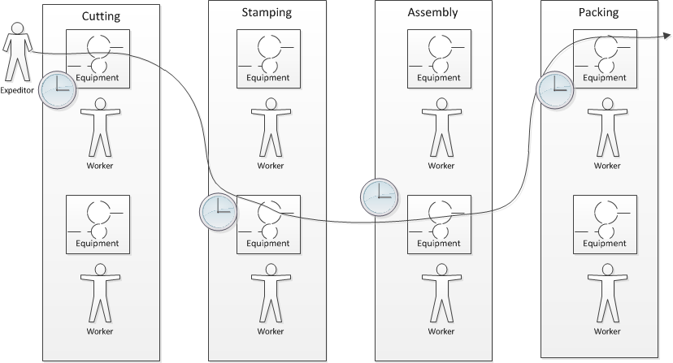
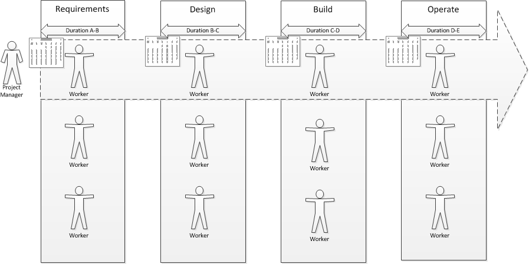

==== Principles and theories of project management

The previous chapter discussed some typical applications of project management, starting with very simple examples and moving into more complex topics.

However, project management (NOT restricted to IT) is a defined area of study, theory, and professional practice. This section provides a (necessarily brief) overview of these topics.

We will first discuss the author's own framework for understanding project demand holistically in the context of other forms of demand.

We will then discuss the Project Management Body of Knowledge, which is the leading industry framework in project management, at least in the United States. (PRINCE2 is another framework, originating from the UK, which will not be covered in this edition.)

We will compare project execution to more general problems of scheduling and execution, and finally we will take a brief look at Eli Goldratt's Critical Chain.

===== The two dimensions of demand management
Project management is our first major specialization of xref:2.05.00-work-management[Chapter 5]'s general concept of "work management." (We will turn to process management in the next chapter.) In the interest of keeping project management firmly in context, consider the following two-dimensional analysis:

image::images/3.08-2d-demand.png[]

You should spend some time considering the graphic, which provides a unique way of understanding the work you are now experiencing as a "team of teams" or "manager of managers" in an IT-dependent environment of increasing size and complexity.

We've come a long ways from the last section's insistence that "it's all just work." But there still is an essential truth there. Regardless of the abstract label we put on a given activity, it represents some set of tasks or objectives that real people are going to take time to perform, and expect to be compensated for. Retaining a clear realization of this is essential to maintaining truly business-aligned IT management.

Let's consider the various forms that demand may take. While this may not be project management per se, it's essential to putting project management in a broader context. This will also help you develop a deeper understanding of an *architecture of IT management*, a topic the author has explored in other works.<<Betz2011>>

The diagram has two dimensions:

* Planning
* Granularity

The bubbles represent a "space" where one is likely to find that kind of work. As indicated by the central diagonal, it reflects an assumption that larger amounts of work are more likely to be planned further in advance. However, this is not always true. A large, unwelcome amount of required work that shows up with no planning is probably a disaster. Desired work (in the form of aggregate transactional demand) may also spike unexpectedly.

 [The following table is work in process, currently with just a few examples filled in]

[cols="2*", options="header"]
|===
|Type of work |Description
|Core transactional demand
|This is the demand on the fully automated IT system for a given moment of truth: a banking account lookup, a streaming movie, a Human Resources record update
|Routine service requests and incidents
|Service requests are predefined, process-driven work items, rarely requiring creative thought or analysis. Incidents span a spectrum, but some are simpler and more routine than others, especially those stemming from user misunderstanding or error.
|Changes
|Changes represent modifications of established IT functionality or xref:2.06.03-state[state]. They represent some definite risk to one or more IT services, which is why they are planned on a longer lead time. However, they ideally remain relatively granular, which helps reduce their risk.
|Routine releases, stories, reports
|Releases and (in the Agile world) stories represent larger increments of functionality
|Services and Projects
|A Project is a large, planned amount of work with a defined end date. It might create a Service, which also represents a commitment to a large, ongoing amount of work, perhaps comparable in scope to the Project.
|Severe incidents
|Severe incidents by definition are not planned. But they represent a significant amount of work to overcome.
|===

Some forms of work may lead to other forms of work. For example, Projects may manifest as Stories, Releases, and Changes. This complicates the diagram a bit; we don't want to "double-count" work effort. But not all Releases derive from Projects, and not all Project work (especially in complex environments) can be cleanly reduced to a set of smaller tasks.

The final point of this diagram: you only have so much capacity to execute the work it implies. If you have a disaster, it may impact your ability to deliver user stories, changes, or even meet transactional demand. Trade-offs must be considered.

===== The Project Management Body of Knowledge
The second half of this book will devote increasing attention to frameworks. What is a framework?
A framework is a formalized body of knowledge, usually sustained by some appropriate professional body, that defines the necessary and appropriate skills and concepts for practitioners.

The Project Management Body of Knowledge is sustained by the Project Management Institute. PMI describes itself as:

_the world's leading not-for-profit professional membership association for the project, program and portfolio management profession. Founded in 1969, PMI delivers value for more than 2.9 million professionals working in nearly every country in the world through global advocacy, collaboration, education and research. PMI advances careers, improves organizational success and further matures the profession of project management through its globally recognized standards, certifications, resources, tools, academic research, publications, professional development courses, and networking opportunities_ (from http://www.pmi.org/About-Us.aspx[www.pmi.org]).

The Project Management Body of Knowledge is articulated in a publication, _A Guide to the Project Management Body of Knowlege._ While this may seem to imply that the PMBOK and its guide are two different things, they are not -- it is one publication.

The PMBOK, as of the latest edition, consists of:

* 47 Project Management "processes," grouped into
* 5 Project Management process "groups" and
* 10 Project Management "knowledge areas"

The groups are the easiest to start with. They are:

* Initiating
* Planning
* Executing
* Monitoring and Controlling
* Closing

The PMBOK is clear that the "Process Groups are not project phases. In fact, it is possible that all Process Groups could be conducted within a phase." <<PMI2013>>, A1.3.

The Knowledge Areas are a different dimension, and consist of:

* Project Integration Management
* Project Scope Management
* Project Time Management
* Project Cost Management
* Project Quality Management
* Project Human Resource Management
* Project Communication Management
* Project Risk Management
* Project Procurement Management
* Project Stakeholder Management

Finally, the 47 project management "processes" include topics such as (selected items):

* Develop Project Charter
* Develop Project Management Plan
* Direct and Manage Project Work
* Perform Integrated Change Control

Each process is categorized by one Process Group and one Knowledge Area, resulting in a matrix. A full matrix is not presented here due to copyright concerns, but one can be seen http://www.focus-on-training.co.uk/blog/pmbok-process-groups-knowledge-areas[here].

PMBOK details are easily obtained on the web, and will not be repeated here. It's clear that the Agile critiques of waterfall project management have been taken seriously by the PMBOK braintrust. There is now a PMI Agile certification and much explicit recognition of the need for iterative and incremental approaches to project work.

PMBOK remains extensive and complex when considered as a whole. This is necessary, as it is used to manage extraordinarily complex and costly efforts in domains such as construction, military/aerospace, government, and others. Some of these efforts (especially those involving systems engineering, over and above software engineering) do have requirements for extensive planning and control that PMBOK meets well.

However, in Agile domains that seek to be more adaptive to changing business dynamics, full use of the PMBOK framework may be unnecessary and wasteful. The accepted response is to "tailor" the guidance, omitting those plans and deliverables that are not needed.

For example, PMBOK calls for a "stakeholder management plan" to be produced as part of the Project Stakeholder Management knowledge area and the Planning process group. The author has never seen one of these deliverables produced, in years of enterprise experience. However, for certain projects they may make sense.

Part of the problem with extensive frameworks such as PMBOK is that knowing how and when to tailor them is hard-won knowledge that is not part of the usual formalized training. And yet, without some idea of "what matters" in applying the framework, there is great risk of wasted effort. The Agile movement in some ways is a reaction to the waste that can result from overly detailed frameworks.

===== The Work Breakdown Structure and its challenges

===== Scheduling and execution

 Production spectrum illustration? (diagonal)

To understand how project management works across a functionally organized system, consider the internals of each functional area:

Each combination of worker and equipment can be considered a workstation in this simplified model.

If there is concern for flow across the functional areas, one technique used in manufacturing is that of expediting. An individual in the role of  "expeditor" tracks the process across the work stations and ensures that any friction or blockages are overcome so that the entire process completes and value is delivered. This can be seen as a preliminary form of project management.

As the production line evolves, scheduling may be used as well: the assignment of work to each workstation (combination of worker and equipment) may have its timing and duration specified in advance. While this is not an optimal approach according to Lean philosophy (which emphasizes "pull" techniques), https://en.wikipedia.org/wiki/Scheduling_(production_processes)[production scheduling] is widely used in manufacturing.

NOTE: Production scheduling is a large topic in and of itself. It is part of the domain of interest of the professional organization, The American Production and Inventory Control Society (APICS).

IT systems development, when crossing functions, is rarely if ever considered as a simple end to end process that can run itself, with only a lightweight expeditor. Instead, since there is substantially increased complexity, a project paradigm is used across the functions. The project manager plays the role of expanded expeditor:

The above diagram, which you should study carefully, is a more detailed representation of the classic "waterfall" project. It still bears strong similarities to the idealized manufacturing model presented just previously. In particular, notice that the default model is that *the need for the resource is tightly bounded by the calendar*. In the above model, the following resource requirements are apparent:

. One Requirements analyst is needed between times A and B (e.g, from May 1 through 15).
. One Architect is needed between times B and C (e.g., from May 16 through 31)
. One Developer is needed between times C and D (e.g., from June 1 through 15)
. One Release Engineer is needed between times D and E (e.g., from June 15 through 30)

*This is a deliberately unworkable model for illustration.* (But the author can attest it has been tried...) Sometimes, the terms "mechanistic," "deterministic," or "linear" are used to describe waterfall project methods. This shows them at their extreme, insofar as they are essentially translations of a manufacturing model.

The basic problem: if the Developer is released from the project on June 15, and issues were to arise on June 20 with the release, flow would be interrupted and the system would not be delivered successfully.

Because of this, the project may retain some residual claim on all the engaged resources, but their utilization may be low or zero at certain points.

If we re-imagine the diagram with the different functional areas along the horizontal, we start to develop an understanding of the interrelatedness of product development. The following is one representation of the Rational Unified Process, an early depiction of this interrelatedness:

image::https://upload.wikimedia.org/wikipedia/commons/1/19/Development-iterative.png[]

_Rational Unified Process, from https://en.wikipedia.org/wiki/Rational_Unified_Process[Wikpedia]_

One interesting aspect of the diagram is that it shows just how difficult it can be to staff a project. Demand for given functional roles ebbs and flows unpredictably. The project manager is expected to manage the uncertain handoffs between the various functional areas, and anticipate resource requirements stemming from unexpected feedback demands. This is why "T-shaped" professionals (see Chapter 7) are desirable, because they can move from area to area in response to demand.

Ultimately, the reason classical production scheduling is inappropriate for delivering new IT functionality is that there is simply too much variability in product development. (Again see Chapter 4 for further discussion of this.) However, this does not change the fact that some level of planning and estimation is needed. To what extent this more variable IT work can be quantitatively managed is an active area of discussion in the software, Agile, and related communities.

===== Critical chain & related topics [to be written]
* Earned value management
* The problem of fractional allocation
* Execution, resource & scheduling constraints
* Reinertsen's critique of CC
