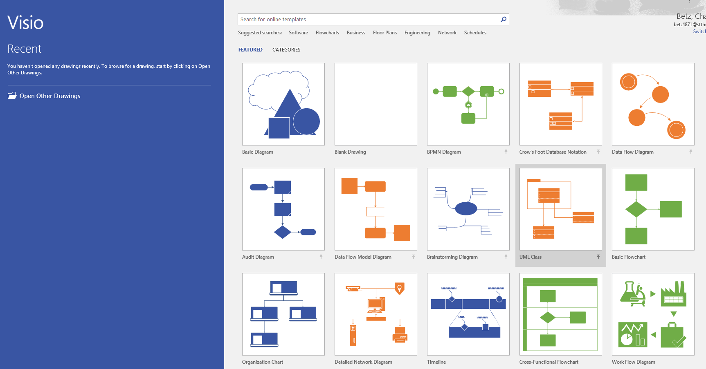
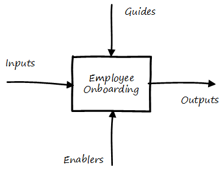
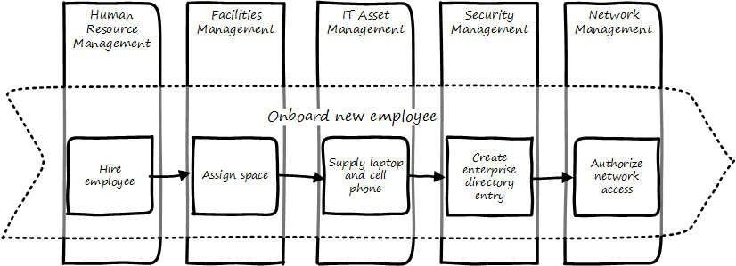
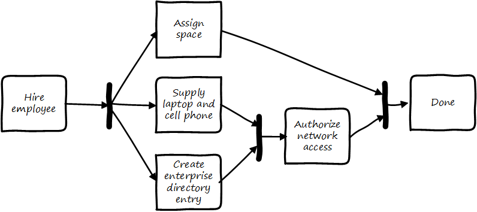

==== Process management practices
[quote, Don Reinertsen, Managing the Design Factory pp. 197-198]
The first question is, why control the process? When we know why, it almost automatically clarifies how we must control the process. Is a controlled process inherently better than one that has more uncertainty? No. Since the purpose of our process is to make money, it would follow that the purpose of controlling the process must be to influence economic outcomes. There is no other reason to be interested in process control.

===== BPM fundamentals
We've discussed some of the factors leading to the need for process management, but we haven't yet come to grips with what it *is*.

Process management is grounded in business fundamentals. Businesses convert inputs (capital, materials, staff talent) into valuable outputs and generate valuable surplus (margin) for shareholders and other stakeholders.

This act of *conversion* is a *process*. The overall process has been described by Michael Porter as a "value chain."

image::images/3.09-valCh.png[]
Value Chain similar to <<Porter1998>>.

Note the progression along the bottom: first, raw materials are acquired, then manufactured, then distributed at which point they are marketed and sold, and ultimately serviced. Porter termed this set of activities "Primary."

The upper half represents what Porter termed "support." Supporting activities represent necessary, but not value adding, functions.

There are many criticisms of the Porter value chain. Without research and development, there is no product, so why is it considered a support activity? Surely, marketing and sales help drive demand for the product, especially with manufacturing lead times shrinking, so why do they appear so late in the game?

Overall, the model represents a manufacturing-centric world where customers were happy to buy what was on offer.

However, this does not change the fact that most value has some rough ordering to it (it is difficult to sell and service a product before you invent and produce it), and the idea that some activities are primary while others are supporting also is useful.

The value chain as a whole is high level. We can think of a large company in these terms, but we cannot easily manage it this way. Value chains therefore are the ultimate "process" but in order for process to have value, we need to take it down a level or two.

In order to do this, we should clarify some terms.

===== Process and related terms

The following terms often appear in discussions of process:

* Function
* Capability
* Practice

We will use the following definitions:

A *process* is an ordered, countable set of activities; an event-driven, value-adding sequence that can be measured and improved. The following terms often are used to describe processes or their components:

* Value chain
* Value stream
* Business process
* Workflow
* Procedure
* Task
* Step

Processes *cross* functions.

Visually, processes are often represented with chevrons, like Porter's original value chain:

image::images/3.09-chevrons.png[]

There is no industry standard that definitely lists the concepts above in terms of granularity. Is a "task" larger or smaller than a "procedure?" We will not discuss these much. However, between the high level concept of "value chain" and the concepts of "process" and "activity," is the concept of "value stream."  This is a key concept from the Lean community, and is a relatively higher-level concept (a value chain decomposes into value streams, according to some.) A value stream for example could be the complete manufacturing and sales process for one product family. Because they are more specific, value streams are more measurable and countable. Optimizing them in terms of eliminating wasted time, effort and inventory is an objective of Lean thinking. See _Learning to See_ by Rother and Shook <<Rother2003>>.

*Functions* are unordered, steady state domains of activity. An organizational chart often can be based on various functions. Functions also often imply hierarchy. They are more difficult to measure or improve; usually, improving a function means improving some process it owns or performs.

Functions, especially when they are closely aligned to an organizational structure, may be represented as a hierarchy:

image::images/3.09-hier.png[]

They may also be represented as nested shapes:

image::images/3.09-hier-nested.png[]

However - and this is an important point - functions do *not* necessarily need to reflect the organizational chart. Often, they are used as a "logical" construct, to help with organizational design.

What do we mean by this?

Suppose two companies merge. They may leave their organizational charts untouched for a time, because they do not know what parts of each company should merge together. They have two sets of developers, two sets of sales staff, and so on. They do not feel that either company's organizational structure is a good basis for the new, larger company.

To solve this, they might create a logical functional hierarchy, with no-one's name on any part. Where their actual organization structure (temporarily) has duplication, the logical hierarchy does not. They then start to populate it with individuals and teams from the previous companies and in this way develop a new organizational structure.

image::images/3.09-hier2.png[]

This kind of thinking can help the organization evolve over time. If different teams are finding themselves performing similar activities, a functional analysis might indicate a new organizational structure.

Finally, the following two terms are also unordered, but have different connotations from function:

* Capability
* Service (sometimes)

A *capability* is a generic term for a capacity or potential.

A *service* is a transactional act of value, simultaneously produced and delivered (more on this later)

Finally, the concept of *practice* is the least formalized of the concepts. It represents a loose, conceptual area that may represent a community of common interest (for example, a Java community of practice). It's not usually measured or tracked for improvement. Some topics may start as a practice and formalize into a function, for example Capacity management.

Review the section on the xref:spotify-model[Spotify model]. How does it relate to the discussion here?

We say that an IT management capability may be implemented by a process, function, or practice.

===== A deeper look at processes and functions
Processes cross functions in a repeatable way. You may have deep organizational functions such as

* Human Resource Management
* Facilities Management
* IT Asset Management
* Security Management
* Network Management

However, you have a value adding activity of bringing in a new employee that involved ALL of these functions:

image::images/3.09-ProcXFunc.png[]

. The HR department enters the employee in the HR system (including payroll).
. Either the HR department or the hiring manager requests space from Facilities Management.
. A workstation and smart phone are requested from IT Asset Management
. When those devices are received, Security authorizes them (and the employee) to enterprise systems (critically the enterprise directory)
. If a wired connection is needed, Network Management may be required to "turn  on" a port in the employee's location.

This is a deliberately older, traditional workflow. Modern organizations may accelerate things:

. HR enters a record
. All employees use common "hoteling" space, so the major Facilities concern is whether the space can accommodate the peak # of employees seen (e.g. at 10 AM on a Monday)
. Equipment is either BYOD (Bring Your Own Device) or is ordered from an authorized vendor and drop-shipped directly to the employee
. In either case, security must establish some control over the devices, so that organizational data remains secure. There are various approaches for this, even for devices owned by the employee.
. Networking in modern organizations is almost all wireless, but the employee still requires the appropriate credentials, likely provided by security. As with facilities, Networking's concerns now move to questions of capacity and availability of the overall infrastructure.

Notice however that even in the modern scenario we have an end to end, repeatable value flow that crosses distinct domains of concern. The employee is not productive until all these steps are taken. Since the employee starts drawing payroll on hire, there is a substantial cost of delay for this entire process. A week's unproductive time could amount to $10,000 or more, wasted.

Such delays can easily happen, when functional areas are focused just on their responsibility, and no-one is concerned for the overall process. This is why Rummler and Brache chose the title _Improving Performance: How to Manage the White Space on the Organization Chart_ for their groundbreaking book on business process. The "white space" they are talking about is the spaces between the functions, also termed "silos" or "towers:"

image::images/3.09-PXFNamed.png[]

You may notice that the cross functional process is named with an active verb, "Onboard." This is in contrast to the functional silos, which end in "management." This is deliberate and a well-established BPM best practice. "Onboard employee" is event-driven and countable; it has a clear beginning and end and therefore can be measured in various ways. "Human Resource Management" on the other hand has no beginning or end; it is a steady-state set of organizational concerns and resources.

IMPORTANT: The idea that processes are active and countable, while functions are passive and ongoing, is critical to effective organizational design and performance management.

Finally, context is everything. Notice that this end to end process of "onboard employee" belongs to the overall supporting activity of Human Resource Management in terms of the value chain we started with:

image::images/3.09-ProcContext.png[]

There is a rich variety of ways to think about enterprises and their operations at the largest scale. We will return to the question of process context and value chain in the chapter section on process frameworks. For now, we will move to a more detailed level of process modeling, now that we have introduced certain key concepts.

===== Process modeling

If you page back through this book, you will see many graphics: some are pictures from real life, while others are conceptual. The practice of communicating concepts through graphical forms has a long history and great breadth of application. If you have access to the Microsoft product Visio, you can get a sense of this through looking at the various templates and solutions:

The idea that a box can represent an activity or objective, and can be linked in sequence to other boxes though lines, has been around since at least the 1920s. Many different visual languages have been developed over the years for various purposes. Some are highly formalized, others less so. The following definitions may help:

A *modeling language* is a set of concepts and definitions that describes a given problem space. Modeling languages can be formalized to different degrees of precision.

A *notation* is a specific set of visual symbols mapped onto a modeling language. One modeling language might have different notations; for example, Data Flow Diagrams have two notations but both communicate essentially the same language.

A *model* is a specific usage of a modeling language and notation to communicate some idea about a system. It may also be a verb, e.g. "I am going to *model* the system."

There are many different forms of modeling, extending far beyond IT and digital management. Scientists develop models of physical processes; financial analysts develop models of the stock market. Different aspects of a digital system might be modeled at different times:

* The process it is automating might be modeled as part of analysis
* Its data structures might be modeled somewhat later
* And when the system is running under load, capacity analysts might model its consumption of compute and network resources and develop projections for when additional capacity might be needed.

Process modeling is therefore only a subset, but an important one. Process analysis is one of most important activities in the broader area of business analysis and architecture, which in turn are key to xref:2.04.00-product-mgmt[product management] in general (as we briefly mentioned in Chapter 4).

There are many process modeling languages and notations:

* Generic flowcharting
* The IDEF family
* The Unified Modeling Language
* Business Process Modeling Notation

There are many references on these in the concluding chapter section. We will only discuss some of the more important concepts in this section:

* The IGOE foundation (Input/Guide/Output/Enabler)
* Ordering, conditionality, and synchronization
* Swimlanes

====== IGOE (Input/Guide/Output/Enabler)
A useful framework for thinking about activities represented as icons is the IGOE approach <<BPTrends2013>>. IGOE stands for:

* Inputs
* Guides
* Outputs
* Enablers

*Inputs* include the information or event stimulus that initiates the activity. They also include resources that will be consumed in the course of the activity.

*Guides* govern the process, setting constraints and expectations (e.g. current HR policies). They are not consumed.

*Outputs* include the final, value-added outcome of the activity, and also serve as a signal for downstream activities to commence.

*Enablers* support the process, without being immediately consumed. Examples include infrastructure and facilities support.

The IGOE approach is seen in the classic IDEF0 standard (the terms used there were Inputs, Controls, Outputs, Mechanisms). This is a form of *functional modeling* which is *not* event driven but rather is used to scope higher level interactions between areas.

The original intent of the IDEF0 standard was for a multi-level, decomposition approach, A high level scope would be elaborated thus:

image::images/3.09-IGOE2.png[]

However, there is not a clear sense of the events, since the primary objects are still the functions. There also is the temptation to insert extraneous information, as indicated in the line between Facilities Management and IT Asset Management labeled "Provides space for ??".

It is true that Facilities Management does provide space for the IT Asset Management Team (in fact, all of these functions provide services to each other), but to draw this would result in a "spaghetti" diagram with several dozen lines, and not much explanatory power.

Purely functional modeling of this nature is therefore limited in usefulness, although it can be a good place to start.

====== Ordering, synchronization, and conditionality
Activities in process modeling, by contrast, emphasize active verbs:

* Hire
* Assign
* Supply
* Create
* Authorize

Multiple activities can be sequenced and this is often represented as a series of shapes connected by arrows:

image::images/3.09-ordering1.png[]

Notice these activities align to the overall cross-functional flow we discussed above:

However, we encounter a complication. In order to describe this process accurately, we should note that some people do not have space assigned, if they are primarily telecommuting and/or working in "hoteling" space. We want to show a decision point, which in many notations is represented by a diamond.

image::images/3.09-ordering4.png[]

Finally, this ordering is taking too long, because people are waiting for space to be assigned before doing anything else. This is a well understood problem; processes can branch and run in parallel (you may well be writing code that works this way; human processes also do this). In UML, the term is "fork" for when processes diverge to run in parallel, and "join" when they must again synchronize for the next activity to continue:

In the above diagram, we see that 3 activities (including the decision point) can commence independently when the employee is hired, but network access requires that the employee have both an entry in the enterprise directory, as well as their hardware supplied. The entire process is complete when their space, equipment, and access needs have been met.

====== Swimlanes
We made much of the fact that processes cross functions, and yet with our final diagram we have lost our view of this fact. We can re-introduce the functional boundaries through the use of swimlanes (pioneered by Rummler in <<Rummler1995>>):

image::images/3.09-swimlanes.png[]

Adding the swimlanes helps us understand the cross-functional handoffs, and also where certain activities will remain within the scope of one function. Another interesting, finer point is the question of the synch points. Observe the synch point in the Network Management swimlane. Its presence implies that the Network Management function must confirm that the employee has equipment and a directory in the enterprise directory.

You may notice that this diagram has been "rotated." The diagram was becoming too long if drawn left to right. UML Activity Diagrams frequently use a top-to-bottom approach. The meaning of the diagram is not changed.

====== A final caution on technique
The techniques briefly discussed here can be applied and combined in many different ways, and result in models of large scope and complexity. However there are crucial limitations to visual representations of complexity.

There are endless nuances and debates about BPM notations, methodology, and philosophy. Don't get caught up in it. Modeling should generate simple, clear artifacts that are useful by a broad audience, and it should not become an end in itself, or (in general) consume inordinate amounts of time. We will discuss this further in the chapter section on Agile.

With the above discussion, we have covered in a summary form the basics of business process modeling. We finish this chapter section with a discussion of some higher-level BPM pitfalls.

===== The pitfall of process "silos"
[quote, Alex Sharp, Workflow Modeling]
One organization enthusiastically embraced process improvement, with good reason: customers, suppliers, and employees found the company's processes slow, inconsistent, and error prone. Unfortunately, they were so enthusiastic that each team defined the work of their small group or department as a complete process. Of course, each of these was in fact the contribution of a specialized functional group to some larger, but unidentified, processes. Each of these "processes" was "improved" independently, and you can guess what happened. +
 +
Within the boundaries of each process, improvements were implemented that made work more efficient from the perspective of the performer. However, these mini-processes were efficient largely because they had front-end constraints that made work easier for the performer but imposed a burden on the customer or the preceding process. The attendant delay and effort meant that the true business processes behaved even more poorly than they had before. This is a common outcome when processes are defined too "small." Moral: Don't confuse subprocesses or activities with business processes.

 obtain permission

The above quote well illustrates the dangers of combining local optimization and  process management. Many current authors speak highly of self-organizing teams, but self-organizing teams may seek to optimize locally. Process management was originally intended to overcome this problem, but modeling techniques can be applied at various levels, including within specific departments. This is where enterprise business architecture can assist, to identify these longer, end to end flows of value and highlight the handoff areas, so that the process benefits the larger objective.

===== The pitfall of process complexity
A related problem is when the process simply becomes too complex for humans to follow. Multi-page process models are rarely consulted, even if the team affected developed them. This is especially true when there are many optional or conditional steps in the process.

There are two related lines of response to this:

* Case Management
* The Checklist Manifesto

====== Case Management

NOTE: Do not confuse "Case" here with Computer Assisted Software Engineering.

Case management is a concept used in medicine, law, and social services. Case management can be thought of as a high-level process supporting the skilled knowledge worker applying their professional expertise.

image::images/3.09-casemgmt.png[]

To quote the Workflow Management Coalition:
****
[Business Process Modeling] and [Case Management] are useful for different kinds of business situations.

* Highly predictable and highly repeatable business situations are best supported with BPM.
** For example signing up for cell phone service: it happens thousands of times a day, and the process is essentially fixed.
* Unpredictable and unrepeatable business situations are best handled with ACM.
** For example investigation of a crime will require following up on various clues, down various paths, which are not predictable before hand. The are various tests and procedures to use, but they will be called only when needed.
<<WFMC2010>>, via <<England2013>>
****

Noted IT consultant and author Rob England contrasts "case management" with "standard process" in his book  _Plus! The Standard+Case Approach: See Service Response in a New Light_. Some processes are repeatable and can be precisely standardized, but it is critical for anyone working in complex environments to understand the limits of this.

====== The Checklist Manifesto
The Checklist Manifesto is the name of a notable book by author/surgeon Atul Gawande <<Gawande2010>>. The title can be misleading; the book in no way suggests that all work can be reduced to repeatable checklists. Instead, it is another in depth examination of the  relationship between standardization and complexity. Like case management, it addresses the problem of complex activities requiring professional judgement.

Unlike case management, it explores more time-limited and often urgent activities such as flight operations, large scale construction, and surgery. These activities, as a whole, cannot be reduced to one master process; there is too much variation and complexity.

However, within the overall bounds of flight operations, or construction, or surgery, there are critical sequences of events that MUST be executed, often in a specific order. Gawande discusses the airline industry as a key exemplar of this. Instead of one "master checklist" there are specific, clear, brief checklists for a wide variety of scenarios, such as a cargo hold door becoming unlatched.

There are similarities and differences between core BPM approaches and checklists. Often, business process management is employed to describe processes that are automated and where their progress is tracked in a database. Checklists, on the other hand, may be more manual, and may represent a briefer period of time.

Finally, in chapter 8, we discussed the concept of the xref:submittal-schedule[submittal schedule], which Gawande encountered in his discussions with the construction industry. In this approach, the actual, trackable task is that *two or more parties consult with each other.* This technique is also applicable in a BPM and Case Management sense.

===== Process proliferation
The final pitfall we cover here is that of process proliferation.

resource
complexity
context switching
