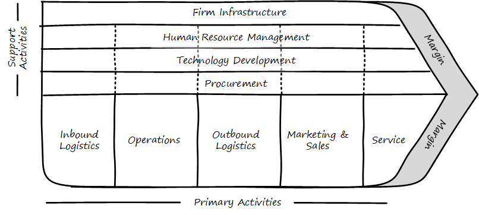
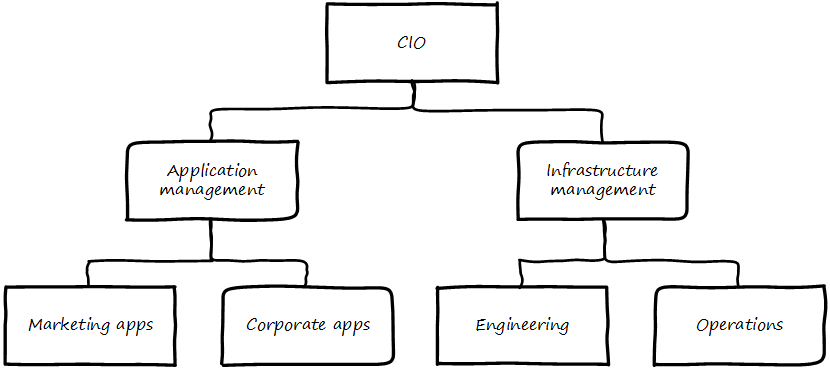
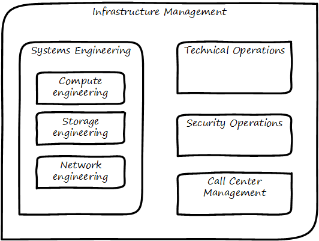
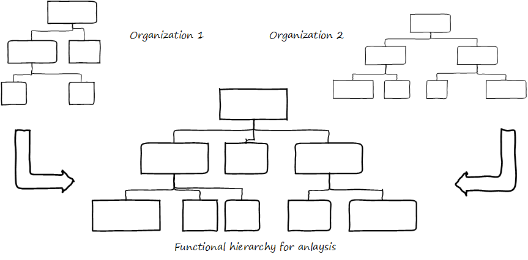
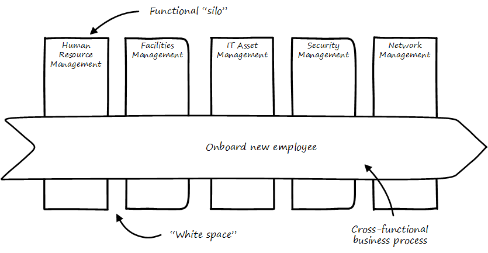

==== Process management practices
[quote, Don Reinertsen, Managing the Design Factory pp. 197-198]
The first question is, why control the process? When we know why, it almost automatically clarifies how we must control the process. Is a controlled process inherently better than one that has more uncertainty? No. Since the purpose of our process is to make money, it would follow that the purpose of controlling the process must be to influence economic outcomes. There is no other reason to be interested in process control.

===== BPM fundamentals
We've discussed some of the factors leading to the need for process management, but we haven't yet come to grips with what it *is*.

Process management is grounded in business fundamentals. Businesses convert inputs (capital, materials, staff talent) into valuable outputs and generate valuable surplus (margin) for shareholders and other stakeholders.

This act of *conversion* is a *process*. The overall process has been described by Michael Porter as a "value chain."

Value Chain similar to <<Porter1998>>.

Note the progression along the bottom: first, raw materials are acquired, then manufactured, then distributed at which point they are marketed and sold, and ultimately serviced. Porter termed this set of activities "Primary."

The upper half represents what Porter termed "support." Supporting activities represent necessary, but not value adding, functions.

There are many criticisms of the Porter value chain. Without research and development, there is no product, so why is it considered a support activity? Surely, marketing and sales help drive demand for the product, especially with manufacturing lead times shrinking, so why do they appear so late in the game?

Overall, the model represents a manufacturing-centric world where customers were happy to buy what was on offer.

However, this does not change the fact that most value has some rough ordering to it (it is difficult to sell and service a product before you invent and produce it), and the idea that some activities are primary while others are supporting also is useful.

The value chain as a whole is high level. We can think of a large company in these terms, but we cannot easily manage it this way. Value chains therefore are the ultimate "process" but in order for process to have value, we need to take it down a level or two.

In order to do this, we should clarify some terms.

===== Process and related terms

The following terms often appear in discussions of process:

* Function
* Capability
* Practice

We will use the following definitions:

A *process* is an ordered, countable set of activities; an event-driven, value-adding sequence that can be measured and improved. The following terms often are used to describe processes or their components:

* Value chain
* Value stream
* Business process
* Workflow
* Procedure
* Task
* Step

Processes *cross* functions.

Visually, processes are often represented with chevrons, like Porter's original value chain:

image::images/3.09-chevrons.png[]

*Functions* are unordered, steady state domains of activity. An organizational chart often can be based on various functions. Functions also often imply hierarchy. They are more difficult to measure or improve; usually, improving a function means improving some process it owns or performs.

Functions, especially when they are closely aligned to an organizational structure, may be represented as a hierarchy:

They may also be represented as nested shapes:

However - and this is an important point - functions do *not* necessarily need to reflect the organizational chart. Often, they are used as a "logical" construct, to help with organizational design.

What do we mean by this?

Suppose two companies merge. They may leave their organizational charts untouched for a time, because they do not know what parts of each company should merge together. They have two sets of developers, two sets of sales staff, and so on. They do not feel that either company's organizational structure is a good basis for the new, larger company.

To solve this, they might create a logical functional hierarchy, with no-one's name on any part. Where their actual organization structure (temporarily) has duplication, the logical hierarchy does not. They then start to populate it with individuals and teams from the previous companies and in this way develop a new organizational structure.

This kind of thinking can help the organization evolve over time. If different teams are finding themselves performing similar activities, a functional analysis might indicate a new organizational structure.

Finally, the following two terms are also unordered, but have different connotations from function:

* Capability
* Service (sometimes)

A *capability* is a generic term for a capacity or potential.

A *service* is a transactional act of value, simultaneously produced and delivered (more on this later)

Finally, the concept of *practice* has the following characteristics: It is the least formalized of the concepts. It represents a loose, conceptual area that may represent a community of interest (for example, a Java community of interest). It's not usually measured or tracked for improvement. Some topics may start as a practice and formalize into a function, for example Capacity management.

We say that an IT management capability may be implemented by a process, function, or practice.

===== A deeper look at processes and functions
Processes cross functions in a repeatable way. You may have deep organizational functions such as

* Human Resource Management
* Facilities Management
* IT Asset Management
* Security Management
* Network Management

However, you have a value adding activity of bringing in a new employee that involved ALL of these functions:

image::images/3.09-ProcXFunc.png[]

. The HR department enters the employee in the HR system.
. Either the HR department or the hiring manager requests space from Facilities Management.
. A workstation and smart phone are requested from IT Asset Management
. When those devices are received, Security authorizes them (and the employee) to enterprise systems (critically the enterprise directory)
. If a wired connection is needed, Network Management may be required to "turn  on" a port in the employee's location.

This is a deliberately older, traditional workflow. Modern organizations may accelerate things:

. HR enters a record
. All employees use common "hoteling" space, so the major Facilities concern is whether the space can accommodate the peak # of employees seen (e.g. at 10 AM on a Monday)
. Equipment is either BYOD (Bring Your Own Device) or is ordered from an authorized vendor and drop-shipped directly to the employee
. In either case, security must establish some control over the devices, so that organizational data remains secure. There are various approaches for this, even for devices owned by the employee.
. Networking in modern organizations is almost all wireless, but the employee still requires the appropriate credentials, likely provided by security. As with facilities, Networking's concerns now move to questions of capacity and availability of the overall infrastructure.

Notice however that even in the modern scenario we have an end to end, repeatable value flow that crosses distinct domains of concern. The employee is not productive until all these steps are taken. Since the employee starts drawing payroll on hire, there is a substantial cost of delay for this entire process. A week's unproductive time could amount to $10,000 or more, wasted.

Such delays can easily happen, when functional areas are focused just on their responsibility, and no-one is concerned for the overall process. This is why Rummler and Brache titled their book, _Improving Performance: How to Manage the White Space on the Organization Chart_. The "white space" they are talking about is the spaces between the functions, also termed "silos" or "towers:"

Finally, context is everything. Notice that this end to end process of "onboard employee" belongs to the overall supporting activity of Human Resource Management in terms of the value chain we started with:

image::images/3.09-ProcContext.png[]

There is a rich variety of ways to think about enterprises and their operations at the largest scale. We will return to the question of process context and value chain in the chapter section on process frameworks. For now, we will move to a more detailed level of process modeling, now that we have introduced certain key concepts.

===== Process modeling

It's not all about this

Processes, as a best practice, are named with active verbs.

ordering, synch, conditionality

Swimlanes

BPMN, BPEL

===== RACI
also seen in general treatments of mgmt, project mgmt, etc - also EA/BizArch

but most refined in process approaches

How to structure the matrix

RACI
focus on specific decisions rather than abstract concepts like empowerment and strong vs. weak teams. It is much more useful for teams to know which product features they can change without outside approval than it is to find out they are "empowered."

reinertsen has stuff on this

===== Process granularity
[quote, Alex Sharp, Workflow Modeling]
One organization enthusiastically embraced process improvement, with good reason: customers, suppliers, and employees found the company's processes slow, inconsistent, and error prone. Unfortunately, they were so enthusiastic that each team defined the work of their small group or department as a complete process. Of course, each of these was in fact the contribution of a specialized functional group to some larger, but unidentified, processes. Each of these "processes" was "improved" independently, and you can guess what happened. +
 +
 Within the boundaries of each process, improvements were implemented that made work more efficient from the perspective of the performer. However, these mini-processes were efficient largely because they had front-end constraints that made work easier for the performer but imposed a burden on the customer or the preceding process. The attendant delay and effort meant that the true business processes behaved even more poorly than they had before. This is a common outcome when processes are defined too "small." Moral: Don't confuse subprocesses or activities with business processes.

If processes are connected on a 1:1 basis, then we say that they are part of a single, end-to-end, business process.

 <<Sharp2009>>

Precision and accuracy in process management?

====== Case Management

===== Process vs execution (execution includes concern for resource)

====== Decision rules
 Reinertsen Boeing case

Rule engines

===== Cynefin and the Checklist Manifesto
  The problem of determinism
  Required interactions as well as required steps
  Process as a Mintzberg liaison mechanism

* "Process" at Toyota (Rother)
