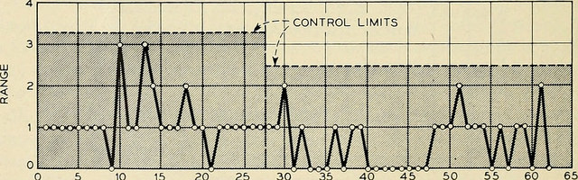

anchor:continuous-improvement[]

==== Process control and continuous improvement

ifdef::collaborator-draft[]

****
*Collaborative*

 Status: This section is in process as of June 4, 2016. Expect volatility.

include::../../../collab-links.adoc[]

****

endif::collaborator-draft[]

[quote, Martin Fowler, preface to Agile Software Development with Scrum]
a process can still be controlled even if it can't be defined.

In this chapter section, we take a deeper look at the concept of process and how processes are managed and controlled. In particular, we will explore the concept of continuous (or continual) improvement and its rich history and complex relationship to Agile.

You are now at a stage in your company's evolution, or your career, where an understanding of continuous improvement is helpful. Without this, you will increasingly find you don't understand the language and motivations of leaders in your organization, especially those with business degrees or background.

NOTE: There is a debate over to use the term "continuous" or "continual" improvement. We will use "continuous" here as it is the more commonly seen. Advocates of "continual" argue it is the more grammatically correct.

The scope of the word "process" is immense. Examples include:

* The end to end flow of chemicals through a refinery
* The set of activities across a manufacturing assembly line, resulting in a product for sale
* The steps expected of a customer service representative in handling an inquiry
* The steps followed in troubleshooting a software-based system
* The general steps followed in creating and executing a project
* The overall flow of work in software development, from idea to operation

This breadth of usage requires us to be careful and specific in any discussion of the word "process." In particular, we need to be careful and critical in understanding the concepts of efficiency, variation, and effectiveness. These concepts lie at the heart of understanding continuous improvement and how to correctly apply it in the digital economy.

Companies institute processes because it has been long understood that repetitive activities can be optimized when they are better understood, and if they are optimized, they are more likely to be economical and even profitable.

We have emphasized throughout this book that the process by which complex systems are created is not repetitive. Such creation is a process of *product development*, not *production.* And yet, the entire digital organization covers a broad spectrum of process possibilities, from the repetitive to the unique. You need to be able to identify what kind of process you are dealing with, and to choose the right techniques to manage it.

For example, the employee provisioning process flow shown in the previous chapter is simple and prescriptive. Measuring its efficiency and variability would be possible, and perhaps useful.

There are many aspects of continuous improvement we won't cover in this brief section. Some of them (systems thinking, culture, and others) have already been covered in this book. This book is based in part on Lean and Agile premises, and continuous improvement is one of the major influences on Lean and Agile, so in some ways we come full circle.

We are focusing on continuous improvement in the context of processes and process improvement. We'll therefore scope this to a few concerns: efficiency, variation, effectiveness, and empirical process control.

===== History of continuous improvement
NOTE: History is important. You may think your career is far removed from the early days of the industrial revolution, but the influence of early management thinkers such as Frederick Taylor remains. You need to be able to recognize when his ideas are being applied, especially if they are being applied inappropriately (as continues to happen, even a hundred years later).

The history of continuous improvement is intertwined with the history of 20th century business itself. Before the industrial revolution, goods and services were produced primarily by local farmers, artisans, and merchants. Techniques were jealously guarded, not shared. A given blacksmith might have two or three workers, who might all forge a pan or a sword in a different way. The term "productivity" itself was unknown.

Then the Industrial Revolution happened.

As steam and electric power increased the productivity of industry, requiring greater sums of capital to fund, a search for improvements began. Blacksmith shops began to consolidate into larger organizations, and technology became more complex and dangerous. It started to become clear that allowing each worker to perform the work as they preferred was not feasible.

Enter the scientific method. Thinkers such as Frederick Taylor and Frank and Lillian Gilbreth (of "Cheaper by the Dozen" fame) started applying careful techniques of measurement and comparison, in search of the "one best way" to dig ditches or assemble vehicles. An entire profession of industrial engineering was established, along with the formal study of business management itself.

====== Frederick Taylor and efficiency

Frederick Taylor (1856-1915)  was a mechanical engineer and one of the first industrial engineers. In 1911, he wrote _Principles of Scientific Management_.

One of Taylor's primary contributions to management thinking was a systematic approach to efficiency. To understand this, let's consider some fundamentals.

Human beings engage in repetitive activities. These activities consume inputs and produce outputs. It is often possible to compare the outputs against the inputs, numerically, and understand how "productive" the process is.

For example, suppose you have two factories producing identical kitchen utensils (pizza cutters, say).

If one factory can produce 50,000 pizza cutters for $2,000, while the other requires $5,000, the first factory is more productive.

Assume for a moment that the workers are all earning the same across each factory. There is possibly a "process" problem. The first factory is more _efficient_ than the second; it can produce more given the same set of inputs. Why?

There are many possible reasons. Perhaps the second factory is poorly laid out and the work in progress must be moved too many times in order for workers to perform their tasks. Perhaps the workers are using tools that require more manual steps. Understanding the differences between the two factories, and recommending the "best way," is what Taylor pioneered, and what industrial engineers do to this day.

As Peter Drucker, one of the most influential management thinkers, says of Frederick Taylor:

****
The application of knowledge to work explosively increased productivity. For hundreds of years there had been no increase in the ability of workers to turn out goods or to move goods . . . But within a few years after Taylor began to apply knowledge to work, productivity began to rise at a rate of 3.5 to 4 percent compound a year—which means doubling every eighteen years or so. Since Taylor began, productivity has increased some fiftyfold in all advanced countries. On this unprecedented expansion rest all the increases in both standard of living and quality of life in the developed countries. <<Drucker1993>>, pp.37-38.
****

====== W.E. Deming and variation
The quest for effiency leads to the long-standing management interest in variability and variation. What do we mean by this?

If you expect a process to take 5 days, what do you make of occurrences when it takes 7 days? 4 days? If you expect a manufacturing process to yield 98% usable product, what do you do when it falls to 97%? 92%?

In highly repeatable manufacturing processes, statistical techniques can be applied. Analyzing such "variation" has been a part of management for decades, and is an important part of disciplines such as Six Sigma. This is why Six Sigma is of such interest to manufacturing firms.

\W. Edwards Deming (1900-1993) is noted for (among many other things) his understanding of variation and organizational responses to it. Understanding variation is one of the major parts of his "System of Profound Knowledge." He emphasizes the need to distinguish special causes from  common causes of variation; special causes are those requiring management attention.

Deming in particular was an advocate of the control chart, a technique to understand whether a process was within statistical control:

_image from https://www.flickr.com/photos/internetarchivebookimages/14775750673/, no known copyright restrictions_

However, using techniques of this nature makes certain critical assumptions about the nature of the process. These techniques were defined to understand *physical* processes that in general follow normal distributions. In general, applying statistical process control to variable, creative product development processes is inappropriate.

Understanding variation and when to manage it therefore requires care.

For example, let's say you are working at a large manufacturer, in their IT organization, and you see the KPI "variance from project plan." The idea is that your actual project time, scope and resources should be the same, or close to, what you planned. In practice, this tends to become a discussion about time, as resources and scope are often fixed.

The assumption is that, for your project tasks, you should be able to estimate to a meaningful degree of accuracy. Your estimates are equally likely to be too low, or too high. Furthermore, it should be somehow possible to improve the accuracy of your estimates.

The problem is that neither of these are true. Despite heroic efforts, you cannot improve your estimation. In process control jargon, there are too many causes of variation for "best practices" to emerge. Project tasks remain unpredictable, and the variability does not follow a normal distribution - there is a long tail to the right, of tasks that take 2x, 3x or 10x longer than estimated.

====== Don Reinertsen and effectiveness
[quote, Don Reinertsen, Managing the Design Factory]
the purpose of controlling the process must be to influence economic outcomes. There is no other reason to be interested in process control.

Discussions of efficiency usually focus on productivity given a certain set of inputs. Time can be one of those inputs. Everything else being equal, a company that can produce the pizza cutters more quickly is also viewed as more efficient. Customers may pay a premium for early delivery, and may penalize late delivery; such charges typically would be some percentage (say plus or minus 20%) of the final price of the finished goods.

However, the question of time becomes a game-changer in the "process" of new product development. As we have discussed previously: Starting with a series of influential articles starting in the early 1980s, Don Reinertsen developed the idea of "cost of delay" for product development.

Where the cost of a delayed product shipment might be some percentage, the cost of delay for a delayed product could be much more substantial. For example, if a new product launch misses a key trade show where competitors will be presenting similar innovations, the cost to the company might be millions of dollars of lost revenue - many times the product development investment. (Perhaps even orders of magnitude larger.)

This is not really a question of "efficiency;" of comparing inputs to outputs and looking for a few percentage points improvement. It is more a matter of effectiveness; of the company's ability to execute on complex knowledge work.

===== Ken Schwaber and empirical process control
Ken Schwaber, inventor of the Scrum methodology (along with Jeff Sutherland) 
