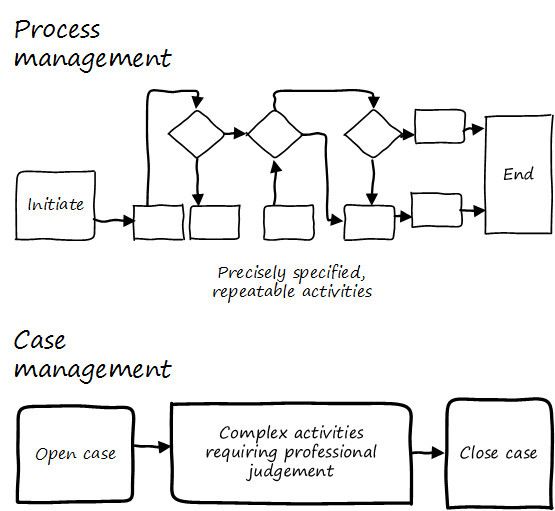

==== Agile and IT process management

[quote, Manifesto for Agile Software Development]
Individuals and interactions over processes and tools.

Like project management, the practice of process management is under scrutiny in the new Lean and Agile world. The idea of

continuous improvement as demand

===== "quality"

In the world of agile delivery the role of quality assurance needs to adapt from auditing the quality of the process and product that is delivered at the end of the lifecycle, to supporting practices that ensure that quality is built in and validated from the beginning of the project.

Ambler, Scott W.; Lines, Mark (2012-05-31). Disciplined Agile Delivery: A Practitioner's Guide to Agile Software Delivery in the Enterprise (IBM Press) (Kindle Locations 8175-8177). Pearson Education. Kindle Edition.

===== misunderstanding variation

===== misunderstanding economics

===== The pitfall of process "silos"
[quote, Alex Sharp, Workflow Modeling]
One organization enthusiastically embraced process improvement, with good reason: customers, suppliers, and employees found the company's processes slow, inconsistent, and error prone. Unfortunately, they were so enthusiastic that each team defined the work of their small group or department as a complete process. Of course, each of these was in fact the contribution of a specialized functional group to some larger, but unidentified, processes. Each of these "processes" was "improved" independently, and you can guess what happened. +
 +
Within the boundaries of each process, improvements were implemented that made work more efficient from the perspective of the performer. However, these mini-processes were efficient largely because they had front-end constraints that made work easier for the performer but imposed a burden on the customer or the preceding process. The attendant delay and effort meant that the true business processes behaved even more poorly than they had before. This is a common outcome when processes are defined too "small." Moral: Don't confuse subprocesses or activities with business processes.

 obtain permission

The above quote well illustrates the dangers of combining local optimization and  process management. Many current authors speak highly of self-organizing teams, but self-organizing teams may seek to optimize locally. Process management was originally intended to overcome this problem, but modeling techniques can be applied at various levels, including within specific departments. This is where enterprise business architecture can assist, to identify these longer, end to end flows of value and highlight the handoff areas, so that the process benefits the larger objective.

===== The pitfall of process complexity
A related problem is when the process simply becomes too complex for humans to follow. Multi-page process models are rarely consulted, even if the team affected developed them. This is especially true when there are many optional or conditional steps in the process.

There are two related lines of response to this:

* Case Management
* The Checklist Manifesto

====== Case Management

NOTE: Do not confuse "Case" here with Computer Assisted Software Engineering.

Case management is a concept used in medicine, law, and social services. Case management can be thought of as a high-level process supporting the skilled knowledge worker applying their professional expertise.

To quote the Workflow Management Coalition:
****
[Business Process Modeling] and [Case Management] are useful for different kinds of business situations.

* Highly predictable and highly repeatable business situations are best supported with BPM.
** For example signing up for cell phone service: it happens thousands of times a day, and the process is essentially fixed.
* Unpredictable and unrepeatable business situations are best handled with ACM.
** For example investigation of a crime will require following up on various clues, down various paths, which are not predictable before hand. The are various tests and procedures to use, but they will be called only when needed.
<<WFMC2010>>, via <<England2013>>
****

Noted IT consultant and author Rob England contrasts "case management" with "standard process" in his book  _Plus! The Standard+Case Approach: See Service Response in a New Light_. Some processes are repeatable and can be precisely standardized, but it is critical for anyone working in complex environments to understand the limits of this.

====== The Checklist Manifesto
The Checklist Manifesto is the name of a notable book by author/surgeon Atul Gawande <<Gawande2010>>. The title can be misleading; the book in no way suggests that all work can be reduced to repeatable checklists. Instead, it is another in depth examination of the  relationship between standardization and complexity. Like case management, it addresses the problem of complex activities requiring professional judgement.

Unlike case management, it explores more time-limited and often urgent activities such as flight operations, large scale construction, and surgery. These activities, as a whole, cannot be reduced to one master process; there is too much variation and complexity.

However, within the overall bounds of flight operations, or construction, or surgery, there are critical sequences of events that MUST be executed, often in a specific order. Gawande discusses the airline industry as a key exemplar of this. Instead of one "master checklist" there are specific, clear, brief checklists for a wide variety of scenarios, such as a cargo hold door becoming unlatched.

There are similarities and differences between core BPM approaches and checklists. Often, business process management is employed to describe processes that are automated and whose progress is tracked in a database. Checklists, on the other hand, may be more manual, and may represent a briefer period of time.

Finally, in chapter 8, we discussed the concept of the xref:submittal-schedule[submittal schedule], which Gawande encountered in his discussions with the construction industry. In this approach, the actual, trackable task is that *two or more parties consult with each other.* This technique is also applicable in a BPM and Case Management sense.

===== Process proliferation
The final pitfall we cover here is that of process proliferation.

Process is a powerful tool. Ultimately it is how value is delivered. However, too many processes can have negative results on an organization.

Review the fundmentals of process modeling above. One thing that you do not see is any attention to the resource impacts of the process. This is a primary difference between project and process management; in process management, resource availability is in general assumed.

More advanced forms of process modeling and simulation (see " https://www.google.com/search?q=discrete+event+simulation[discrete event simulation])" can provide insight into the resource demands for processes. However, such techniques 1) require specialized tooling and 2) are not part of the typical BPM practitioner's skillset.

Many enterprise environments have multiple cross-functional processes:

* service requests,
* compliance certifications,
* asset validations,
* provisioning requests,
* capacity assessments,
* change approvals,
* training obligations,
* performance assessments,
* audit responses,
* expense reporting,
* travel approvals,

and many more.

Such processes can be implemented on the assumption that enterprises can always accommodate another process. The result can be dramatic overburden for digital staff in complex environments.

It is therefore advisable to at least keep an inventory of processes that may impose demand on staff, and understand both the aggregate demand as well as the degree of xref:multi-tasking[multi-tasking and context-switching] that may result (as discussed in Chapter 5). Thorough automation of all processes to the maximum extent possible can also drive value, as both load and distraction are reduced.

We now turn to one of the causes for process proliferation: the industry frameworks.

===== Process management in the organization

Will functions stay with product centricity?

Binary thinking - Stroustrup quote.

we have already discussed some of important tools - Case mgmt, checklist manifesto

===== Self organization?

* Self-organizing (kanban) processes vs. formalized process frameworks.

===== Bureaucratic friction
[quote, Mike Cohn]
"Many companies have at least one dysfunctional area. This may be the “furniture police” who won’t let programmers rearrange furniture to facilitate pair programming. Or it may be a purchasing group that takes six weeks to process a standard software order. In any event these types of insanity get in the way of successful projects. One way to view the project manager is as the bulldozer responsible for quickly removing these problems."

 example of service-ized process dysfunction
 is expediting the only option?
 alternatives...

===== Failure of CASE
past a certain point of complexity (especially in event driven systems) nodes and edges do not work.

orchestration vs choreography

===== Agile modeling (Ambler)

===== Failure of CMM

===== The design factory problem
Misunderstanding variation

===== Process as a source of demand/resource

===== Cost of delay of aggregate process

===== Cultural aspects
overcome through rational, specific understanding of concepts like cadence and synch

 Invariants
 Process is "adaptive" only to a degree
 Standard + case

 Scrum of scrums as a synch point

 Cost of delay & process cycles

"It will be seen that the cost of a process on a single part becomes a perfectly definite and tangible thing and can be recorded as such." Church quoted in <<Huntzinger2007>> p 85

Richard Knaster, IBM Rational’s worldwide agile practice manager, has helped several organizations to scale agile. He reports: “Development intelligence strategies such as automated dashboards are excellent tools to steer projects and ensure that agile teams are working effectively. In large organizations where there are many projects the physical space and governance needs make the use of whiteboards to track projects (e.g., taskboards, burndown charts) unfeasible. Management cannot be expected to attend ten or more daily meetings to understand if the projects responsible for their strategy execution are on track. A large insurance company found that by using IBM Rational Team Concert (RTC) dashboards they could easily see how well projects were progressing towards their release goals and if the agile practices that they had adopted were being followed correctly. By looking at the dashboards, they discovered that some teams were not writing stories effectively, nor concluding the iteration by either marking stories as being done or moving incomplete stories to the next iteration or to the product backlog. The dashboards also helped them get a handle on their technical debt. It was easy to view the defect trend for a single team or for the entire enterprise and understand if the teams were addressing quality throughout the projects or just towards the end of the release. The insurance company was also able to see whether the team was tracking impediments, performing retrospectives, and taking a few key actions from the retrospectives.”

Ambler, Scott W.; Lines, Mark (2012-05-31). Disciplined Agile Delivery: A Practitioner's Guide to Agile Software Delivery in the Enterprise (IBM Press) (Kindle Locations 8337-8348). Pearson Education. Kindle Edition.

 checklist manifesto
